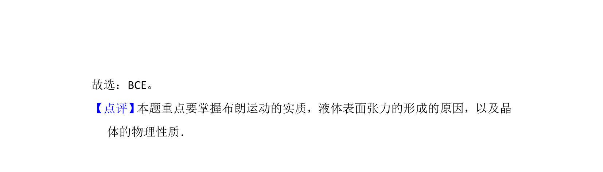

## 题面

## 摘要

本题考查布朗运动、表面张力、液晶特性、沸点与气压及蒸发吸热等热学与物态知识。

## 关联考点

- [[130-分子热运动|布朗运动]]
- [[653-液体表面张力|液体表面张力]]
- [[767-液晶各向异性|液晶各向异性]]
- [[641-沸点与气压|沸点与气压]]

## 答案与解析

> 📄 原 PDF 第 16 页：`素材/真题/吉林/2008-2024·（吉林）物理高考真题/2014年高考物理试卷（新课标Ⅱ）（解析卷）.pdf`
