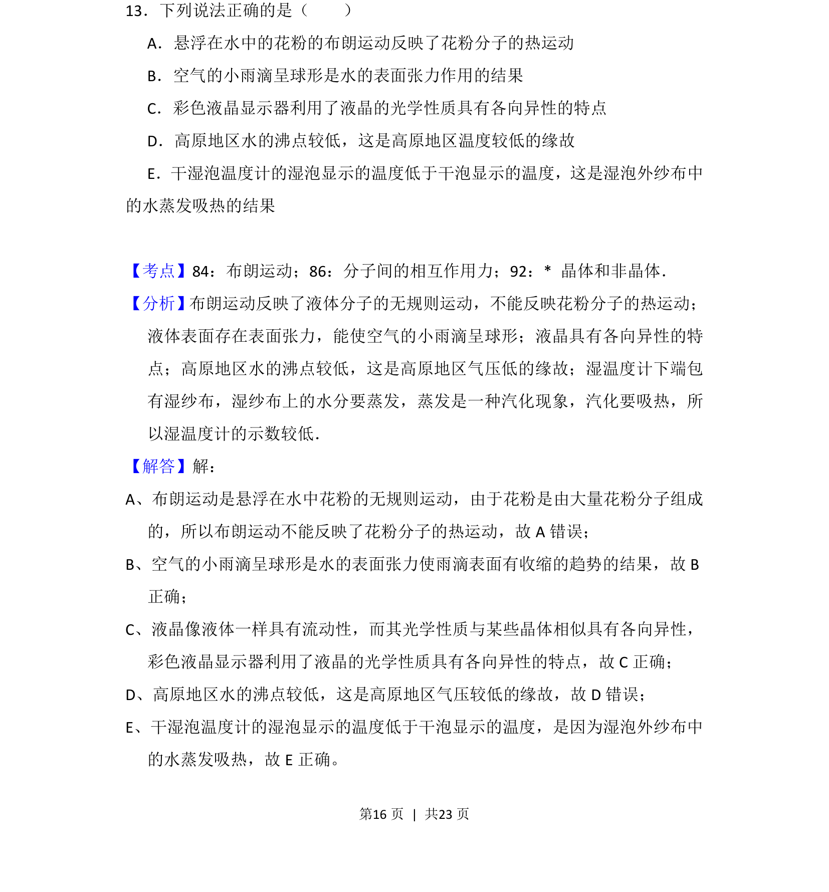
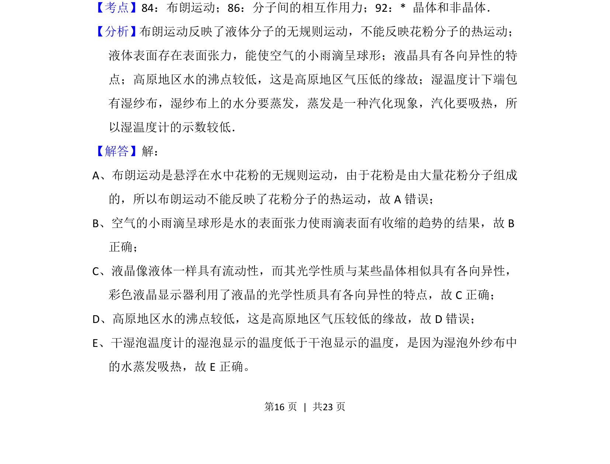
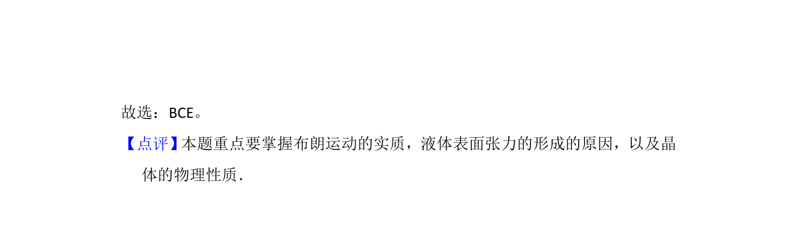

## 题面

## 摘要

本题考查布朗运动、表面张力、液晶特性、沸点与气压及蒸发吸热等热学与物态知识。

## 关联考点

- [[130-分子热运动|布朗运动]]
- [[653-液体表面张力|液体表面张力]]
- [[767-液晶各向异性|液晶各向异性]]
- [[641-沸点与气压|沸点与气压]]

## 答案与解析

> 📄 原 PDF 第 16 页：`素材/真题/吉林/2008-2024·（吉林）物理高考真题/2014年高考物理试卷（新课标Ⅱ）（解析卷）.pdf`

<!-- 题干文本-start -->
## 题干文本
13．下列说法正确的是（　　）
A．悬浮在水中的花粉的布朗运动反映了花粉分子的热运动
B．空气的小雨滴呈球形是水的表面张力作用的结果
C．彩色液晶显示器利用了液晶的光学性质具有各向异性的特点
D．高原地区水的沸点较低，这是高原地区温度较低的缘故
E．干湿泡温度计的湿泡显示的温度低于干泡显示的温度，这是湿泡外纱布中
的水蒸发吸热的结果
<!-- 题干文本-end -->

<!-- 解析文本-start -->
## 解析文本
【考点】84：布朗运动；86：分子间的相互作用力；92：* 晶体和非晶体．菁优网版权所有
【分析】布朗运动反映了液体分子的无规则运动，不能反映花粉分子的热运动；
液体表面存在表面张力，能使空气的小雨滴呈球形；液晶具有各向异性的特
点；高原地区水的沸点较低，这是高原地区气压低的缘故；湿温度计下端包
有湿纱布，湿纱布上的水分要蒸发，蒸发是一种汽化现象，汽化要吸热，所
以湿温度计的示数较低．
【解答】解：
A、布朗运动是悬浮在水中花粉的无规则运动，由于花粉是由大量花粉分子组成
的，所以布朗运动不能反映了花粉分子的热运动，故A错误；
B、空气的小雨滴呈球形是水的表面张力使雨滴表面有收缩的趋势的结果，故B
正确；
C、液晶像液体一样具有流动性，而其光学性质与某些晶体相似具有各向异性，
彩色液晶显示器利用了液晶的光学性质具有各向异性的特点，故C正确；
D、高原地区水的沸点较低，这是高原地区气压较低的缘故，故D错误；
E、干湿泡温度计的湿泡显示的温度低于干泡显示的温度，是因为湿泡外纱布中
的水蒸发吸热，故E正确。
<!-- 解析文本-end -->
