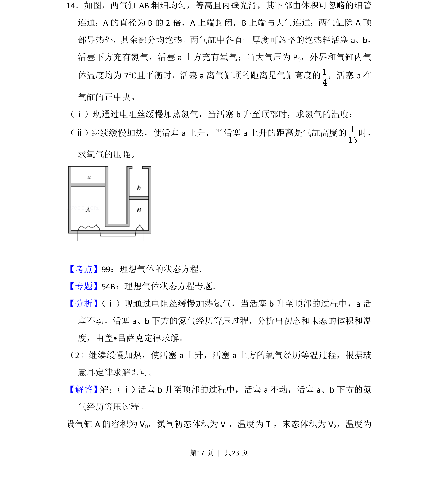

## 题面

## 摘要

本题通过加热氮气及活塞移动过程，考查理想气体状态方程与等压、等温变化的应用。

## 关联考点

- [[理想气体的状态方程]]
- [[盖·吕萨克定律]]
- [[444-玻意耳定律|玻意耳定律]]

## 答案与解析

> 📄 原 PDF 第 17 页：`素材/真题/吉林/2008-2024·（吉林）物理高考真题/2014年高考物理试卷（新课标Ⅱ）（解析卷）.pdf`
