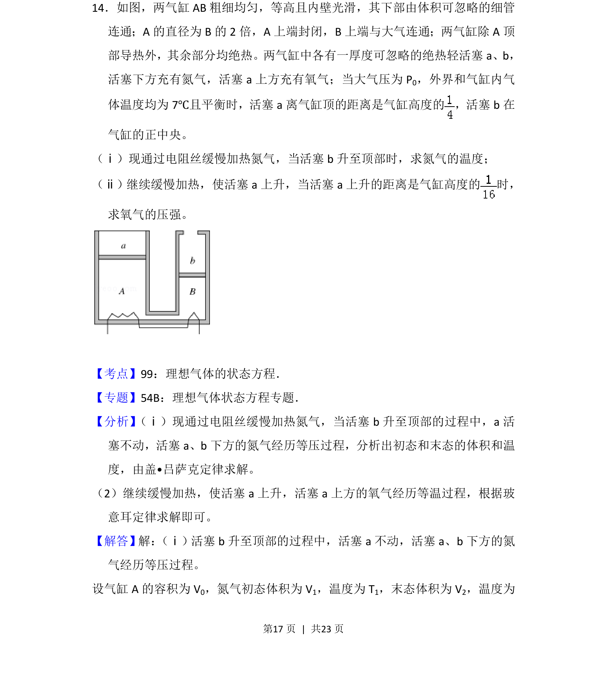
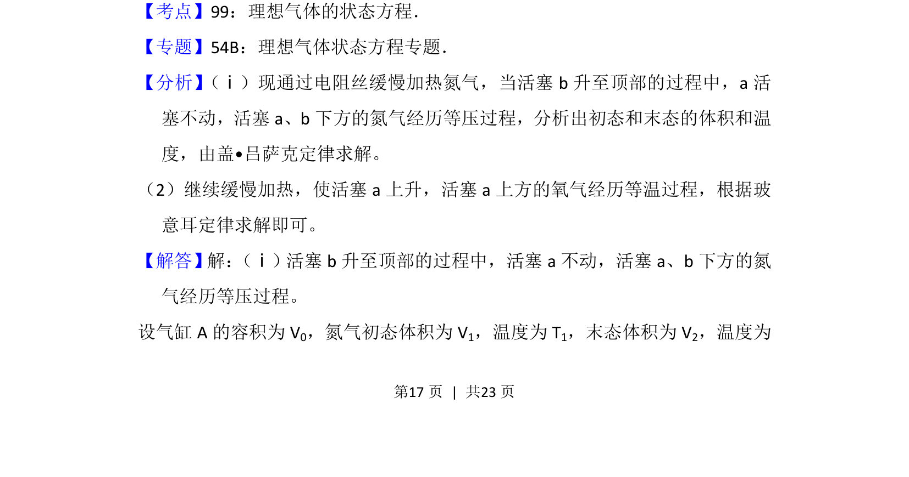
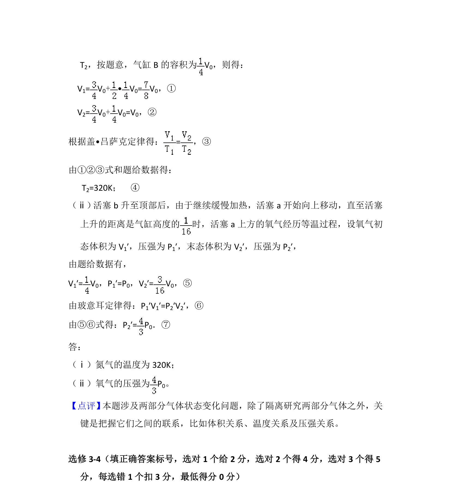

## 题面

## 摘要

本题通过加热氮气及活塞移动过程，考查理想气体状态方程与等压、等温变化的应用。

## 关联考点

- [[446-理想气体状态方程|理想气体的状态方程]]
- [[769-盖·吕萨克定律|盖·吕萨克定律]]
- [[444-玻意耳定律|玻意耳定律]]

## 答案与解析

> 📄 原 PDF 第 17 页：`素材/真题/吉林/2008-2024·（吉林）物理高考真题/2014年高考物理试卷（新课标Ⅱ）（解析卷）.pdf`

<!-- 题干文本-start -->
## 题干文本
14．如图，两气缸AB粗细均匀，等高且内壁光滑，其下部由体积可忽略的细管
连通；A的直径为B的2倍，A上端封闭，B上端与大气连通；两气缸除A顶
部导热外，其余部分均绝热。两气缸中各有一厚度可忽略的绝热轻活塞a、b，
活塞下方充有氮气，活塞a上方充有氧气；当大气压为P 0，外界和气缸内气
体温度均为7℃且平衡时，活塞a离气缸顶的距离是气缸高度的 ，活塞b在
气缸的正中央。
（ⅰ）现通过电阻丝缓慢加热氮气，当活塞b升至顶部时，求氮气的温度；
（ⅱ）继续缓慢加热，使活塞a上升，当活塞a上升的距离是气缸高度的 时，
求氧气的压强。
<!-- 题干文本-end -->

<!-- 解析文本-start -->
## 解析文本
【考点】99：理想气体的状态方程．菁优网版权所有
【专题】54B：理想气体状态方程专题．
【分析】 （ⅰ）现通过电阻丝缓慢加热氮气，当活塞b升至顶部的过程中，a活
塞不动，活塞a、b下方的氮气经历等压过程，分析出初态和末态的体积和温
度，由盖•吕萨克定律求解。
（2）继续缓慢加热，使活塞a上升，活塞a上方的氧气经历等温过程，根据玻
意耳定律求解即可。
【解答】解： （ⅰ）活塞b升至顶部的过程中，活塞a不动，活塞a、b下方的氮
气经历等压过程。
设气缸A的容积为V 0，氮气初态体积为V 1，温度为T 1，末态体积为V 2，温度为
<!-- 解析文本-end -->
