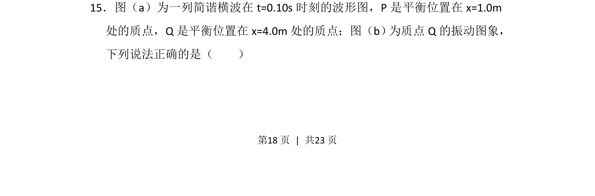
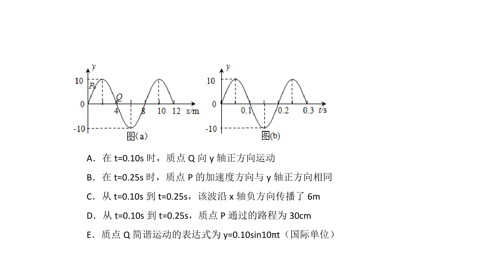
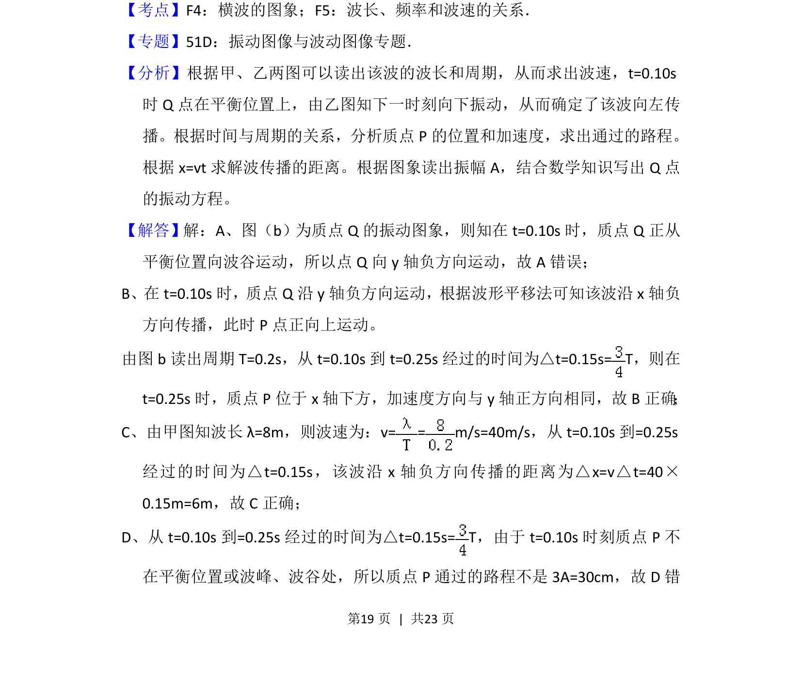
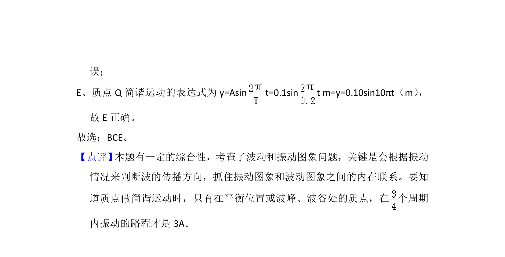

## 题面

## 摘要

波形图与振动图象结合，判断质点振动和波的传播方向。

## 关联考点

- [[713-简谐横波|简谐横波]]
- [[365-波的图象|波形图]]
- [[614-振动图象|振动图象]]
- [[763-质点振动|质点振动]]

## 答案与解析

> 📄 原 PDF 第 18 页：`素材/真题/吉林/2008-2024·（吉林）物理高考真题/2014年高考物理试卷（新课标Ⅱ）（解析卷）.pdf`
