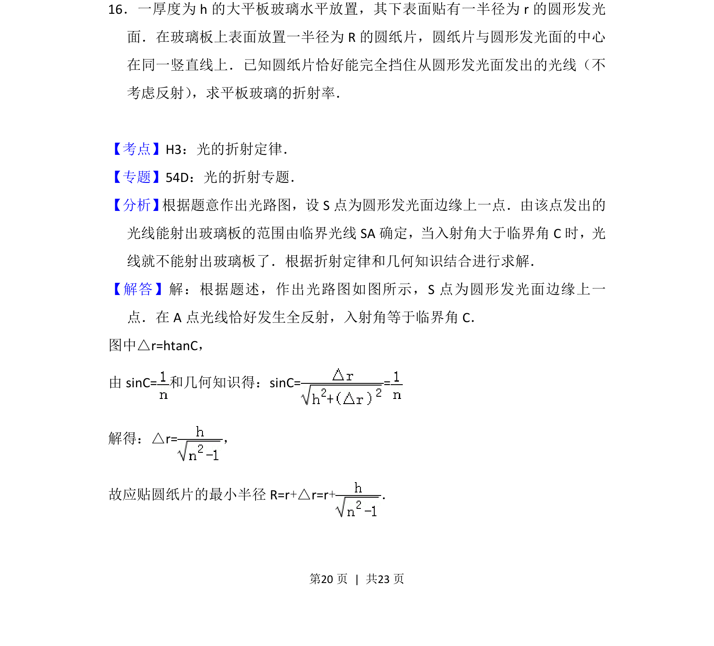
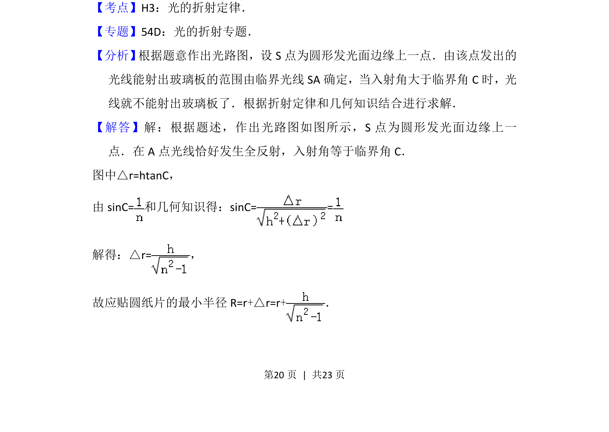
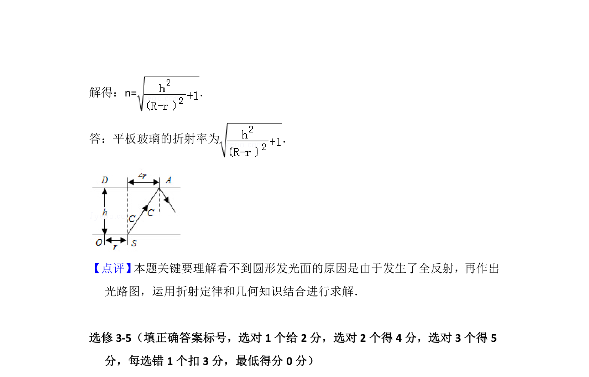

## 题面

## 摘要

此题考查全反射临界角、折射定律及几何光学，需结合光路图求折射率。

## 关联考点

- [[343-全反射|全反射]]
- [[026-折射定律|折射定律]]
- [[336-临界角|临界角]]
- [[几何光学]]

## 答案与解析

> 📄 原 PDF 第 20 页：`素材/真题/吉林/2008-2024·（吉林）物理高考真题/2014年高考物理试卷（新课标Ⅱ）（解析卷）.pdf`
