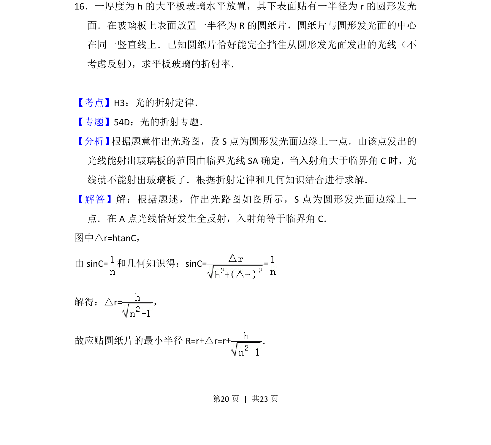
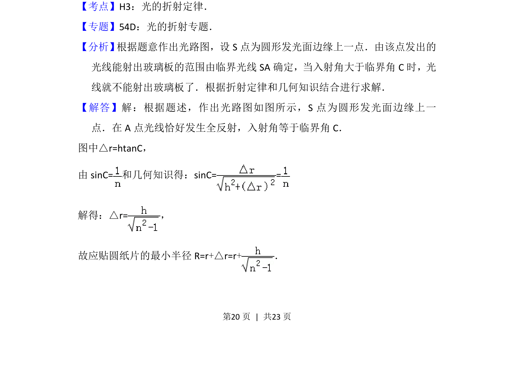
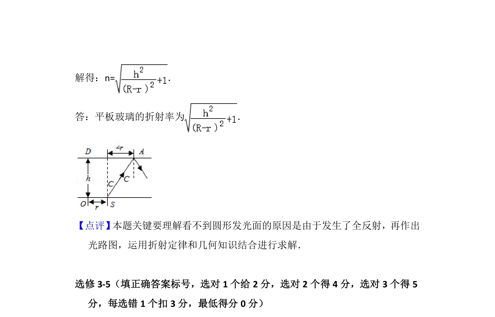

## 题面

## 摘要

此题考查全反射临界角、折射定律及几何光学，需结合光路图求折射率。

## 关联考点

- [[343-全反射|全反射]]
- [[026-折射定律|折射定律]]
- [[336-临界角|临界角]]
- [[455-几何光学|几何光学]]

## 答案与解析

> 📄 原 PDF 第 20 页：`素材/真题/吉林/2008-2024·（吉林）物理高考真题/2014年高考物理试卷（新课标Ⅱ）（解析卷）.pdf`

<!-- 题干文本-start -->
## 题干文本
16．一厚度为h的大平板玻璃水平放置，其下表面贴有一半径为r的圆形发光
面．在玻璃板上表面放置一半径为R的圆纸片，圆纸片与圆形发光面的中心
在同一竖直线上．已知圆纸片恰好能完全挡住从圆形发光面发出的光线（不
考虑反射） ，求平板玻璃的折射率．
<!-- 题干文本-end -->

<!-- 解析文本-start -->
## 解析文本
【考点】H3：光的折射定律．菁优网版权所有
【专题】54D：光的折射专题．
【分析】 根据题意作出光路图，设S点为圆形发光面边缘上一点．由该点发出的
光线能射出玻璃板的范围由临界光线SA确定，当入射角大于临界角C时，光
线就不能射出玻璃板了．根据折射定律和几何知识结合进行求解．
【解答】解：根据题述，作出光路图如图所示，S点为圆形发光面边缘上一
点．在A点光线恰好发生全反射，入射角等于临界角C．
图中△r=htanC，
由sinC=和几何知识得：sinC= =
解得：△r=，
故应贴圆纸片的最小半径R=r+△r=r+．
<!-- 解析文本-end -->
