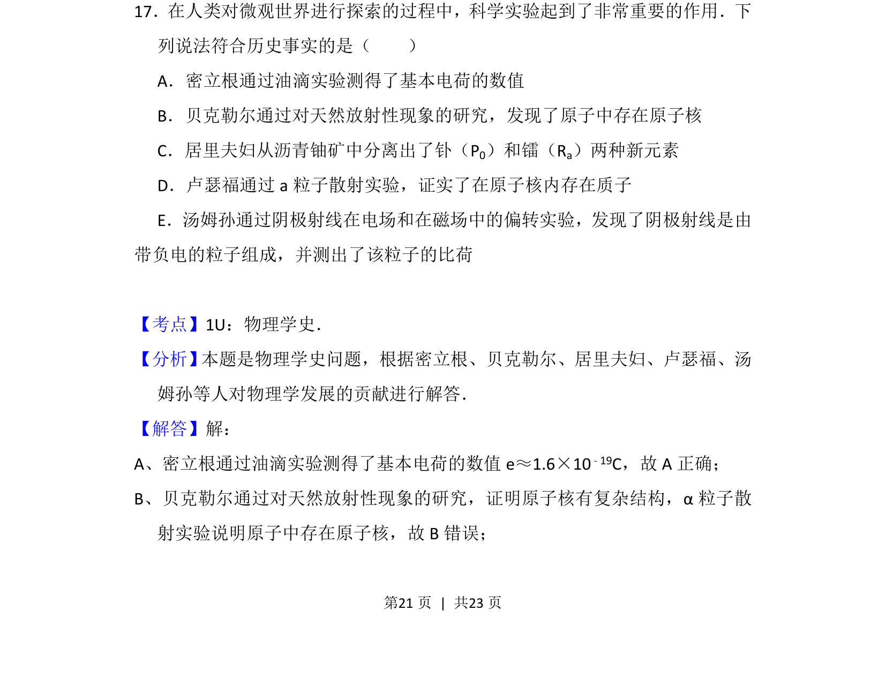
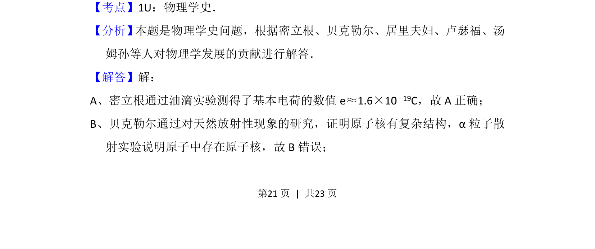
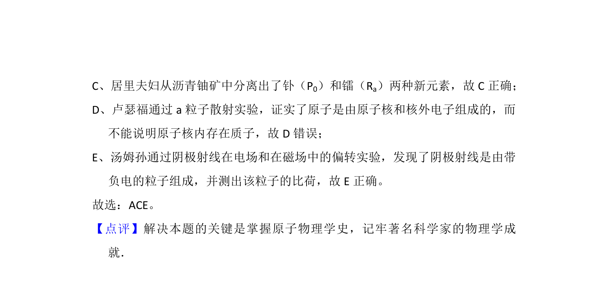

## 题面

## 摘要

本题考查物理学史相关的重要实验与发现的事实判断

## 关联考点

- [[482-物理学史|物理学史]]
- [[247-元电荷|基本电荷]]
- [[577-天然放射性|天然放射性]]
- [[031-原子核|原子核]]

## 答案与解析

> 📄 原 PDF 第 21 页：`素材/真题/吉林/2008-2024·（吉林）物理高考真题/2014年高考物理试卷（新课标Ⅱ）（解析卷）.pdf`

<!-- 题干文本-start -->
## 题干文本
17．在人类对微观世界进行探索的过程中，科学实验起到了非常重要的作用．下
列说法符合历史事实的是（　　）
A．密立根通过油滴实验测得了基本电荷的数值
B．贝克勒尔通过对天然放射性现象的研究，发现了原子中存在原子核
C．居里夫妇从沥青铀矿中分离出了钋（P0）和镭（Ra）两种新元素
D．卢瑟福通过a粒子散射实验，证实了在原子核内存在质子
E．汤姆孙通过阴极射线在电场和在磁场中的偏转实验，发现了阴极射线是由
带负电的粒子组成，并测出了该粒子的比荷
<!-- 题干文本-end -->

<!-- 解析文本-start -->
## 解析文本
【考点】1U：物理学史．菁优网版权所有
【分析】 本题是物理学史问题，根据密立根、贝克勒尔、居里夫妇、卢瑟福、汤
姆孙等人对物理学发展的贡献进行解答．
【解答】解：
A、密立根通过油滴实验测得了基本电荷的数值e≈1.6×10 ﹣19C，故A正确；
B、贝克勒尔通过对天然放射性现象的研究，证明原子核有复杂结构，α粒子散
射实验说明原子中存在原子核，故B错误；
<!-- 解析文本-end -->
