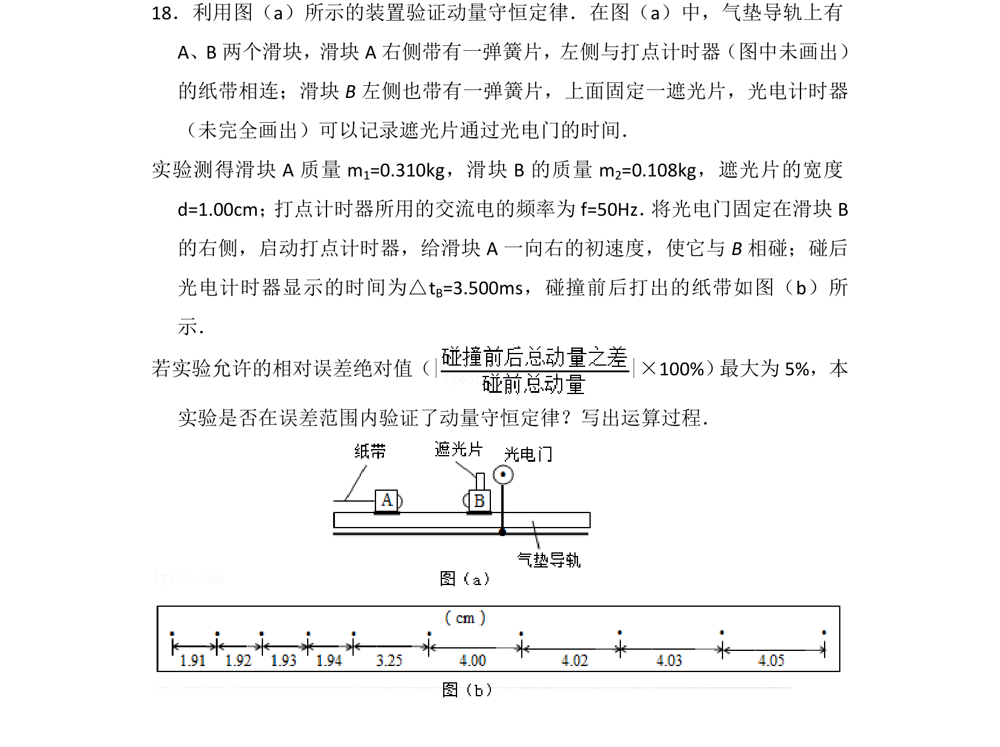
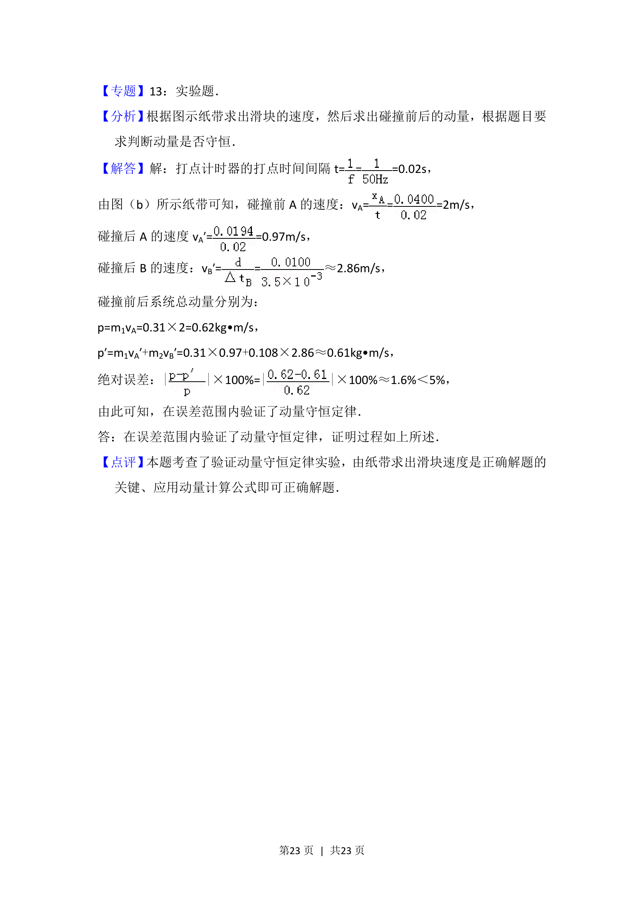

## 题面

## 摘要

通过纸带信息计算碰撞前后速度，验证动量守恒并分析相对误差是否在5%内。

## 关联考点

- [[539-动量守恒|动量守恒]]
- [[487-相对误差|相对误差]]
- [[744-速度计算|速度计算]]
- [[724-误差分析|误差分析]]

## 答案与解析

> 📄 原 PDF 第 22 页：`素材/真题/吉林/2008-2024·（吉林）物理高考真题/2014年高考物理试卷（新课标Ⅱ）（解析卷）.pdf`

<!-- 题干文本-start -->
## 题干文本
18．利用图（a）所示的装置验证动量守恒定律．在图（a）中，气垫导轨上有
A、B两个滑块，滑块A右侧带有一弹簧片，左侧与打点计时器（图中未画出）
的纸带相连；滑块B左侧也带有一弹簧片，上面固定一遮光片，光电计时器
（未完全画出）可以记录遮光片通过光电门的时间．  
实验测得滑块A质量m 1=0.310kg，滑块B的质量m 2=0.108kg，遮光片的宽度
d=1.00cm； 打点计时器所用的交流电的频率为f=50Hz． 将光电门固定在滑块B
的右侧，启动打点计时器，给滑块A一向右的初速度，使它与B相碰；碰后
光电计时器显示的时间为△t B=3.500ms，碰撞前后打出的纸带如图（b）所
示．
若实验允许的相对误差绝对值（| |×100%） 最大为5%，本
实验是否在误差范围内验证了动量守恒定律？写出运算过程．
<!-- 题干文本-end -->

<!-- 解析文本-start -->
## 解析文本
【考点】ME：验证动量守恒定律．菁优网版权所有
<!-- 解析文本-end -->
