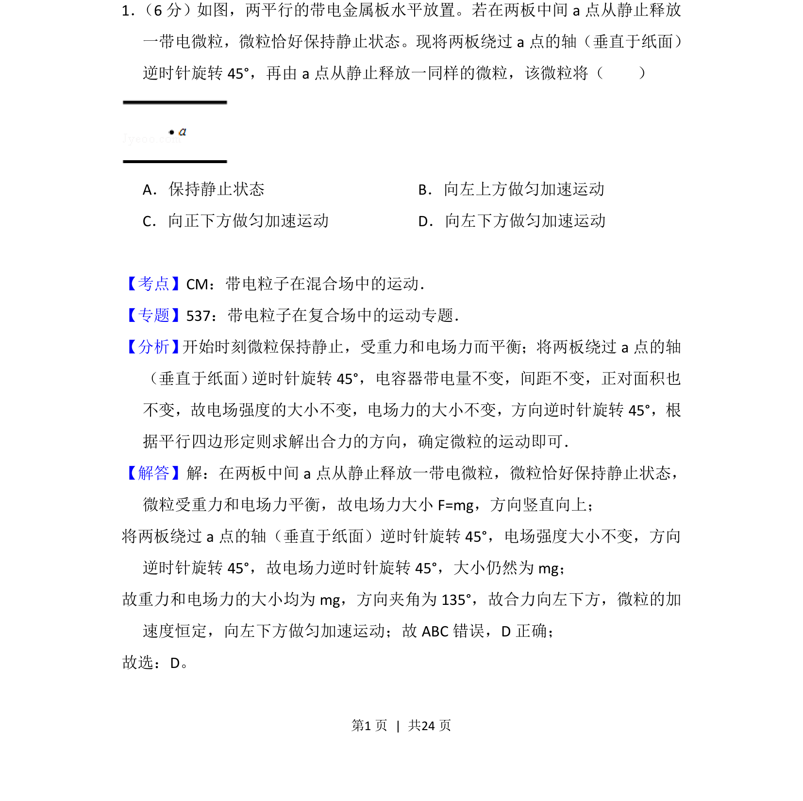
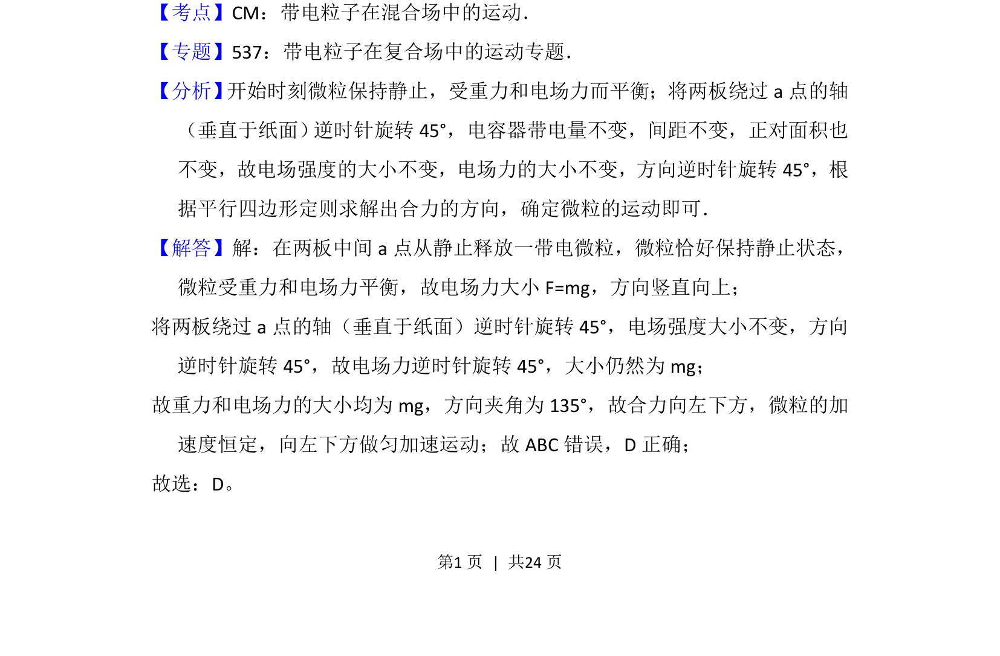
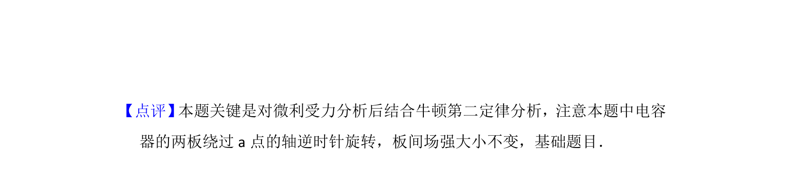

## 题面

## 摘要

微粒在电容器中受重力和电场力平衡，极板旋转后合力方向改变，微粒做匀加速直线运动。

## 关联考点

- [[力的平衡]]
- [[电场力]]
- [[059-力的合成-初中|力的合成]]
- [[运动状态分析]]

## 答案与解析

> 📄 原 PDF 第 1 页：`素材/真题/吉林/2008-2024·（吉林）物理高考真题/2015年高考物理试卷（新课标Ⅱ）（解析卷）.pdf`
