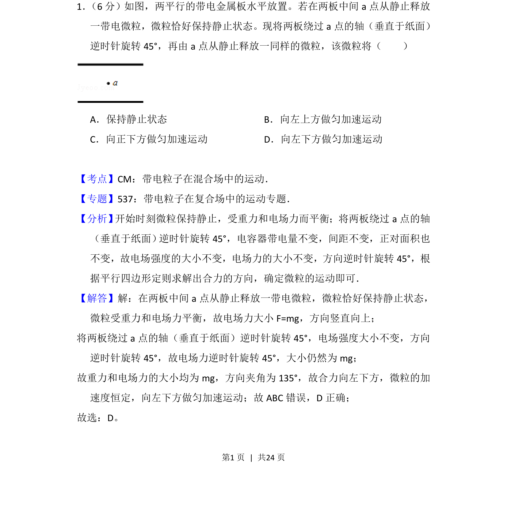
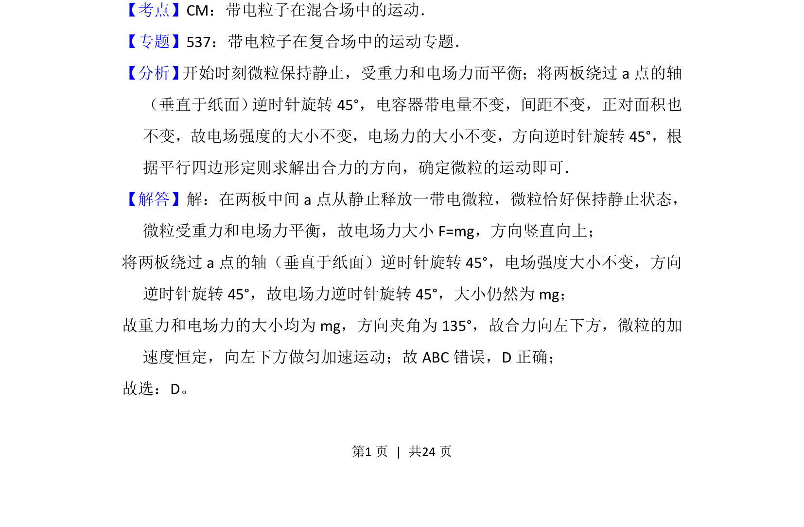
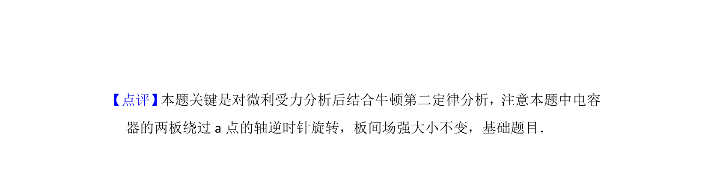

## 题面

## 摘要

微粒在电容器中受重力和电场力平衡，极板旋转后合力方向改变，微粒做匀加速直线运动。

## 关联考点

- [[533-力的平衡|力的平衡]]
- [[672-电场力|电场力]]
- [[059-力的合成-初中|力的合成]]
- [[735-运动状态分析|运动状态分析]]

## 答案与解析

> 📄 原 PDF 第 1 页：`素材/真题/吉林/2008-2024·（吉林）物理高考真题/2015年高考物理试卷（新课标Ⅱ）（解析卷）.pdf`

<!-- 题干文本-start -->
## 题干文本
1． （6分）如图，两平行的带电金属板水平放置。若在两板中间a点从静止释放
一带电微粒，微粒恰好保持静止状态。现将两板绕过a点的轴（垂直于纸面）
逆时针旋转45°，再由a点从静止释放一同样的微粒，该微粒将（　　）
A．保持静止状态B．向左上方做匀加速运动
C．向正下方做匀加速运动D．向左下方做匀加速运动
<!-- 题干文本-end -->

<!-- 解析文本-start -->
## 解析文本
【考点】CM：带电粒子在混合场中的运动．菁优网版权所有
【专题】537：带电粒子在复合场中的运动专题．
【分析】 开始时刻微粒保持静止，受重力和电场力而平衡；将两板绕过a点的轴
（垂直于纸面） 逆时针旋转45°，电容器带电量不变，间距不变，正对面积也
不变，故电场强度的大小不变，电场力的大小不变，方向逆时针旋转45°，根
据平行四边形定则求解出合力的方向，确定微粒的运动即可．
【解答】解：在两板中间a点从静止释放一带电微粒，微粒恰好保持静止状态，
微粒受重力和电场力平衡，故电场力大小F=mg，方向竖直向上；
将两板绕过a点的轴（垂直于纸面）逆时针旋转45°，电场强度大小不变，方向
逆时针旋转45°，故电场力逆时针旋转45°，大小仍然为mg；
故重力和电场力的大小均为mg，方向夹角为135°，故合力向左下方，微粒的加
速度恒定，向左下方做匀加速运动；故ABC错误，D正确；
故选：D。
<!-- 解析文本-end -->
