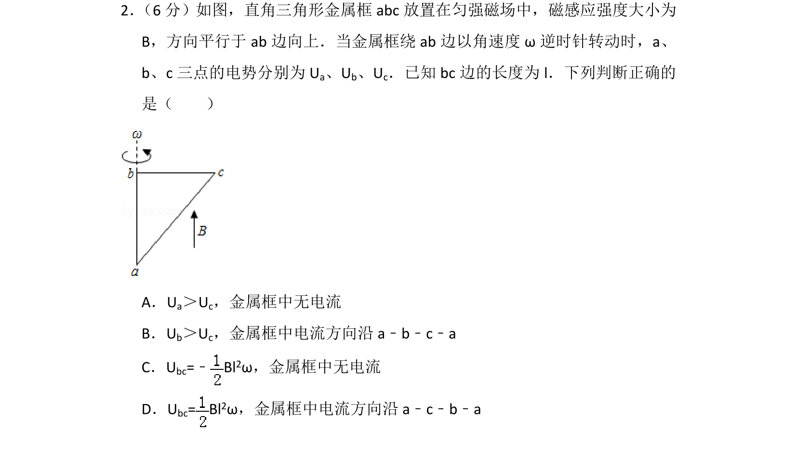
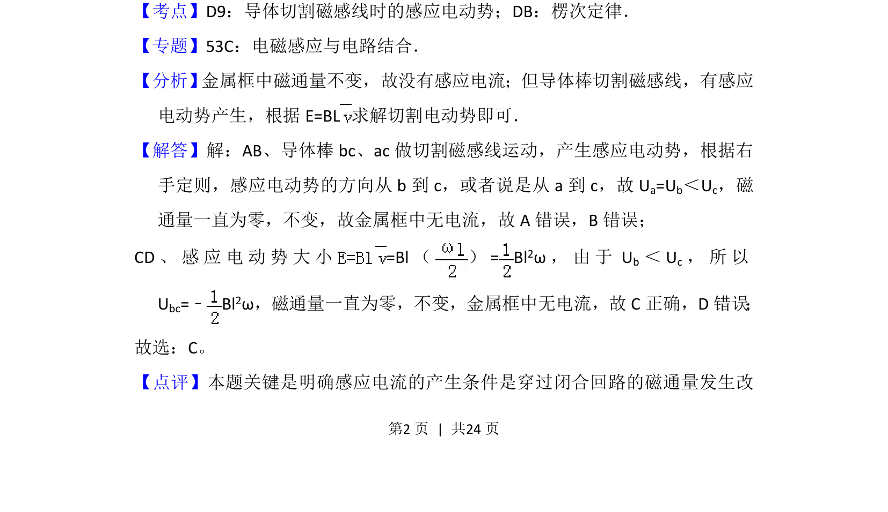
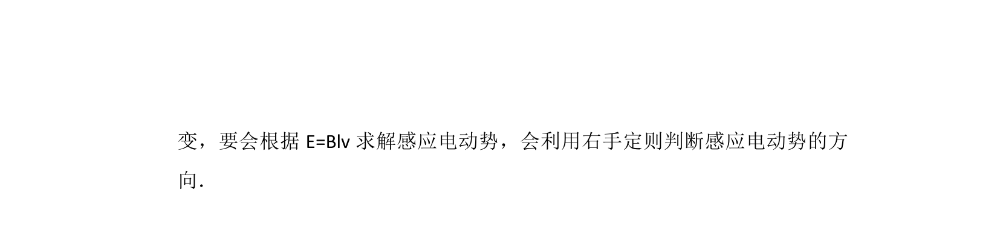

## 题面

## 摘要

金属框在匀强磁场中转动，考查切割磁感线产生感应电动势及感应电流有无的判断。

## 关联考点

- [[590-导体切割磁感线时的感应电动势|导体切割磁感线时的感应电动势]]
- [[393-楞次定律|楞次定律]]
- [[135-安培定则|右手定则]]
- [[704-磁通量不变|磁通量不变]]

## 答案与解析

> 📄 原 PDF 第 2 页：`素材/真题/吉林/2008-2024·（吉林）物理高考真题/2015年高考物理试卷（新课标Ⅱ）（解析卷）.pdf`
