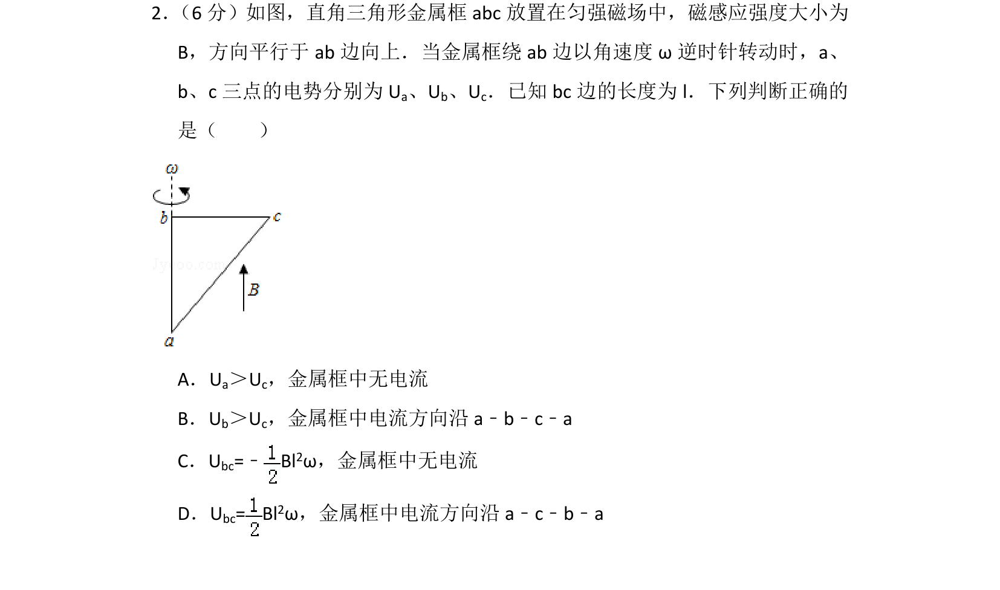
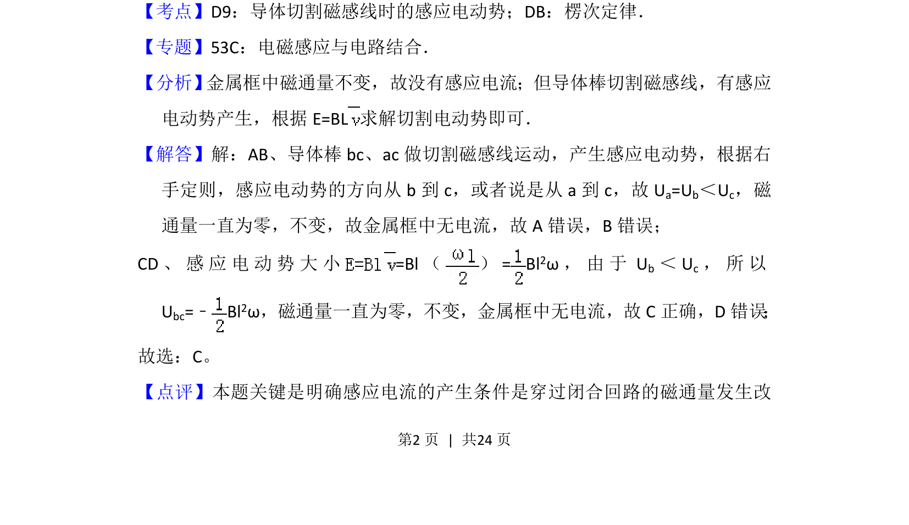
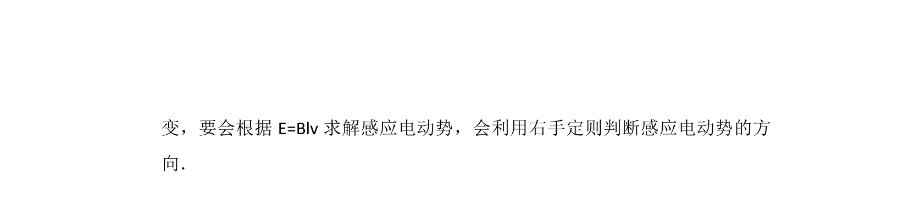

## 题面

## 摘要

金属框在匀强磁场中转动，考查切割磁感线产生感应电动势及感应电流有无的判断。

## 关联考点

- [[590-导体切割磁感线时的感应电动势|导体切割磁感线时的感应电动势]]
- [[393-楞次定律|楞次定律]]
- [[135-安培定则|右手定则]]
- [[704-磁通量不变|磁通量不变]]

## 答案与解析

> 📄 原 PDF 第 2 页：`素材/真题/吉林/2008-2024·（吉林）物理高考真题/2015年高考物理试卷（新课标Ⅱ）（解析卷）.pdf`

<!-- 题干文本-start -->
## 题干文本
2． （6分）如图，直角三角形金属框abc放置在匀强磁场中，磁感应强度大小为
B，方向平行于ab边向上．当金属框绕ab边以角速度ω逆时针转动时，a、
b、c三点的电势分别为U a、Ub、Uc．已知bc边的长度为l．下列判断正确的
是（　　）
A．Ua＞Uc，金属框中无电流
B．Ub＞Uc，金属框中电流方向沿a﹣b﹣c﹣a
C．Ubc=﹣Bl 2ω，金属框中无电流
D．Ubc= Bl 2ω，金属框中电流方向沿a﹣c﹣b﹣a
<!-- 题干文本-end -->

<!-- 解析文本-start -->
## 解析文本
【考点】D9：导体切割磁感线时的感应电动势；DB：楞次定律．菁优网版权所有
【专题】53C：电磁感应与电路结合．
【分析】 金属框中磁通量不变，故没有感应电流；但导体棒切割磁感线，有感应
电动势产生，根据E=BL求解切割电动势即可．
【解答】解：AB、导体棒bc、ac做切割磁感线运动，产生感应电动势，根据右
手定则，感应电动势的方向从b到c，或者说是从a到c，故U a=Ub＜Uc，磁
通量一直为零，不变，故金属框中无电流，故A错误，B错误；
CD、 感 应 电 动 势 大 小=Bl（ ）= Bl 2ω， 由 于U b＜U c， 所 以
Ubc=﹣Bl 2ω，磁通量一直为零，不变，金属框中无电流，故C正确，D错误 ；
故选：C。
【点评】本题关键是明确感应电流的产生条件是穿过闭合回路的磁通量发生改
<!-- 解析文本-end -->
