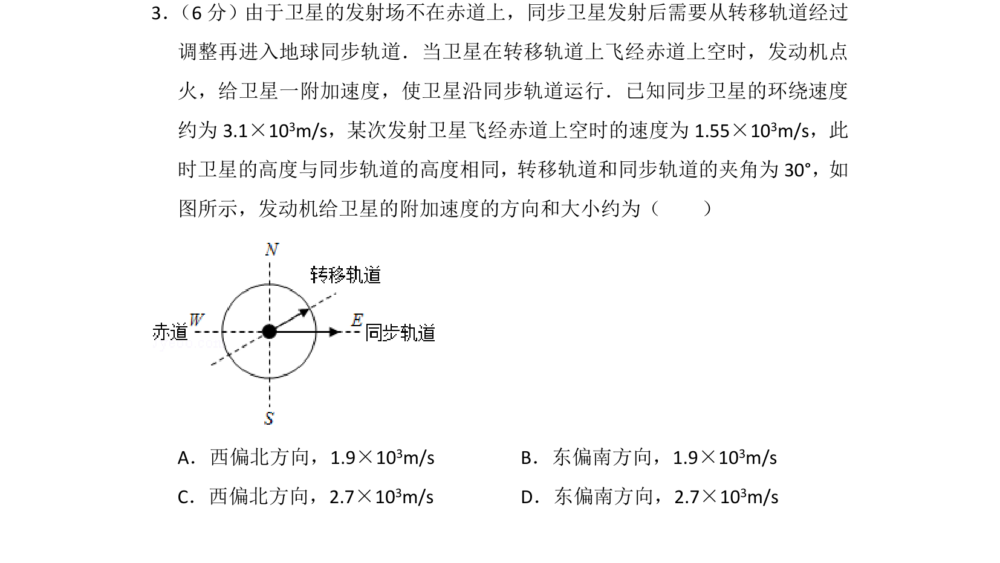
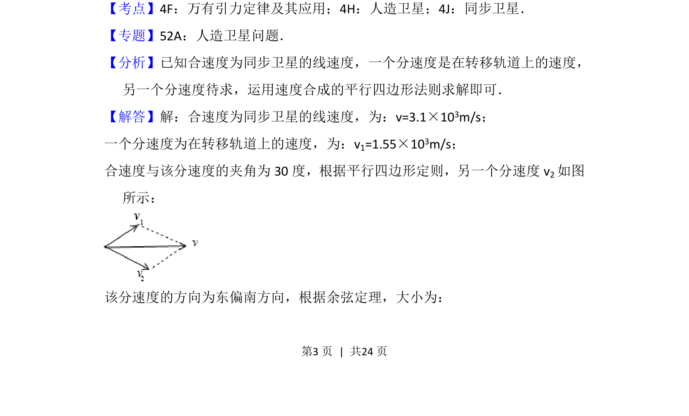
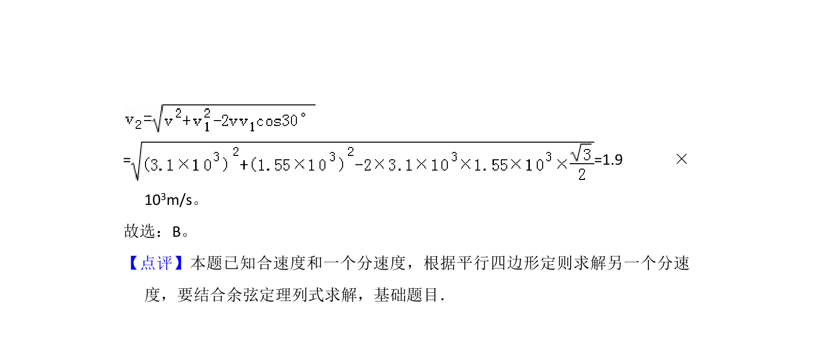

## 题面

## 摘要

该题考查速度矢量合成，利用平行四边形定则和余弦定理求解分速度大小和方向。

## 关联考点

- [[速度合成与分解]]
- [[219-平行四边形定则|平行四边形定则]]
- [[126-定理|余弦定理]]

## 答案与解析

> 📄 原 PDF 第 3 页：`素材/真题/吉林/2008-2024·（吉林）物理高考真题/2015年高考物理试卷（新课标Ⅱ）（解析卷）.pdf`
