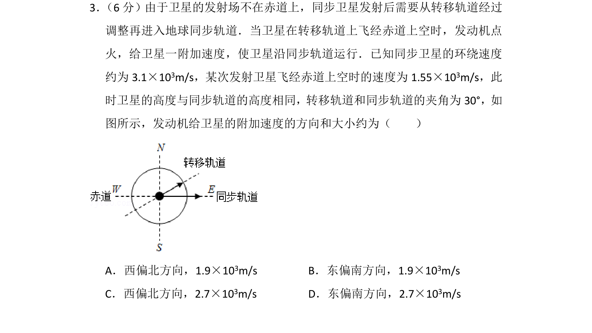
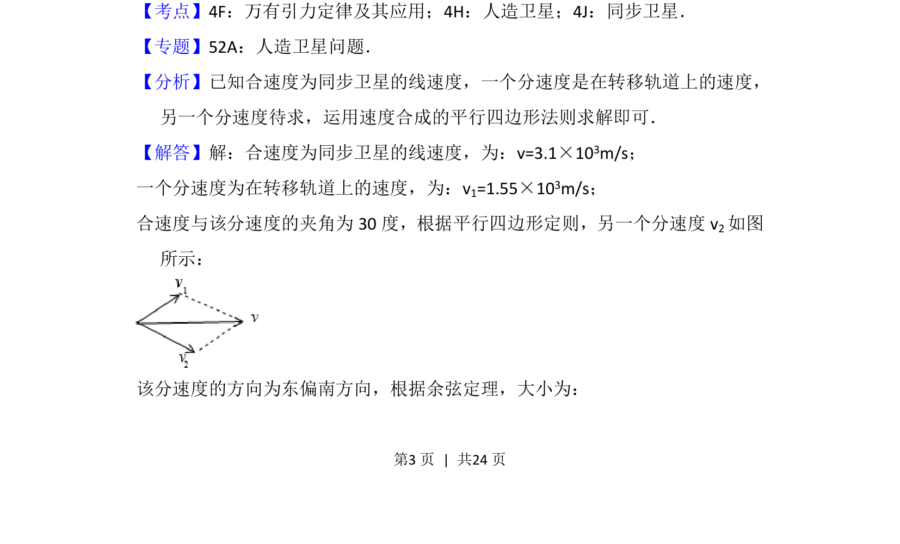
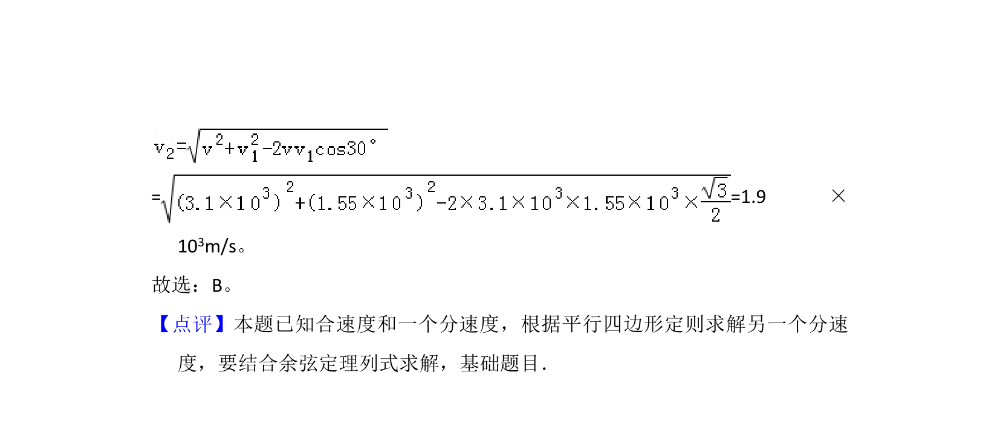

## 题面

## 摘要

该题考查速度矢量合成，利用平行四边形定则和余弦定理求解分速度大小和方向。

## 关联考点

- [[743-速度合成与分解|速度合成与分解]]
- [[219-平行四边形定则|平行四边形定则]]
- [[126-定理|余弦定理]]

## 答案与解析

> 📄 原 PDF 第 3 页：`素材/真题/吉林/2008-2024·（吉林）物理高考真题/2015年高考物理试卷（新课标Ⅱ）（解析卷）.pdf`

<!-- 题干文本-start -->
## 题干文本
3． （6分）由于卫星的发射场不在赤道上，同步卫星发射后需要从转移轨道经过
调整再进入地球同步轨道．当卫星在转移轨道上飞经赤道上空时，发动机点
火，给卫星一附加速度，使卫星沿同步轨道运行．已知同步卫星的环绕速度
约为3.1×10 3m/s，某次发射卫星飞经赤道上空时的速度为1.55×10 3m/s，此
时卫星的高度与同步轨道的高度相同，转移轨道和同步轨道的夹角为30°，如
图所示，发动机给卫星的附加速度的方向和大小约为（　　）
A．西偏北方向，1.9×103m/s B．东偏南方向，1.9×10 3m/s
C．西偏北方向，2.7×103m/s D．东偏南方向，2.7×10 3m/s
<!-- 题干文本-end -->

<!-- 解析文本-start -->
## 解析文本
【考点】4F：万有引力定律及其应用；4H：人造卫星；4J：同步卫星．菁优网版权所有
【专题】52A：人造卫星问题．
【分析】已知合速度为同步卫星的线速度，一个分速度是在转移轨道上的速度，
另一个分速度待求，运用速度合成的平行四边形法则求解即可．
【解答】解：合速度为同步卫星的线速度，为：v=3.1×103m/s；
一个分速度为在转移轨道上的速度，为：v1=1.55×103m/s；
合速度与该分速度的夹角为30度，根据平行四边形定则，另一个分速度v 2如图
所示：
该分速度的方向为东偏南方向，根据余弦定理，大小为：
<!-- 解析文本-end -->
