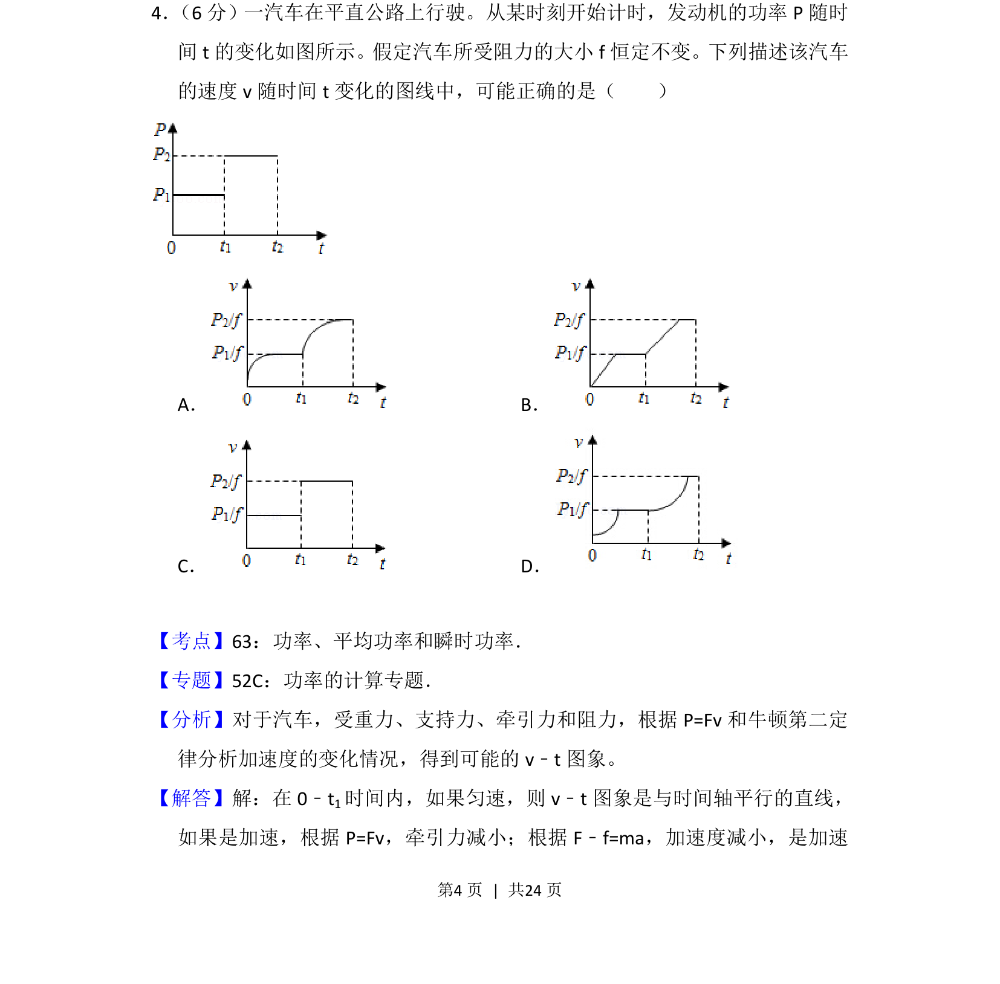
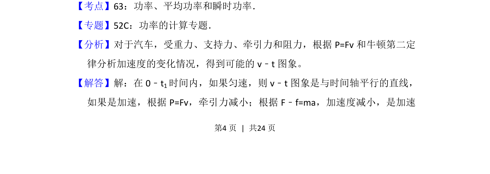
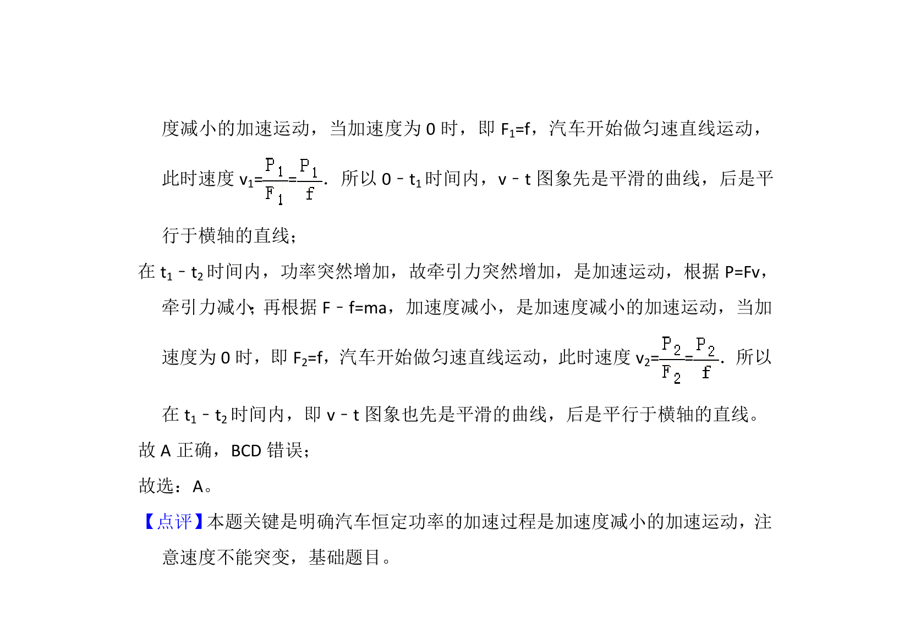

## 题面

## 摘要

汽车以恒定阻力在不同功率下行驶，通过P=Fv和牛顿第二定律分析速度图像变化趋势。

## 关联考点

- [[063-功率|功率]]
- [[601-平均功率|平均功率]]
- [[699-瞬时功率|瞬时功率]]
- [[229-牛顿第二定律|牛顿第二定律]]

## 答案与解析

> 📄 原 PDF 第 4 页：`素材/真题/吉林/2008-2024·（吉林）物理高考真题/2015年高考物理试卷（新课标Ⅱ）（解析卷）.pdf`

<!-- 题干文本-start -->
## 题干文本
4． （6分）一汽车在平直公路上行驶。从某时刻开始计时，发动机的功率P随时
间t的变化如图所示。假定汽车所受阻力的大小f恒定不变。下列描述该汽车
的速度v随时间t变化的图线中，可能正确的是（　　）
A．B．
C．D．
<!-- 题干文本-end -->

<!-- 解析文本-start -->
## 解析文本
【考点】63：功率、平均功率和瞬时功率．菁优网版权所有
【专题】52C：功率的计算专题．
【分析】对于汽车，受重力、支持力、牵引力和阻力，根据P=Fv和牛顿第二定
律分析加速度的变化情况，得到可能的v﹣t图象。
【解答】解：在0﹣t 1时间内，如果匀速，则v﹣t图象是与时间轴平行的直线，
如果是加速，根据P=Fv，牵引力减小；根据F﹣f=ma，加速度减小，是加速
<!-- 解析文本-end -->
