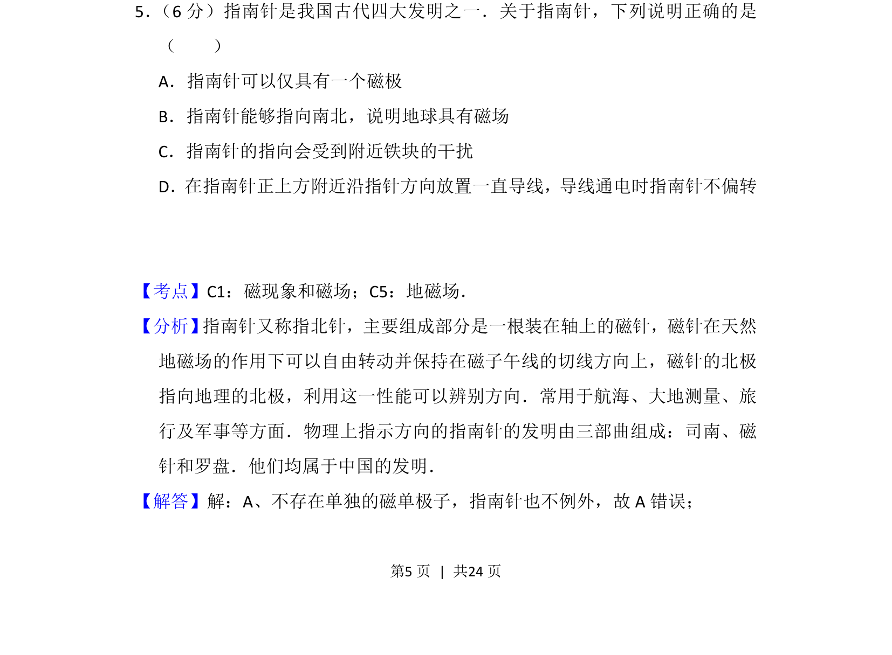
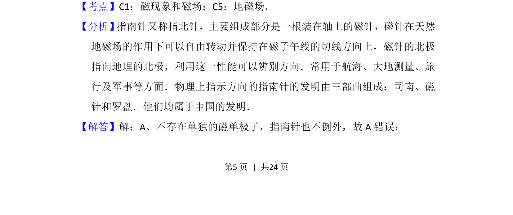
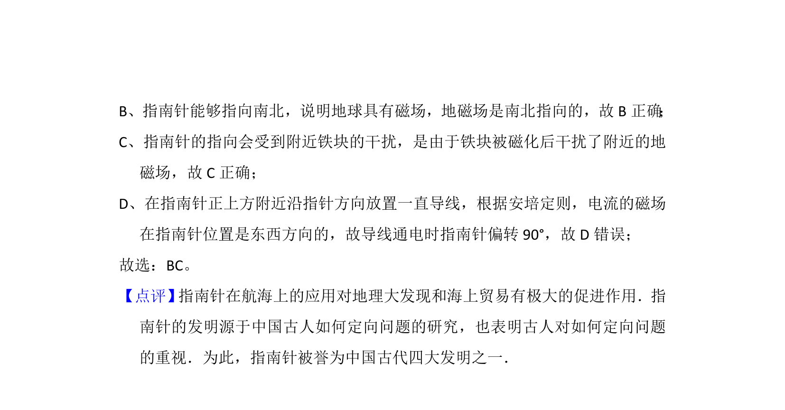

## 题面

## 摘要

指南针工作原理涉及磁极、地磁场及电流磁效应等基本概念。

## 关联考点

- [[192-磁现象|磁现象]]
- [[132-地磁场|地磁场]]
- [[171-电流的磁效应|电流磁效应]]

## 答案与解析

> 📄 原 PDF 第 5 页：`素材/真题/吉林/2008-2024·（吉林）物理高考真题/2015年高考物理试卷（新课标Ⅱ）（解析卷）.pdf`

<!-- 题干文本-start -->
## 题干文本
5． （6分）指南针是我国古代四大发明之一．关于指南针，下列说明正确的是
（　　）
A．指南针可以仅具有一个磁极
B．指南针能够指向南北，说明地球具有磁场
C．指南针的指向会受到附近铁块的干扰
D．在指南针正上方附近沿指针方向放置一直导线，导线通电时指南针不偏转
<!-- 题干文本-end -->

<!-- 解析文本-start -->
## 解析文本
【考点】C1：磁现象和磁场；C5：地磁场．菁优网版权所有
【分析】 指南针又称指北针，主要组成部分是一根装在轴上的磁针，磁针在天然
地磁场的作用下可以自由转动并保持在磁子午线的切线方向上，磁针的北极
指向地理的北极，利用这一性能可以辨别方向．常用于航海、大地测量、旅
行及军事等方面．物理上指示方向的指南针的发明由三部曲组成：司南、磁
针和罗盘．他们均属于中国的发明．
【解答】解：A、不存在单独的磁单极子，指南针也不例外，故A错误；
<!-- 解析文本-end -->
