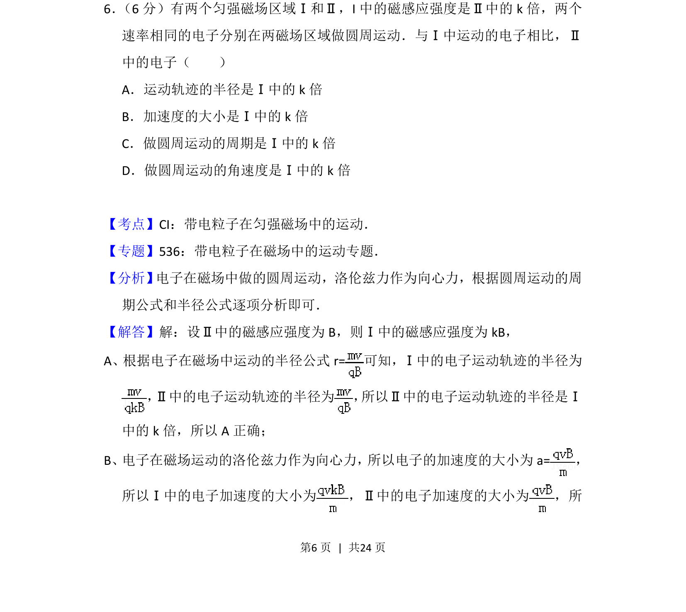

## 题面

## 摘要

电子在不同磁感应强度匀强磁场中做匀速圆周运动的半径、加速度、周期、角速度比较。

## 关联考点

- [[带电粒子在匀强磁场中的运动]]
- [[圆周运动半径]]
- [[257-向心加速度|向心加速度]]
- [[周期公式]]
- [[286-角速度|角速度]]

## 答案与解析

> 📄 原 PDF 第 6 页：`素材/真题/吉林/2008-2024·（吉林）物理高考真题/2015年高考物理试卷（新课标Ⅱ）（解析卷）.pdf`
