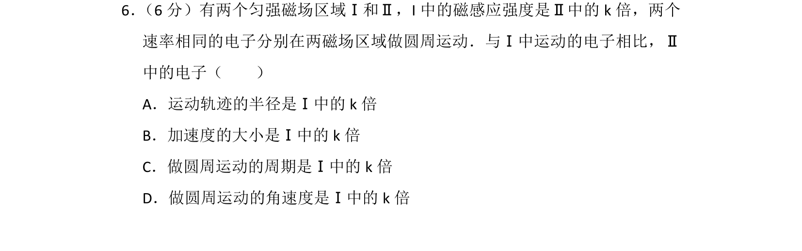
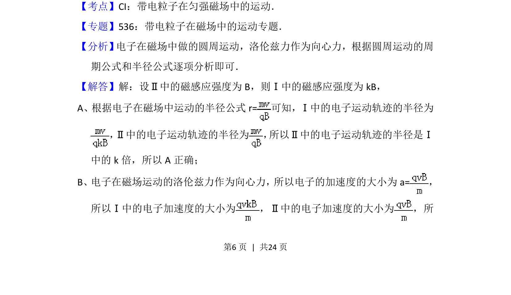
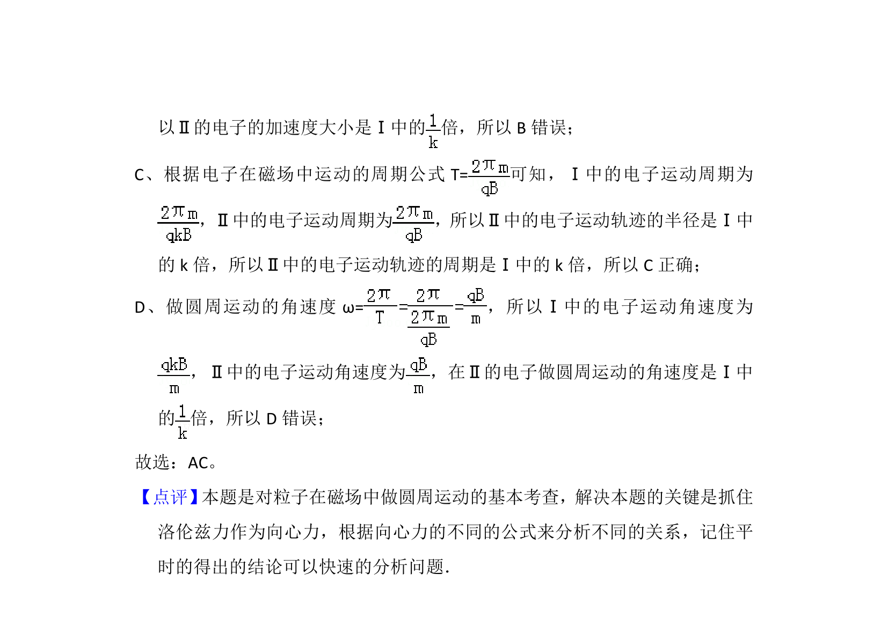

## 题面

## 摘要

电子在不同磁感应强度匀强磁场中做匀速圆周运动的半径、加速度、周期、角速度比较。

## 关联考点

- [[595-带电粒子在匀强磁场中的运动|带电粒子在匀强磁场中的运动]]
- [[571-圆周运动半径|圆周运动半径]]
- [[257-向心加速度|向心加速度]]
- [[759-周期公式|周期公式]]
- [[286-角速度|角速度]]

## 答案与解析

> 📄 原 PDF 第 6 页：`素材/真题/吉林/2008-2024·（吉林）物理高考真题/2015年高考物理试卷（新课标Ⅱ）（解析卷）.pdf`

<!-- 题干文本-start -->
## 题干文本
6． （6分）有两个匀强磁场区域Ⅰ和Ⅱ，I中的磁感应强度是Ⅱ中的k倍，两个
速率相同的电子分别在两磁场区域做圆周运动．与Ⅰ中运动的电子相比，Ⅱ
中的电子（　　）
A．运动轨迹的半径是Ⅰ中的k倍
B．加速度的大小是Ⅰ中的k倍
C．做圆周运动的周期是Ⅰ中的k倍
D．做圆周运动的角速度是Ⅰ中的k倍
<!-- 题干文本-end -->

<!-- 解析文本-start -->
## 解析文本
【考点】CI：带电粒子在匀强磁场中的运动．菁优网版权所有
【专题】536：带电粒子在磁场中的运动专题．
【分析】 电子在磁场中做的圆周运动，洛伦兹力作为向心力，根据圆周运动的周
期公式和半径公式逐项分析即可．
【解答】解：设Ⅱ中的磁感应强度为B，则Ⅰ中的磁感应强度为kB，
A、根据电子在磁场中运动的半径公式r=可知，Ⅰ中的电子运动轨迹的半径为
，Ⅱ中的电子运动轨迹的半径为 ， 所以Ⅱ中的电子运动轨迹的半径是Ⅰ
中的k倍，所以A正确；
B、 电子在磁场运动的洛伦兹力作为向心力，所以电子的加速度的大小为a=，
所以Ⅰ中的电子加速度的大小为 ，Ⅱ中的电子加速度的大小为 ，所
<!-- 解析文本-end -->
