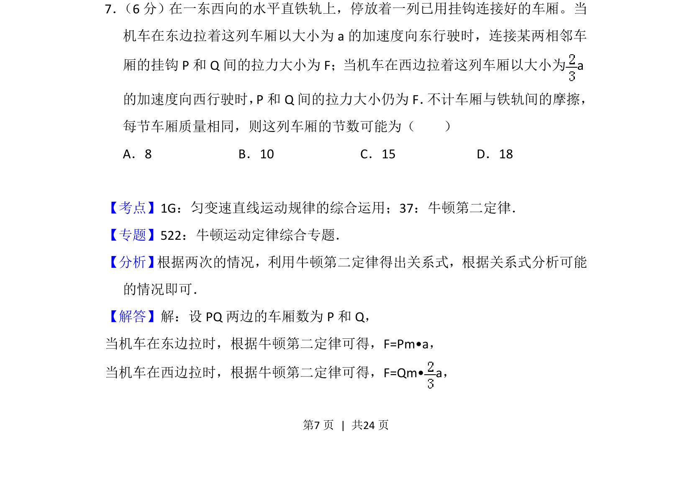
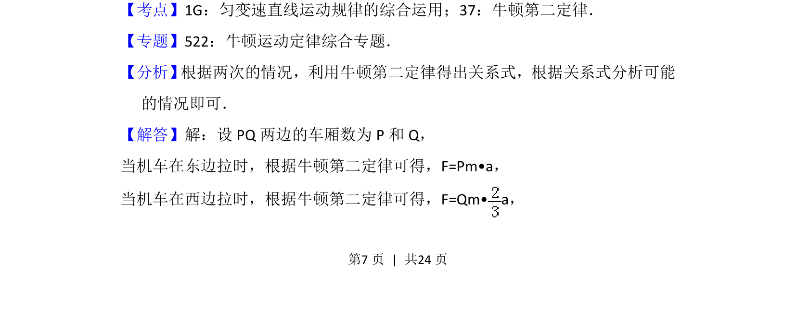
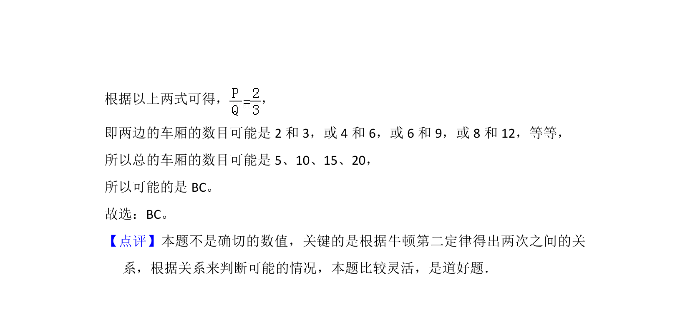

## 题面

## 摘要

通过牛顿第二定律分析连接体的加速度与力关系，求解车厢节数的可能取值。

## 关联考点

- [[229-牛顿第二定律|牛顿第二定律]]
- [[215-匀变速直线运动|匀变速直线运动]]
- [[连接体]]

## 答案与解析

> 📄 原 PDF 第 7 页：`素材/真题/吉林/2008-2024·（吉林）物理高考真题/2015年高考物理试卷（新课标Ⅱ）（解析卷）.pdf`
