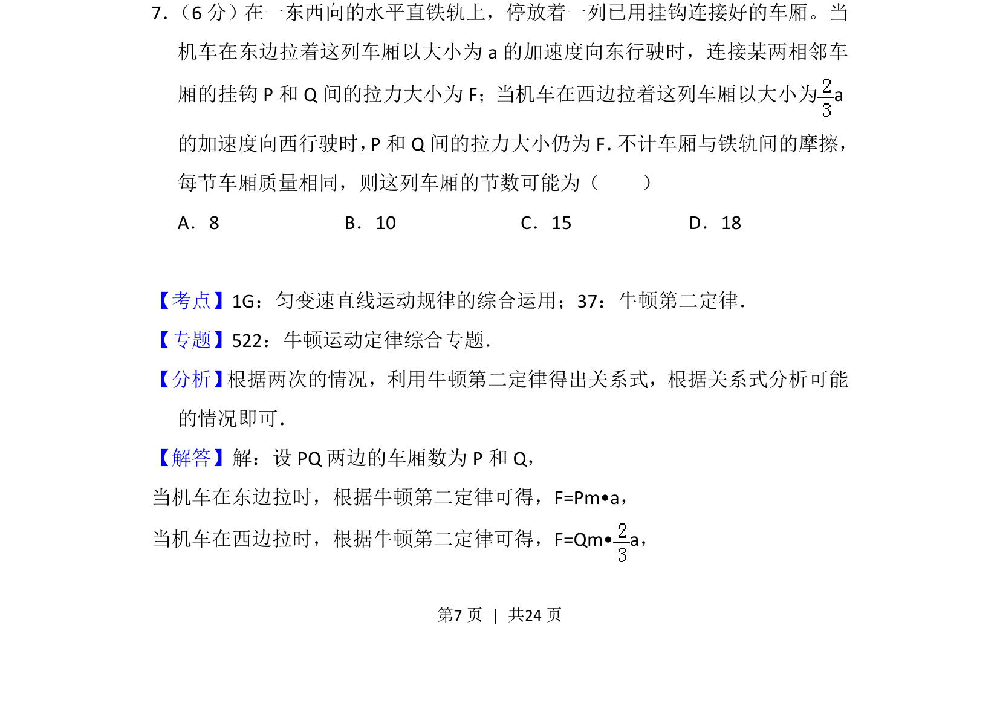
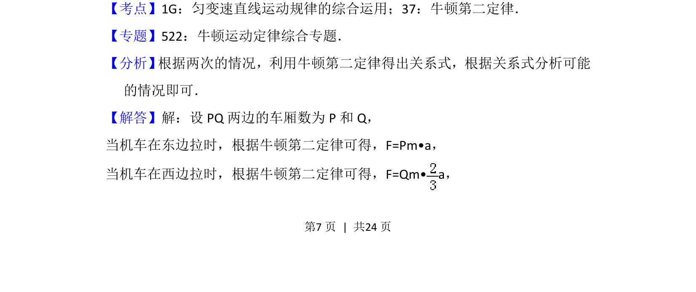
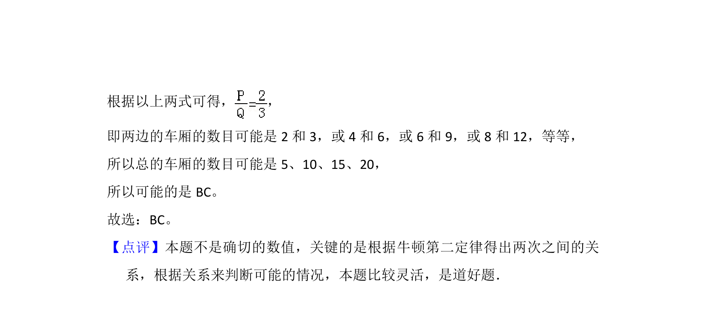

## 题面

## 摘要

通过牛顿第二定律分析连接体的加速度与力关系，求解车厢节数的可能取值。

## 关联考点

- [[229-牛顿第二定律|牛顿第二定律]]
- [[215-匀变速直线运动|匀变速直线运动]]
- [[738-连接体|连接体]]

## 答案与解析

> 📄 原 PDF 第 7 页：`素材/真题/吉林/2008-2024·（吉林）物理高考真题/2015年高考物理试卷（新课标Ⅱ）（解析卷）.pdf`

<!-- 题干文本-start -->
## 题干文本
7． （6分）在一东西向的水平直铁轨上，停放着一列已用挂钩连接好的车厢。当
机车在东边拉着这列车厢以大小为a的加速度向东行驶时，连接某两相邻车
厢的挂钩P和Q间的拉力大小为F；当机车在西边拉着这列车厢以大小为a
的加速度向西行驶时，P和Q间的拉力大小仍为F． 不计车厢与铁轨间的摩擦，
每节车厢质量相同，则这列车厢的节数可能为（　　）
A．8 B．10 C．15 D．18
<!-- 题干文本-end -->

<!-- 解析文本-start -->
## 解析文本
【考点】1G：匀变速直线运动规律的综合运用；37：牛顿第二定律．菁优网版权所有
【专题】522：牛顿运动定律综合专题．
【分析】 根据两次的情况，利用牛顿第二定律得出关系式，根据关系式分析可能
的情况即可．
【解答】解：设PQ两边的车厢数为P和Q，
当机车在东边拉时，根据牛顿第二定律可得，F=Pm•a，
当机车在西边拉时，根据牛顿第二定律可得，F=Qm• a，
<!-- 解析文本-end -->
