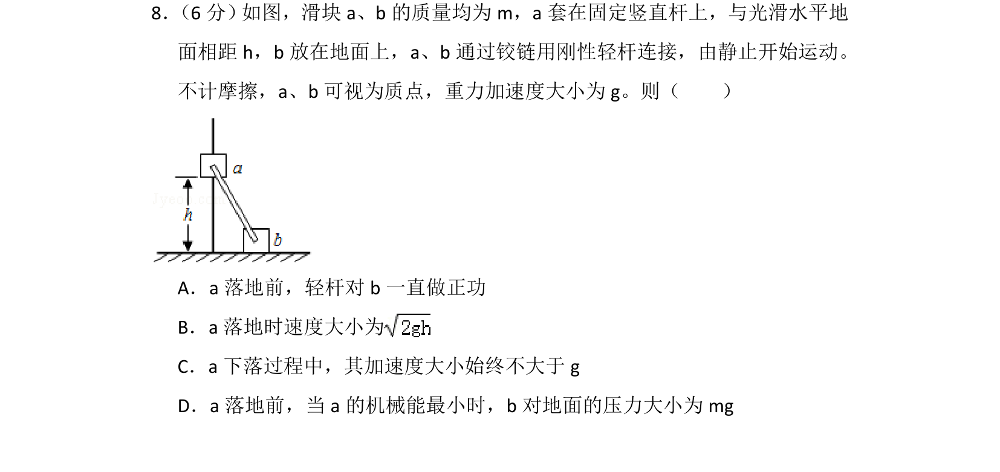
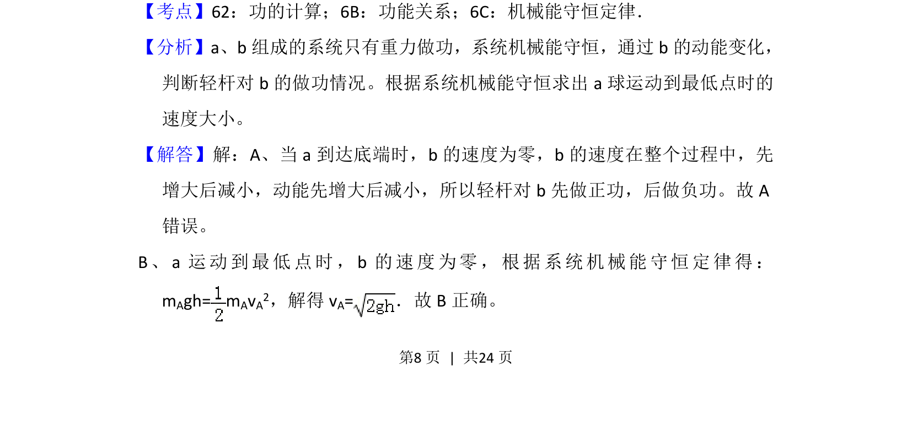
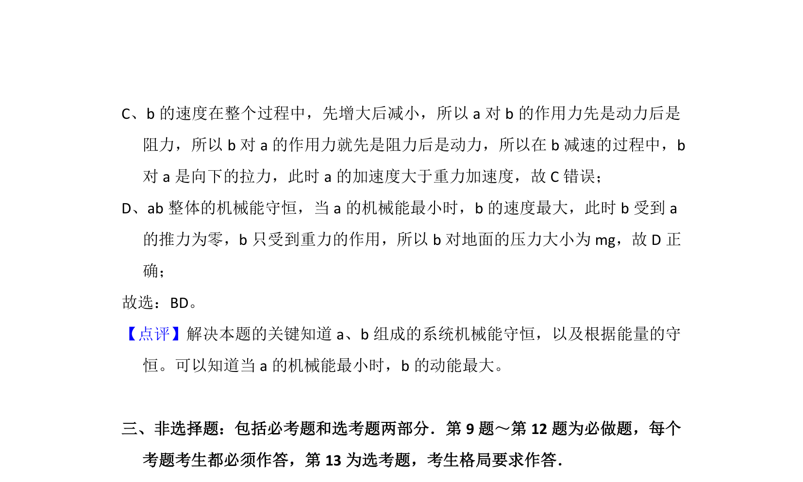

## 题面

## 摘要

a、b通过轻杆连接的系统，分析轻杆做功情况与机械能守恒定律的综合应用。

## 关联考点

- [[085-机械能守恒-初中|机械能守恒定律]]
- [[754-功的计算|功的计算]]
- [[249-功能关系|功能关系]]

## 答案与解析

> 📄 原 PDF 第 8 页：`素材/真题/吉林/2008-2024·（吉林）物理高考真题/2015年高考物理试卷（新课标Ⅱ）（解析卷）.pdf`

<!-- 题干文本-start -->
## 题干文本
8． （6分） 如图，滑块a、b的质量均为m，a套在固定竖直杆上，与光滑水平地
面相距h，b放在地面上，a、b通过铰链用刚性轻杆连接，由静止开始运动。
不计摩擦，a、b可视为质点，重力加速度大小为g。则（　　）
A．a落地前，轻杆对b一直做正功
B．a落地时速度大小为
C．a下落过程中，其加速度大小始终不大于g
D．a落地前，当a的机械能最小时，b对地面的压力大小为mg
<!-- 题干文本-end -->

<!-- 解析文本-start -->
## 解析文本
【考点】62：功的计算；6B：功能关系；6C：机械能守恒定律．菁优网版权所有
【分析】a、b组成的系统只有重力做功，系统机械能守恒，通过b的动能变化，
判断轻杆对b的做功情况。根据系统机械能守恒求出a球运动到最低点时的
速度大小。
【解答】解：A、当a到达底端时，b的速度为零，b的速度在整个过程中，先
增大后减小，动能先增大后减小，所以轻杆对b先做正功，后做负功。故A
错误。
B、a运动到最低点时，b的速度为零，根据系统机械能守恒定律得：
mAgh= m AvA2，解得v A=．故B正确。
<!-- 解析文本-end -->
