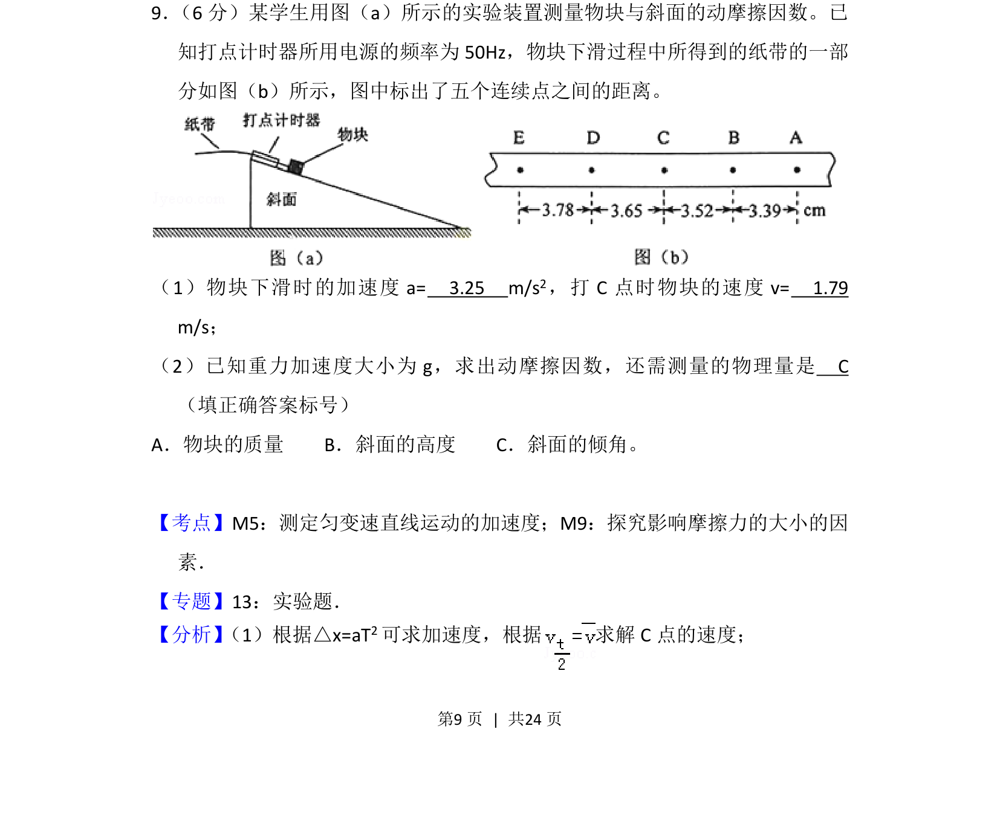
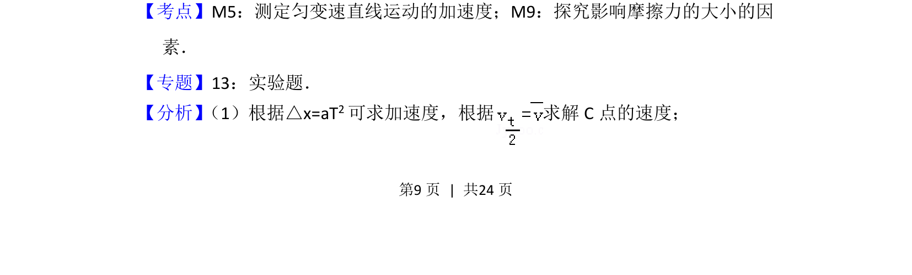
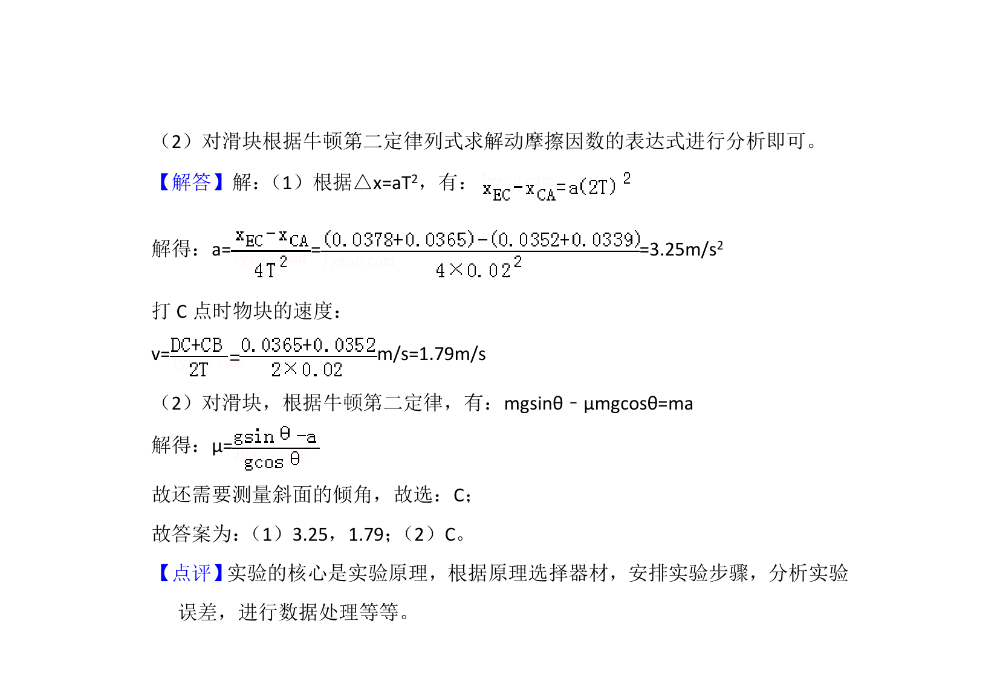

## 题面

## 摘要

考查匀变速直线运动实验数据处理及测量动摩擦因数方法

## 关联考点

- [[650-测定匀变速直线运动的加速度|测定匀变速直线运动的加速度]]
- [[473-探究影响摩擦力的大小的因素|探究影响摩擦力的大小的因素]]

## 答案与解析

> 📄 原 PDF 第 9 页：`素材/真题/吉林/2008-2024·（吉林）物理高考真题/2015年高考物理试卷（新课标Ⅱ）（解析卷）.pdf`

<!-- 题干文本-start -->
## 题干文本
9． （6分）某学生用图（a）所示的实验装置测量物块与斜面的动摩擦因数。已
知打点计时器所用电源的频率为50Hz，物块下滑过程中所得到的纸带的一部
分如图（b）所示，图中标出了五个连续点之间的距离。
（1）物块下滑时的加速度a=　3.25　m/s 2，打C点时物块的速度v=　1.79　
m/s；
（2）已知重力加速度大小为g，求出动摩擦因数，还需测量的物理量是　C　
（填正确答案标号）
A．物块的质量    B．斜面的高度    C．斜面的倾角。
<!-- 题干文本-end -->

<!-- 解析文本-start -->
## 解析文本
【考点】M5：测定匀变速直线运动的加速度；M9：探究影响摩擦力的大小的因
素．菁优网版权所有
【专题】13：实验题．
【分析】 （1）根据△x=aT2可求加速度，根据 求解C点的速度；
<!-- 解析文本-end -->
