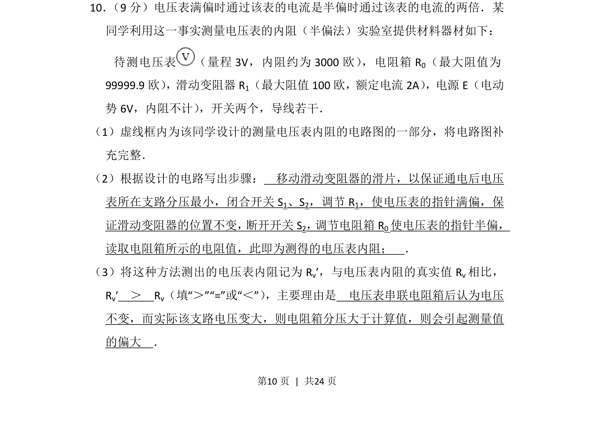
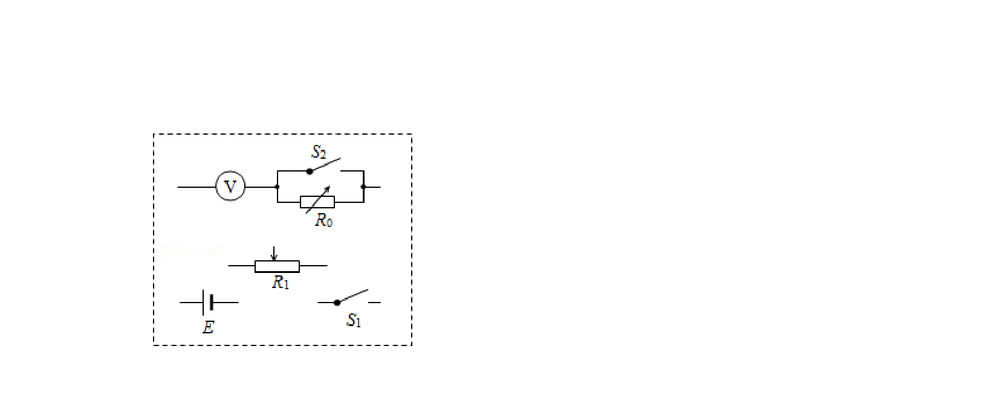
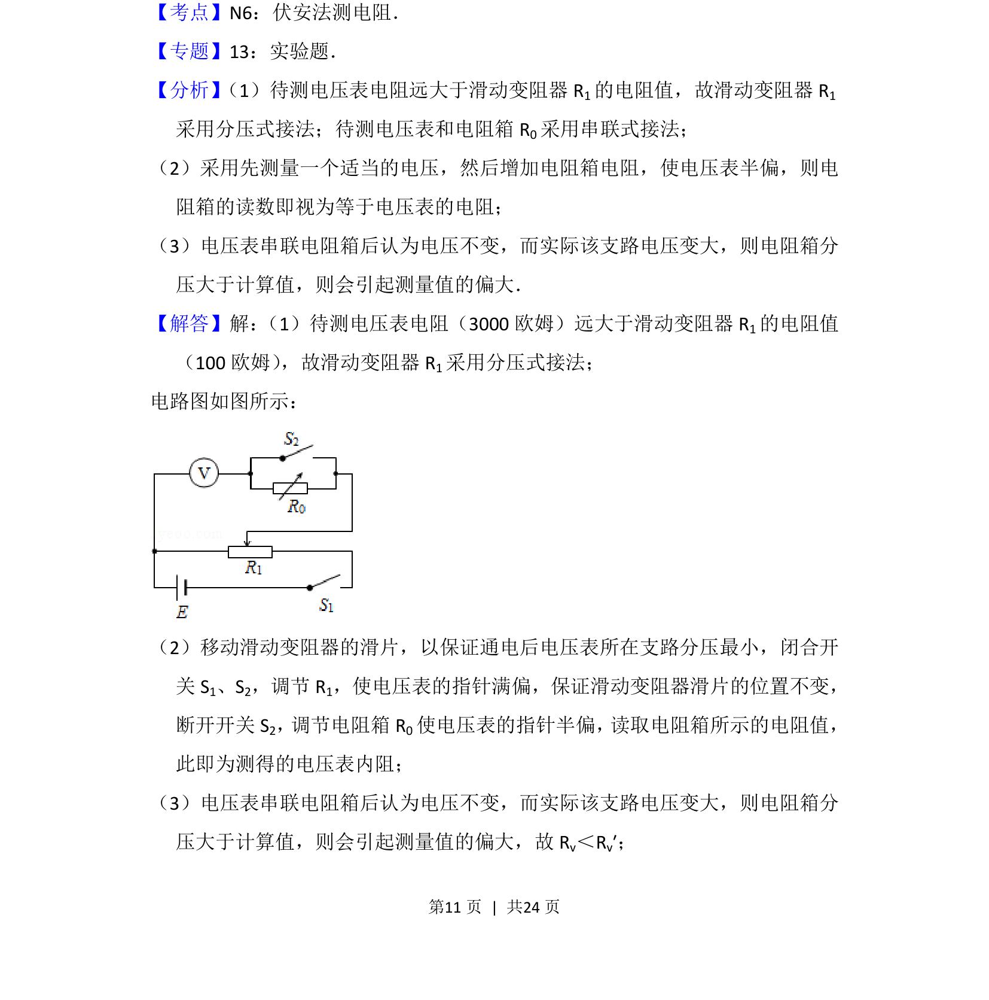
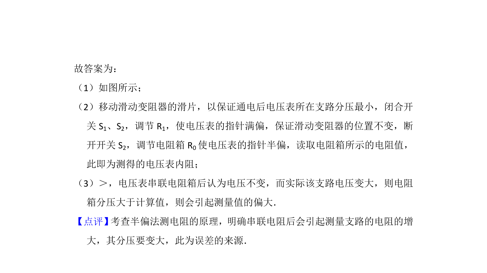

## 题面

## 摘要

半偏法测电压表内阻的电路设计、实验步骤及误差分析

## 关联考点

- [[546-半偏法|半偏法]]
- [[669-电压表内阻测量|电压表内阻测量]]
- [[697-电路设计|电路设计]]
- [[724-误差分析|误差分析]]

## 答案与解析

> 📄 原 PDF 第 10 页：`素材/真题/吉林/2008-2024·（吉林）物理高考真题/2015年高考物理试卷（新课标Ⅱ）（解析卷）.pdf`
