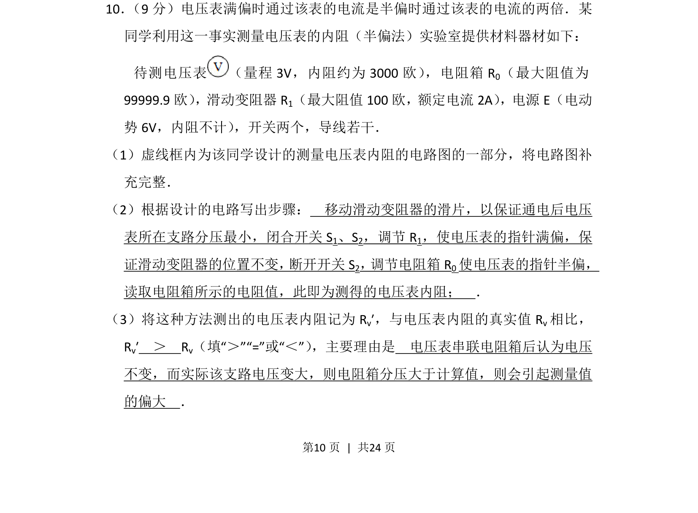
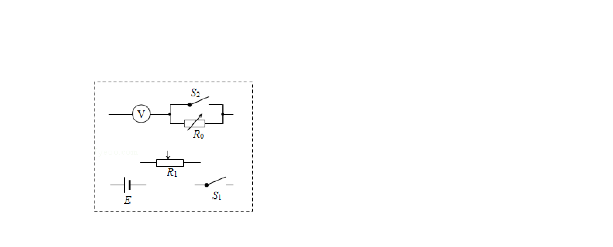
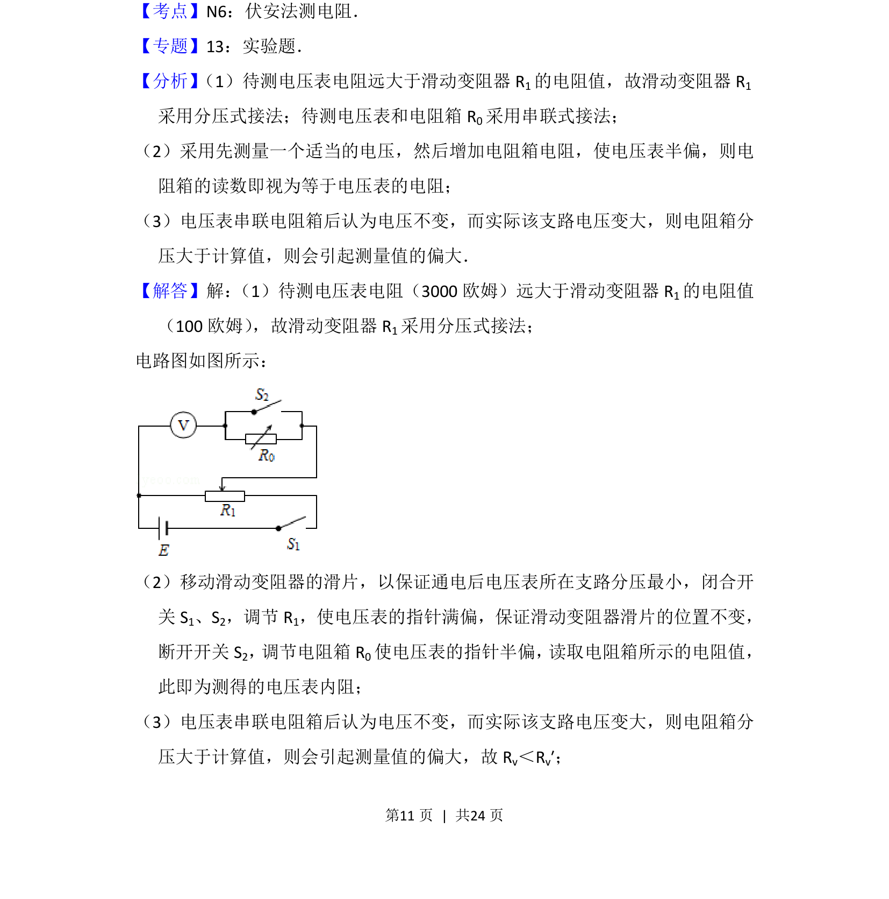
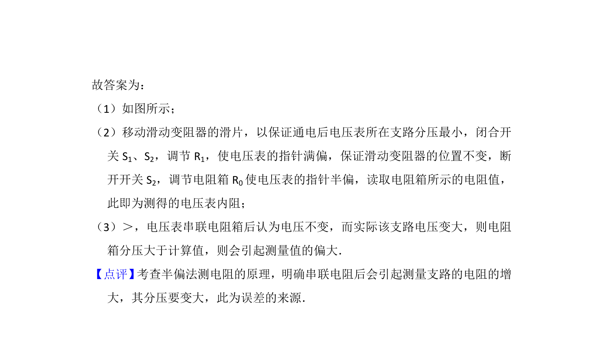

## 题面

## 摘要

半偏法测电压表内阻的电路设计、实验步骤及误差分析

## 关联考点

- [[546-半偏法|半偏法]]
- [[669-电压表内阻测量|电压表内阻测量]]
- [[697-电路设计|电路设计]]
- [[724-误差分析|误差分析]]

## 答案与解析

> 📄 原 PDF 第 10 页：`素材/真题/吉林/2008-2024·（吉林）物理高考真题/2015年高考物理试卷（新课标Ⅱ）（解析卷）.pdf`

<!-- 题干文本-start -->
## 题干文本
10． （9分）电压表满偏时通过该表的电流是半偏时通过该表的电流的两倍．某
同学利用这一事实测量电压表的内阻（半偏法）实验室提供材料器材如下：
    待测电压表 （量程3V，内阻约为3000欧） ，电阻箱R 0（最大阻值为
99999.9欧） ，滑动变阻器R1（最大阻值100欧，额定电流2A） ，电源E（电动
势6V，内阻不计） ，开关两个，导线若干．
（1）虚线框内为该同学设计的测量电压表内阻的电路图的一部分，将电路图补
充完整．
（2）根据设计的电路写出步骤：　移动滑动变阻器的滑片，以保证通电后电压
表所在支路分压最小，闭合开关S 1、S2，调节R 1，使电压表的指针满偏，保
证滑动变阻器的位置不变， 断开开关S2， 调节电阻箱R0使电压表的指针半偏，
读取电阻箱所示的电阻值，此即为测得的电压表内阻；　．
（3）将这种方法测出的电压表内阻记为R v′，与电压表内阻的真实值R v相比，
Rv′　＞　Rv（填“＞”“=”或“＜”） ，主要理由是　电压表串联电阻箱后认为电压
不变，而实际该支路电压变大，则电阻箱分压大于计算值，则会引起测量值
的偏大　．
<!-- 题干文本-end -->

<!-- 解析文本-start -->
## 解析文本

<!-- 解析文本-end -->
