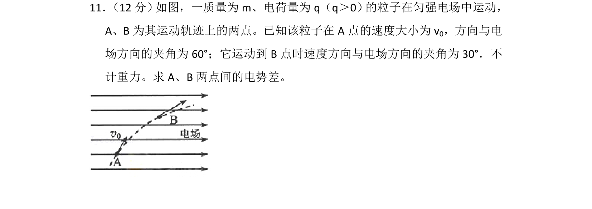
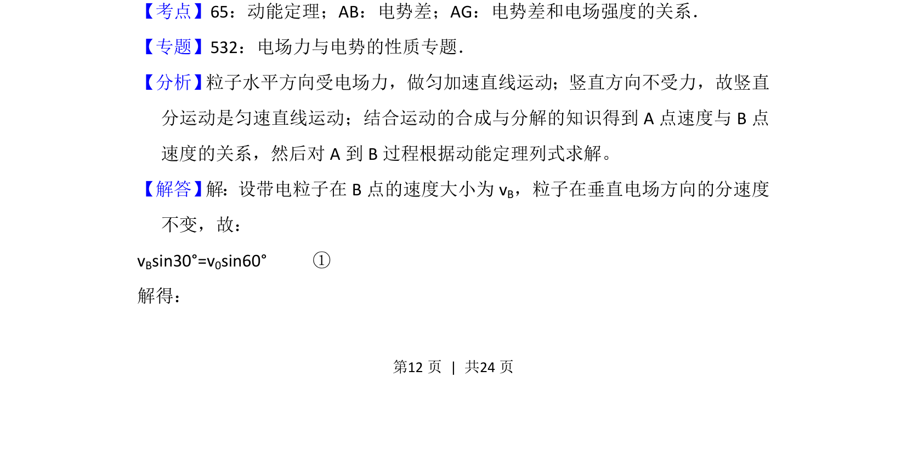
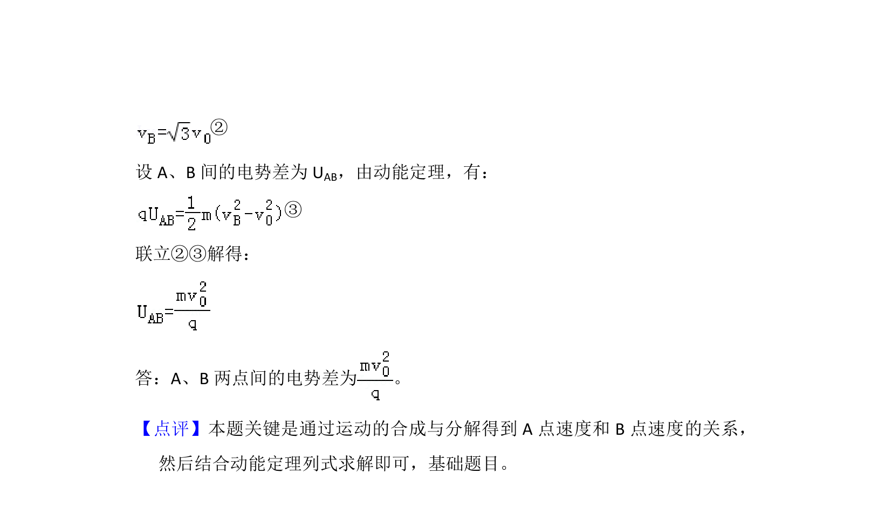

## 题面

## 摘要

带电粒子在匀强电场中运动，已知初末速度方向，求两点间电势差。

## 关联考点

- [[251-动能定理|动能定理]]
- [[288-运动的合成与分解|运动的合成与分解]]
- [[163-电压|电势差]]

## 答案与解析

> 📄 原 PDF 第 12 页：`素材/真题/吉林/2008-2024·（吉林）物理高考真题/2015年高考物理试卷（新课标Ⅱ）（解析卷）.pdf`
