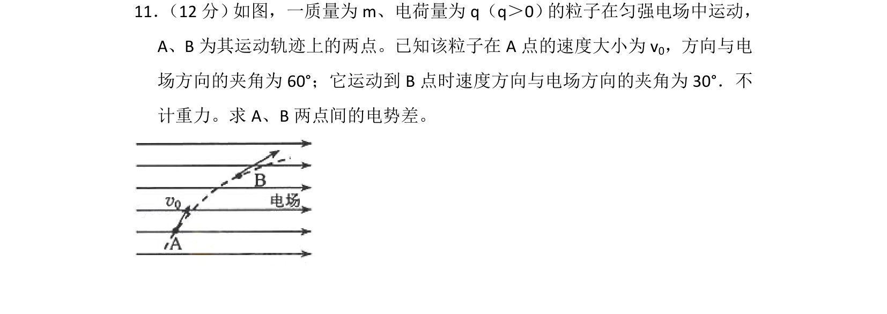
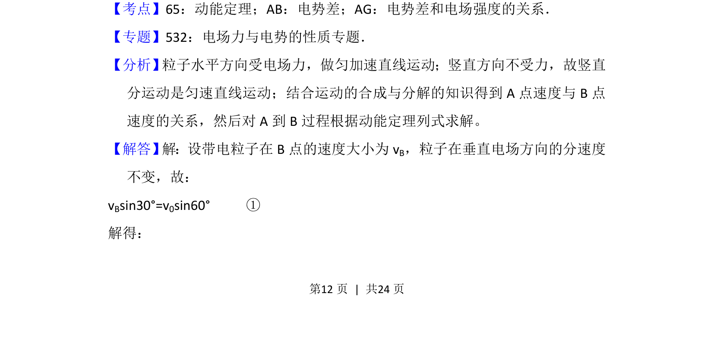
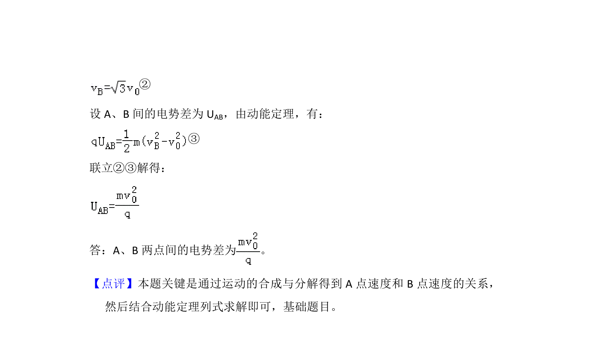

## 题面

## 摘要

带电粒子在匀强电场中运动，已知初末速度方向，求两点间电势差。

## 关联考点

- [[251-动能定理|动能定理]]
- [[288-运动的合成与分解|运动的合成与分解]]
- [[163-电压|电势差]]

## 答案与解析

> 📄 原 PDF 第 12 页：`素材/真题/吉林/2008-2024·（吉林）物理高考真题/2015年高考物理试卷（新课标Ⅱ）（解析卷）.pdf`

<!-- 题干文本-start -->
## 题干文本
11． （12分） 如图，一质量为m、电荷量为q（q＞0） 的粒子在匀强电场中运动，
A、B为其运动轨迹上的两点。已知该粒子在A点的速度大小为v 0，方向与电
场方向的夹角为60°；它运动到B点时速度方向与电场方向的夹角为30°．不
计重力。求A、B两点间的电势差。
<!-- 题干文本-end -->

<!-- 解析文本-start -->
## 解析文本
【考点】65：动能定理；AB：电势差；AG：电势差和电场强度的关系．菁优网版权所有
【专题】532：电场力与电势的性质专题．
【分析】 粒子水平方向受电场力，做匀加速直线运动；竖直方向不受力，故竖直
分运动是匀速直线运动；结合运动的合成与分解的知识得到A点速度与B点
速度的关系，然后对A到B过程根据动能定理列式求解。
【解答】 解：设带电粒子在B点的速度大小为vB，粒子在垂直电场方向的分速度
不变，故：
vBsin30°=v0sin60°     ①
解得：
<!-- 解析文本-end -->
