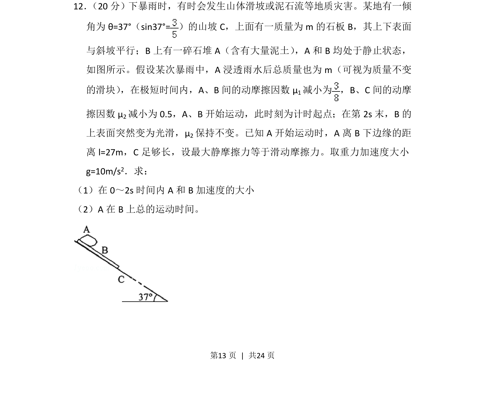
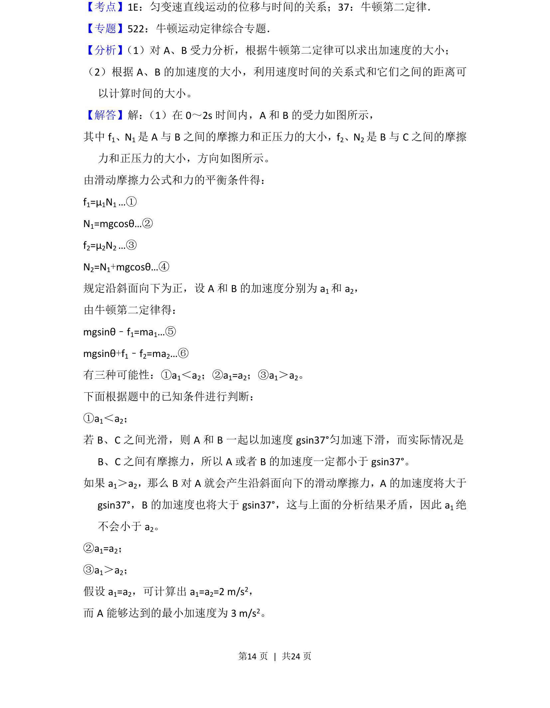
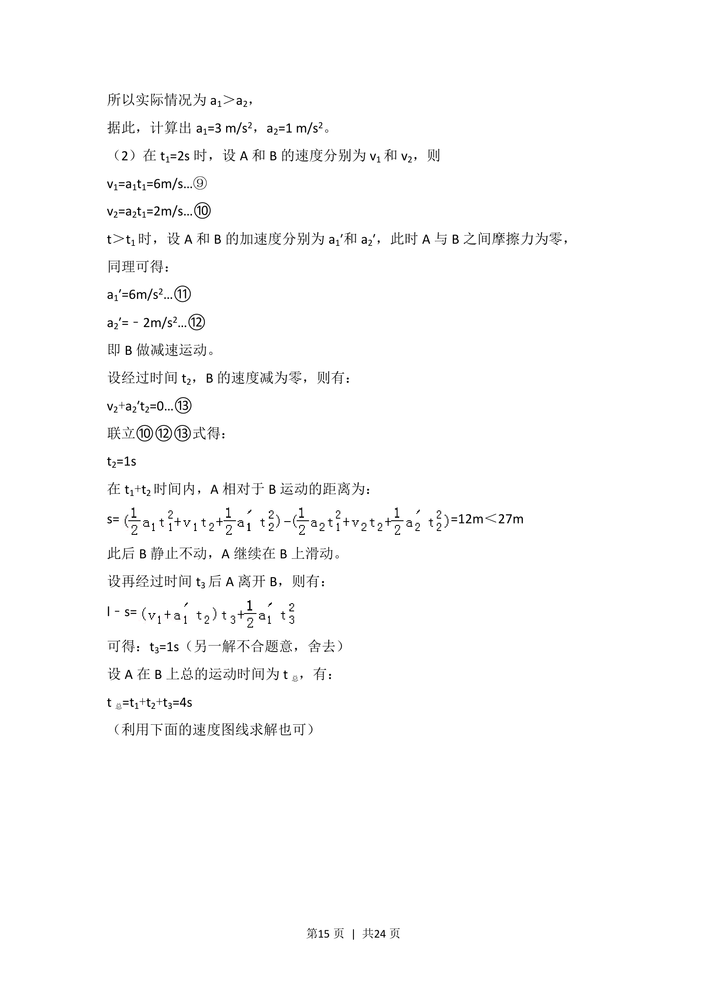
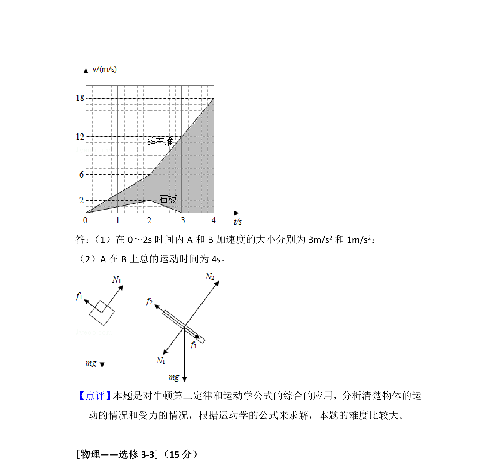

## 题面

## 摘要

考查板块模型在斜面情境下的受力分析和多过程运动学计算。

## 关联考点

- [[229-牛顿第二定律|牛顿第二定律]]
- [[097-滑动摩擦力|滑动摩擦力]]
- [[733-运动学公式|运动学公式]]
- [[280-相对运动|相对运动]]

## 答案与解析

> 📄 原 PDF 第 13 页：`素材/真题/吉林/2008-2024·（吉林）物理高考真题/2015年高考物理试卷（新课标Ⅱ）（解析卷）.pdf`
