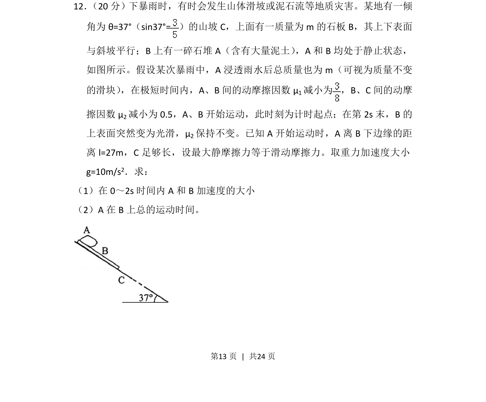
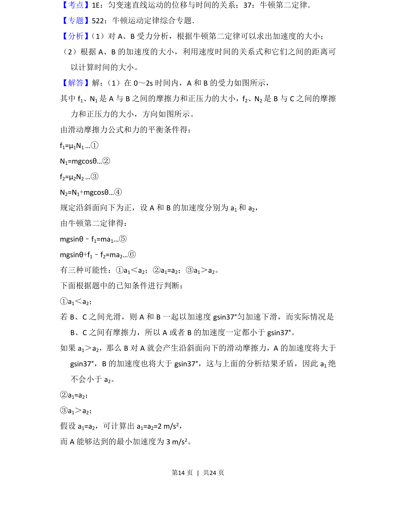
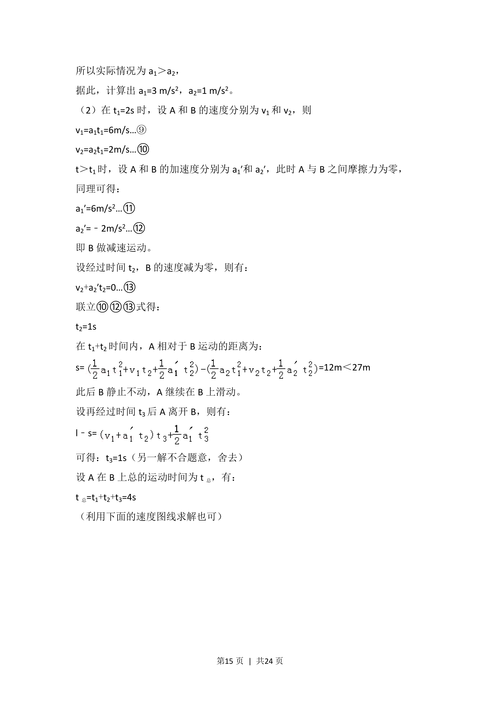
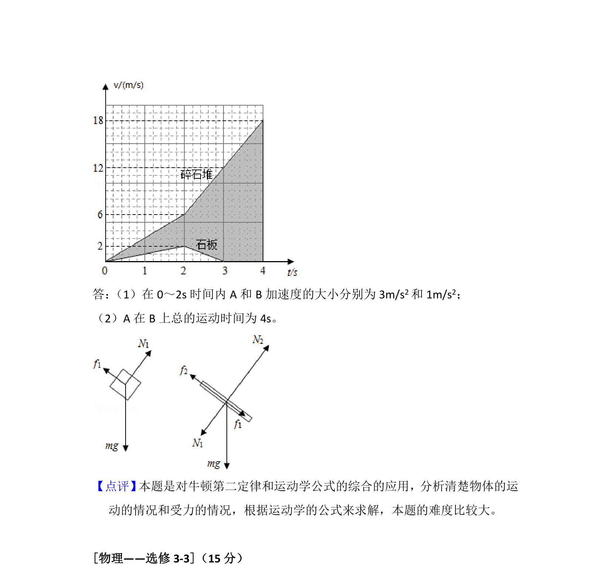

## 题面

## 摘要

考查板块模型在斜面情境下的受力分析和多过程运动学计算。

## 关联考点

- [[229-牛顿第二定律|牛顿第二定律]]
- [[097-滑动摩擦力|滑动摩擦力]]
- [[733-运动学公式|运动学公式]]
- [[280-相对运动|相对运动]]

## 答案与解析

> 📄 原 PDF 第 13 页：`素材/真题/吉林/2008-2024·（吉林）物理高考真题/2015年高考物理试卷（新课标Ⅱ）（解析卷）.pdf`

<!-- 题干文本-start -->
## 题干文本
12． （20分）下暴雨时，有时会发生山体滑坡或泥石流等地质灾害。某地有一倾
角为θ=37°（sin37°=）的山坡C，上面有一质量为m的石板B，其上下表面
与斜坡平行；B上有一碎石堆A（含有大量泥土） ，A和B均处于静止状态，
如图所示。假设某次暴雨中，A浸透雨水后总质量也为m（可视为质量不变
的滑块） ，在极短时间内，A、B间的动摩擦因数μ1减小为 ，B、C间的动摩
擦因数μ 2减小为0.5，A、B开始运动，此时刻为计时起点；在第2s末，B的
上表面突然变为光滑，μ 2保持不变。已知A开始运动时，A离B下边缘的距
离l=27m，C足够长，设最大静摩擦力等于滑动摩擦力。取重力加速度大小
g=10m/s2．求：
（1）在0～2s时间内A和B加速度的大小
（2）A在B上总的运动时间。
<!-- 题干文本-end -->

<!-- 解析文本-start -->
## 解析文本

<!-- 解析文本-end -->
