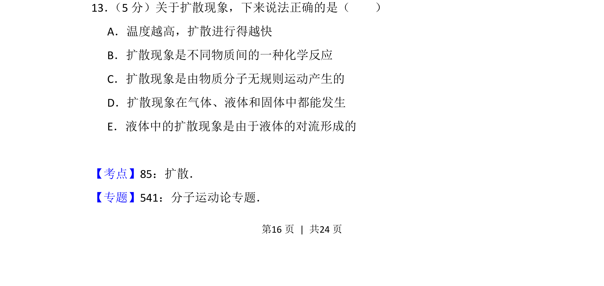
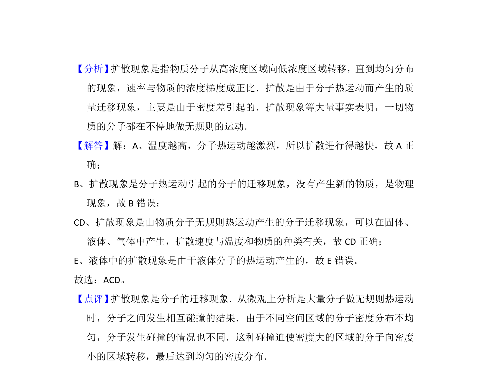

## 题面

## 摘要

温度对扩散速度的影响及扩散现象的本质和发生条件。

## 关联考点

- [[612-扩散现象|扩散现象]]
- [[129-分子动理论|分子运动论]]
- [[659-热运动|热运动]]

## 答案与解析

> 📄 原 PDF 第 16 页：`素材/真题/吉林/2008-2024·（吉林）物理高考真题/2015年高考物理试卷（新课标Ⅱ）（解析卷）.pdf`

<!-- 题干文本-start -->
## 题干文本
13． （5分）关于扩散现象，下来说法正确的是（　　）
A．温度越高，扩散进行得越快
B．扩散现象是不同物质间的一种化学反应
C．扩散现象是由物质分子无规则运动产生的
D．扩散现象在气体、液体和固体中都能发生
E．液体中的扩散现象是由于液体的对流形成的
<!-- 题干文本-end -->

<!-- 解析文本-start -->
## 解析文本
【考点】85：扩散．菁优网版权所有
【专题】541：分子运动论专题．
<!-- 解析文本-end -->
