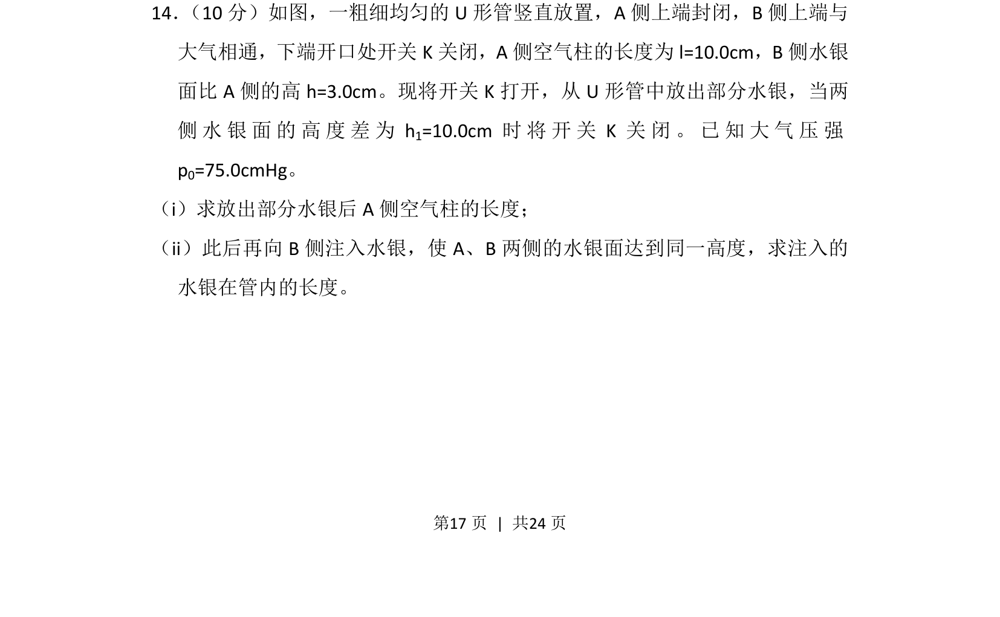
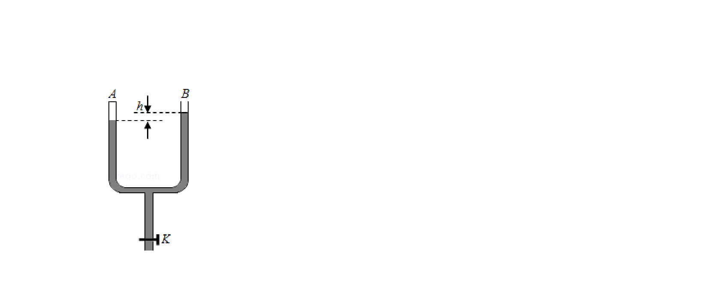
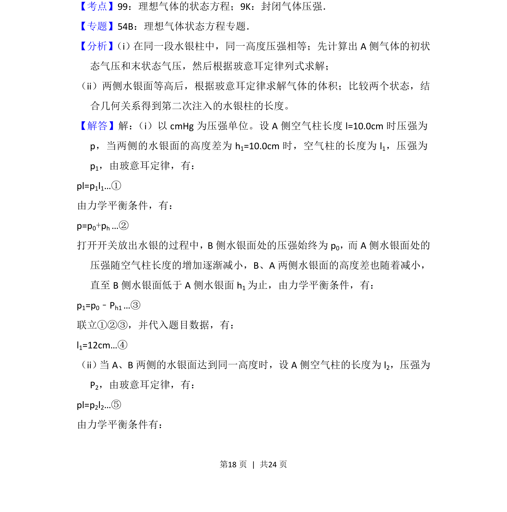
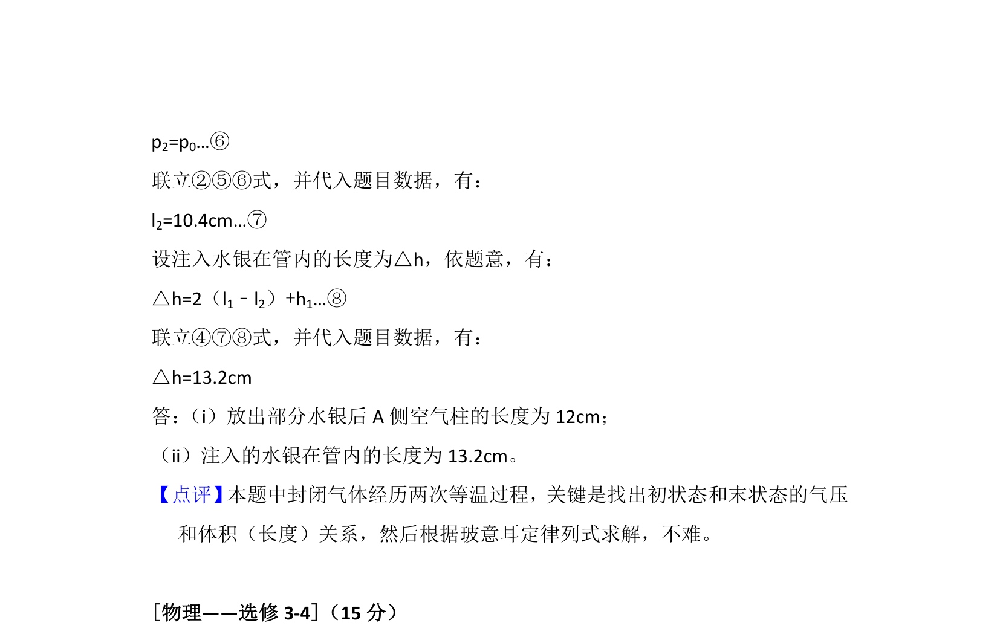

## 题面

## 摘要

考查玻意耳定律在U形管问题中的应用，根据压强与体积关系求解空气柱长度及注入水银量。

## 关联考点

- [[444-玻意耳定律|玻意耳定律]]
- [[549-压强平衡|压强平衡]]
- [[652-体积计算|体积计算]]

## 答案与解析

> 📄 原 PDF 第 17 页：`素材/真题/吉林/2008-2024·（吉林）物理高考真题/2015年高考物理试卷（新课标Ⅱ）（解析卷）.pdf`
