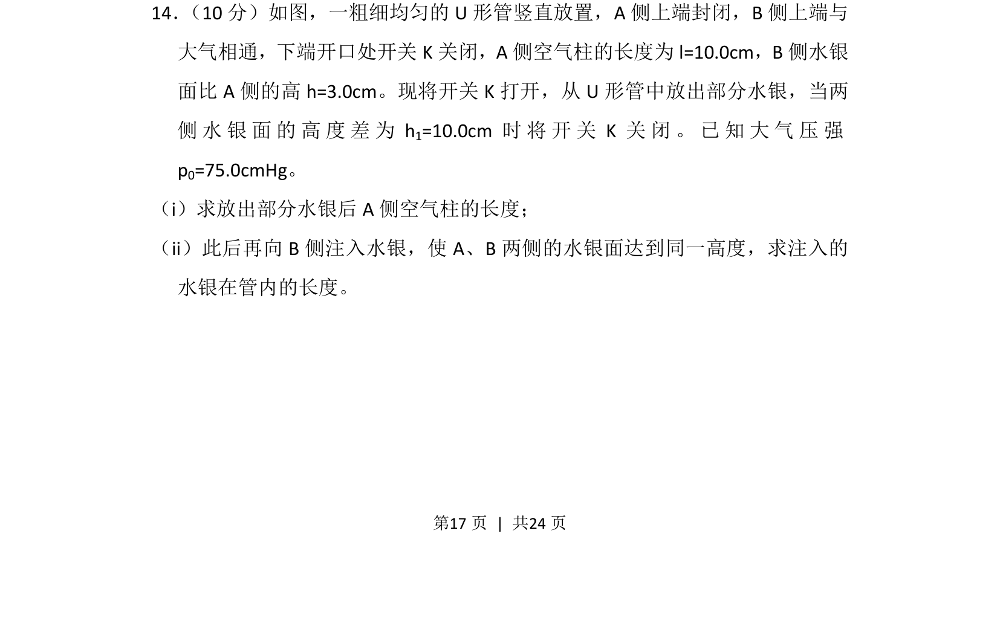
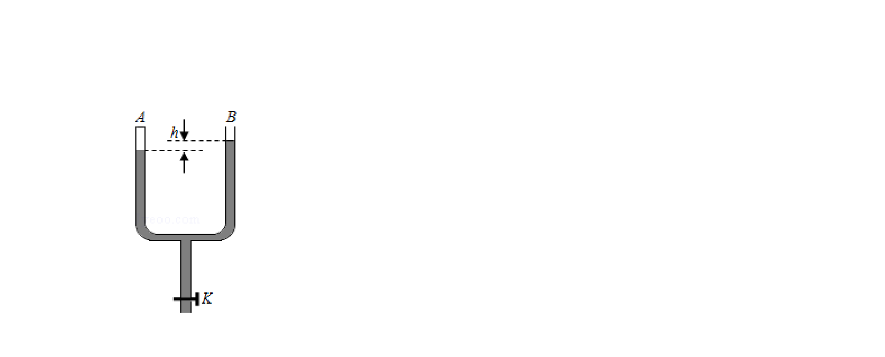
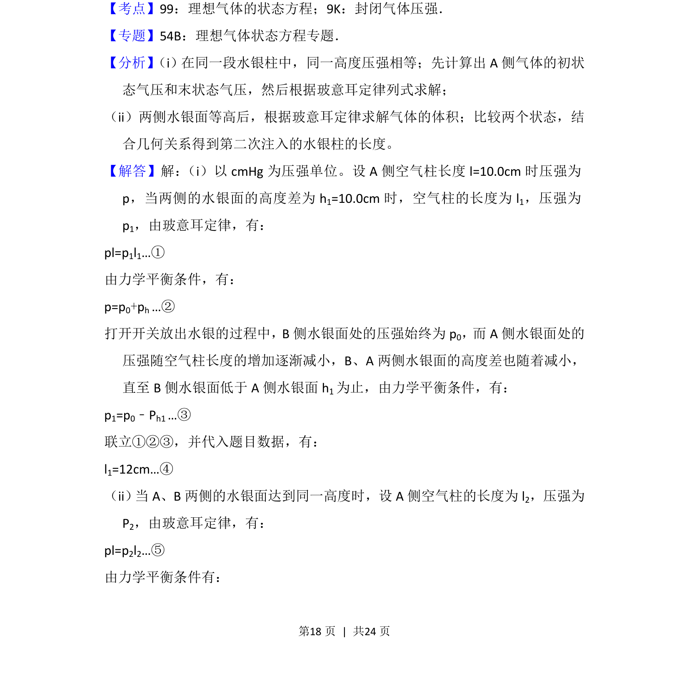
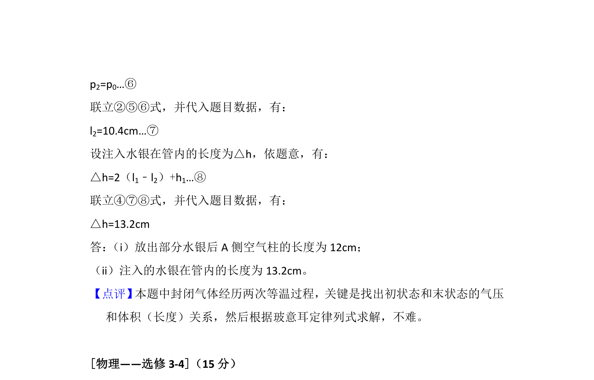

## 题面

## 摘要

考查玻意耳定律在U形管问题中的应用，根据压强与体积关系求解空气柱长度及注入水银量。

## 关联考点

- [[444-玻意耳定律|玻意耳定律]]
- [[549-压强平衡|压强平衡]]
- [[652-体积计算|体积计算]]

## 答案与解析

> 📄 原 PDF 第 17 页：`素材/真题/吉林/2008-2024·（吉林）物理高考真题/2015年高考物理试卷（新课标Ⅱ）（解析卷）.pdf`

<!-- 题干文本-start -->
## 题干文本
14． （10分）如图，一粗细均匀的U形管竖直放置，A侧上端封闭，B侧上端与
大气相通，下端开口处开关K关闭，A侧空气柱的长度为l=10.0cm，B侧水银
面比A侧的高h=3.0cm。现将开关K打开，从U形管中放出部分水银，当两
侧水银面的高度差为h 1=10.0cm时将开关K关闭。已知大气压强
p0=75.0cmHg。
（i）求放出部分水银后A侧空气柱的长度；
（ii）此后再向B侧注入水银，使A、B两侧的水银面达到同一高度，求注入的
水银在管内的长度。
<!-- 题干文本-end -->

<!-- 解析文本-start -->
## 解析文本

<!-- 解析文本-end -->
