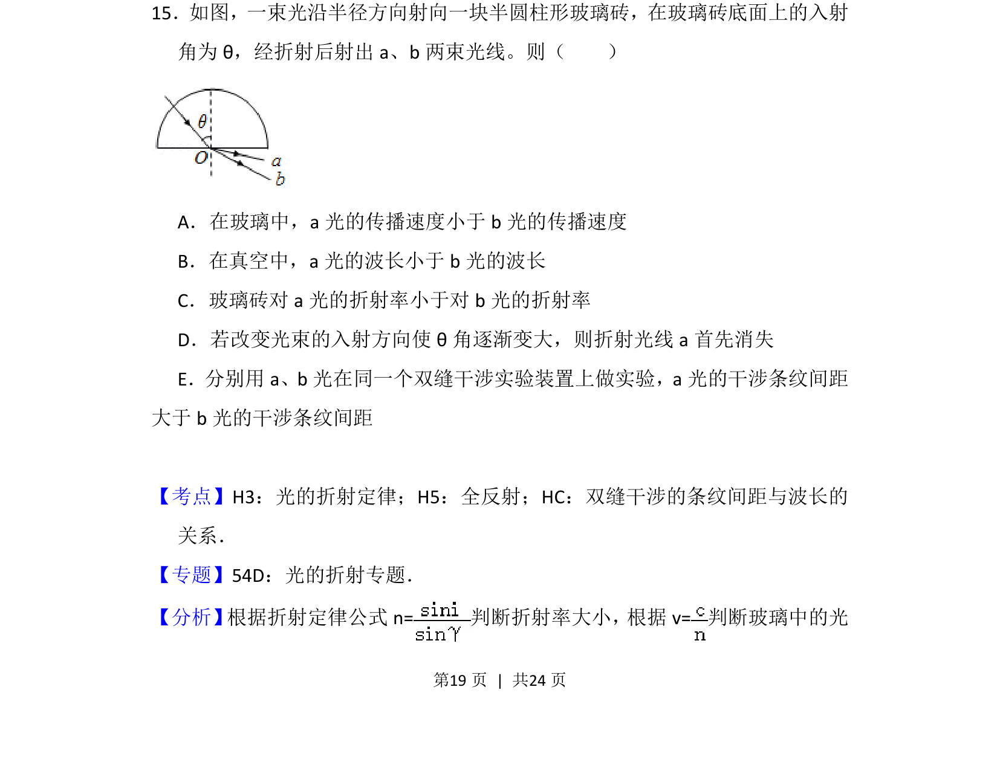
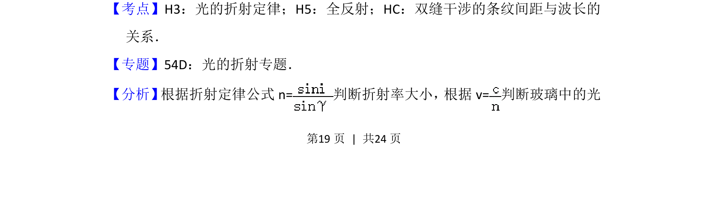
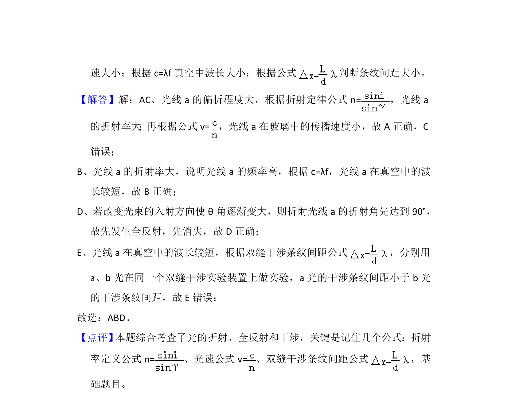

## 题面

## 摘要

该题考查光的折射定律、全反射条件及双缝干涉条纹间距与波长的关系。

## 关联考点

- [[520-光的折射定律|光的折射定律]]
- [[343-全反射|全反射]]
- [[553-双缝干涉条纹间距|双缝干涉条纹间距]]

## 答案与解析

> 📄 原 PDF 第 19 页：`素材/真题/吉林/2008-2024·（吉林）物理高考真题/2015年高考物理试卷（新课标Ⅱ）（解析卷）.pdf`

<!-- 题干文本-start -->
## 题干文本
15．如图，一束光沿半径方向射向一块半圆柱形玻璃砖，在玻璃砖底面上的入射
角为θ，经折射后射出a、b两束光线。则（　　）
A．在玻璃中，a光的传播速度小于b光的传播速度
B．在真空中，a光的波长小于b光的波长
C．玻璃砖对a光的折射率小于对b光的折射率
D．若改变光束的入射方向使θ角逐渐变大，则折射光线a首先消失
E．分别用a、b光在同一个双缝干涉实验装置上做实验，a光的干涉条纹间距
大于b光的干涉条纹间距
<!-- 题干文本-end -->

<!-- 解析文本-start -->
## 解析文本
【考点】H3：光的折射定律；H5：全反射；HC：双缝干涉的条纹间距与波长的
关系．菁优网版权所有
【专题】54D：光的折射专题．
【分析】 根据折射定律公式n=判断折射率大小， 根据v=判断玻璃中的光
<!-- 解析文本-end -->
