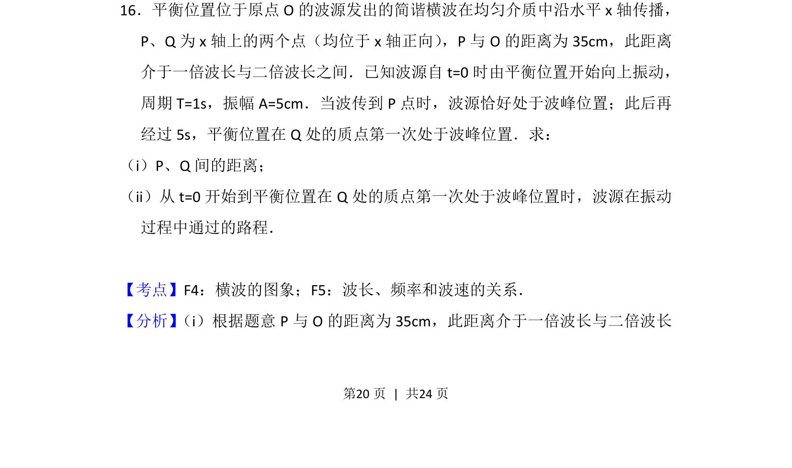
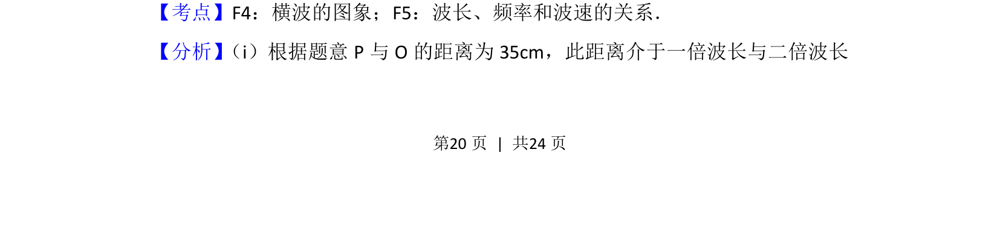
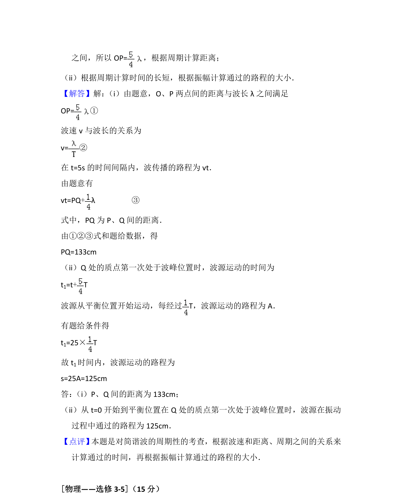

## 题面

## 摘要

考查简谐横波传播规律，利用波长、周期及质点振动状态求两点间距离和波源振动路程。

## 关联考点

- [[630-横波的图象|横波的图象]]
- [[370-波长|波长]]
- [[749-频率和波速的关系|频率和波速的关系]]

## 答案与解析

> 📄 原 PDF 第 20 页：`素材/真题/吉林/2008-2024·（吉林）物理高考真题/2015年高考物理试卷（新课标Ⅱ）（解析卷）.pdf`

<!-- 题干文本-start -->
## 题干文本
16．平衡位置位于原点O的波源发出的简谐横波在均匀介质中沿水平x轴传播，
P、Q为x轴上的两个点（均位于x轴正向） ，P与O的距离为35cm，此距离
介于一倍波长与二倍波长之间．已知波源自t=0时由平衡位置开始向上振动，
周期T=1s，振幅A=5cm．当波传到P点时，波源恰好处于波峰位置；此后再
经过5s，平衡位置在Q处的质点第一次处于波峰位置．求：
（i）P、Q间的距离；
（ii）从t=0开始到平衡位置在Q处的质点第一次处于波峰位置时，波源在振动
过程中通过的路程．
<!-- 题干文本-end -->

<!-- 解析文本-start -->
## 解析文本
【考点】F4：横波的图象；F5：波长、频率和波速的关系．菁优网版权所有
【分析】 （i）根据题意P与O的距离为35cm，此距离介于一倍波长与二倍波长
<!-- 解析文本-end -->
