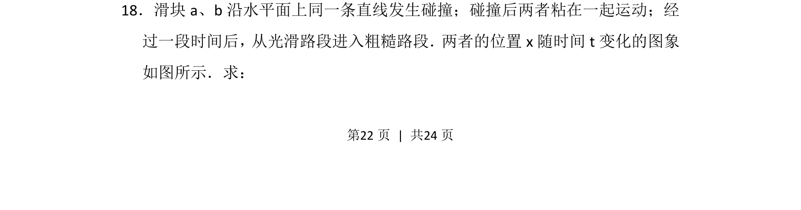
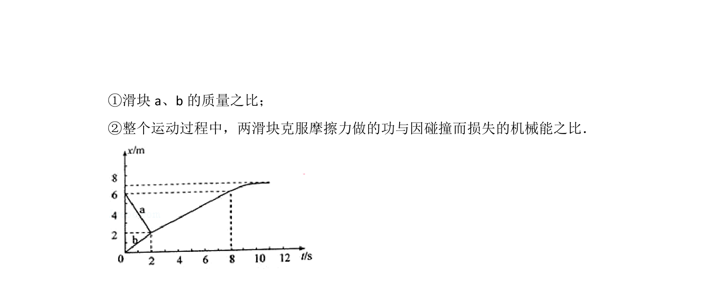
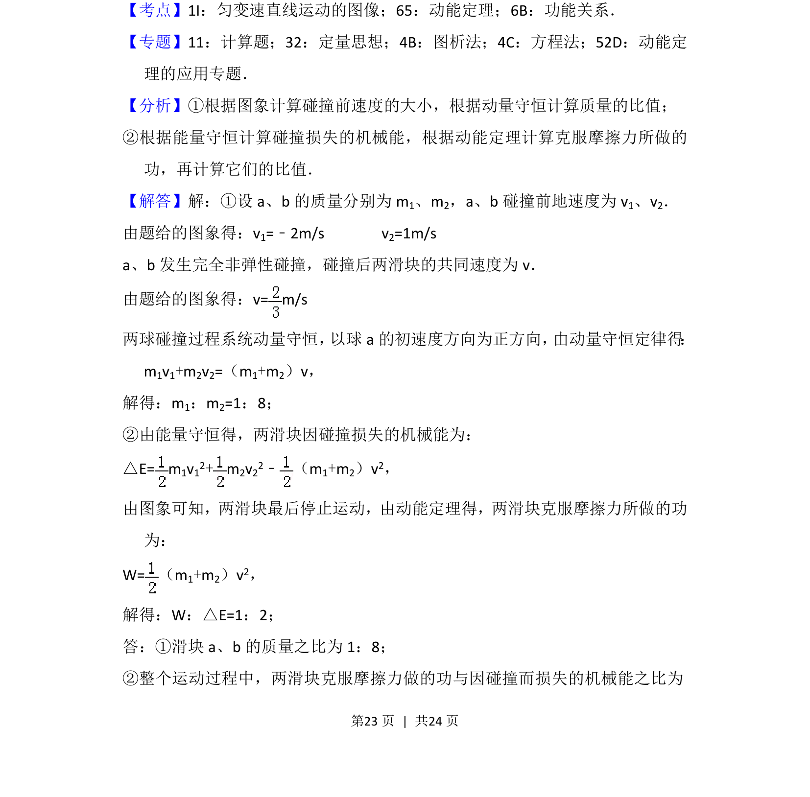
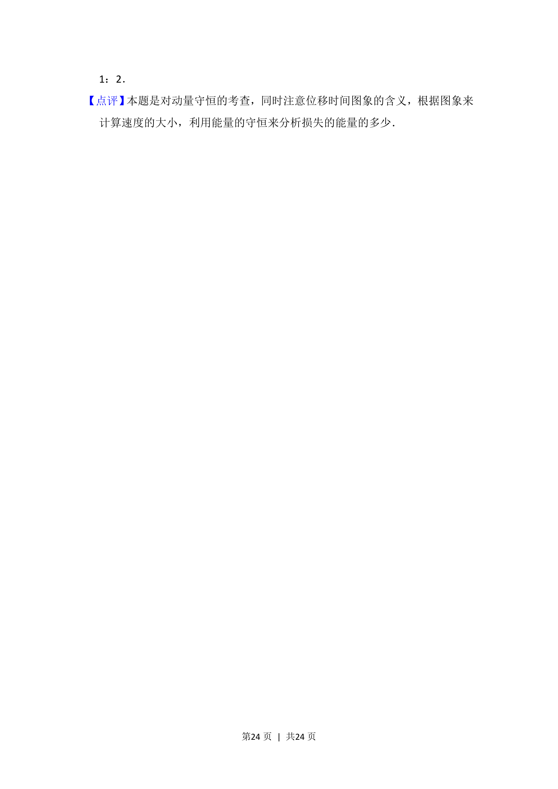

## 题面

## 摘要

滑块碰撞的x-t图象分析，求碰撞前后速度及粗糙段运动情况

## 关联考点

- [[215-匀变速直线运动|匀变速直线运动]]
- [[539-动量守恒|动量守恒]]
- [[570-图象分析|图象分析]]

## 答案与解析

> 📄 原 PDF 第 22 页：`素材/真题/吉林/2008-2024·（吉林）物理高考真题/2015年高考物理试卷（新课标Ⅱ）（解析卷）.pdf`
