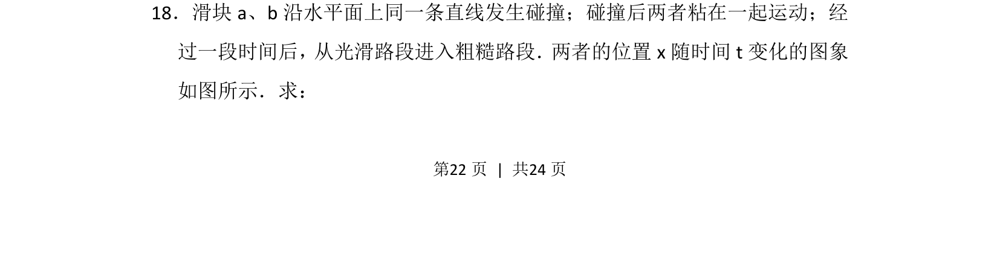
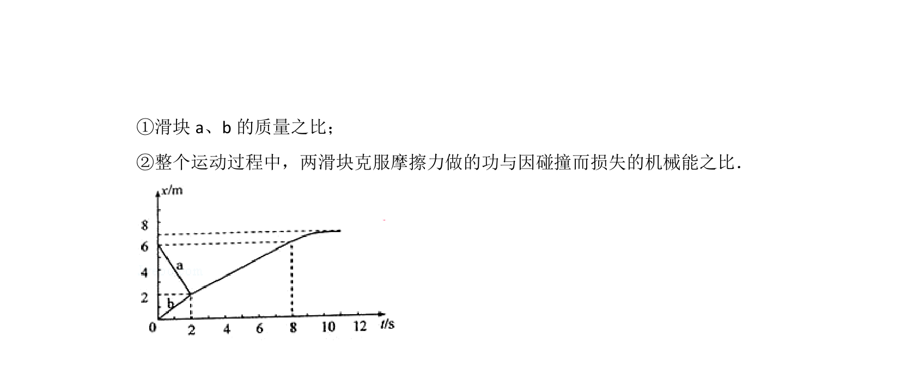
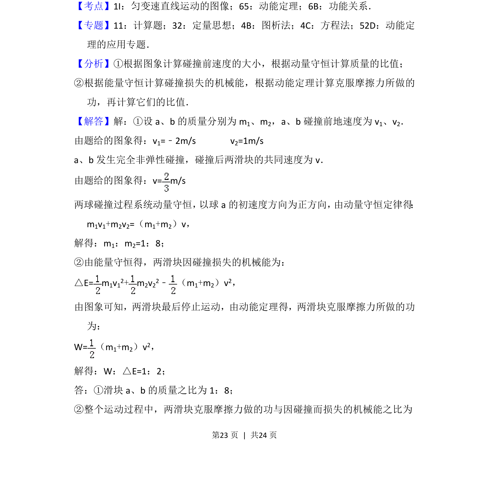
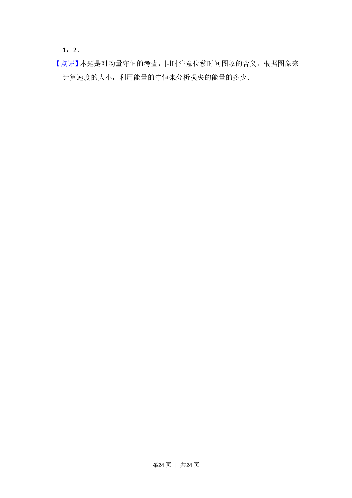

## 题面

## 摘要

滑块碰撞的x-t图象分析，求碰撞前后速度及粗糙段运动情况

## 关联考点

- [[215-匀变速直线运动|匀变速直线运动]]
- [[539-动量守恒|动量守恒]]
- [[564-图像分析|图象分析]]

## 答案与解析

> 📄 原 PDF 第 22 页：`素材/真题/吉林/2008-2024·（吉林）物理高考真题/2015年高考物理试卷（新课标Ⅱ）（解析卷）.pdf`

<!-- 题干文本-start -->
## 题干文本
18．滑块a、b沿水平面上同一条直线发生碰撞；碰撞后两者粘在一起运动；经
过一段时间后，从光滑路段进入粗糙路段．两者的位置x随时间t变化的图象
如图所示．求：
<!-- 题干文本-end -->

<!-- 解析文本-start -->
## 解析文本

<!-- 解析文本-end -->
