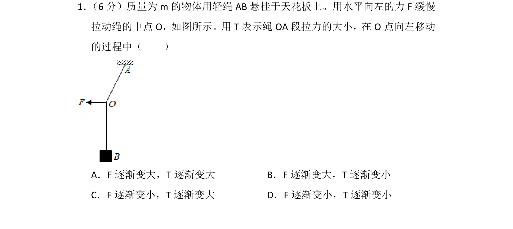
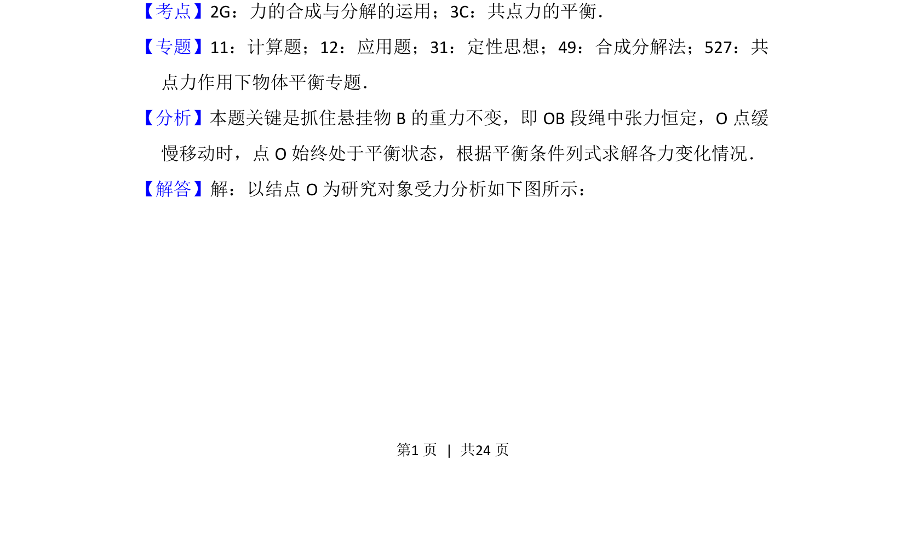
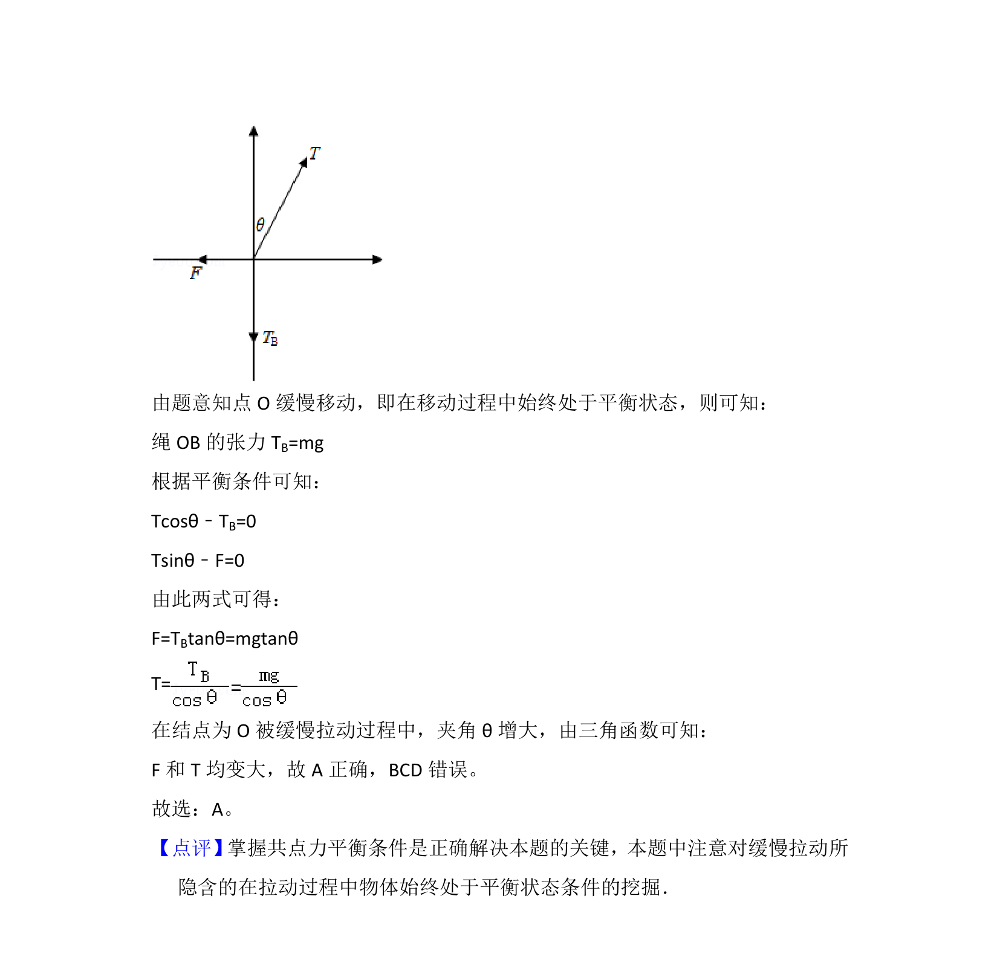

## 题面

## 摘要

本题通过共点力平衡分析绳的拉力与外力变化，考查受力分析与动态平衡。

## 关联考点

- [[532-力的合成与分解|力的合成与分解]]
- [[208-共点力平衡|共点力平衡]]
- [[536-动态平衡分析|动态平衡分析]]

## 答案与解析

> 📄 原 PDF 第 1 页：`素材/真题/吉林/2008-2024·（吉林）物理高考真题/2016年高考物理试卷（新课标Ⅱ）（解析卷）.pdf`
