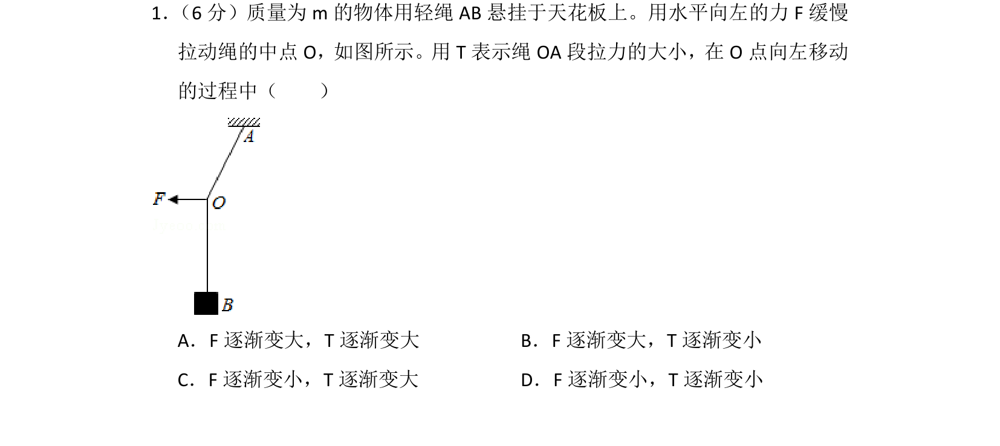
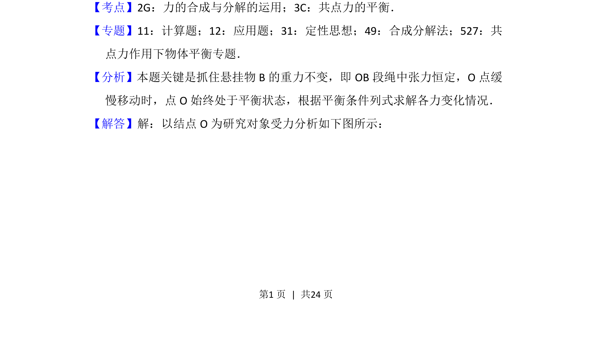
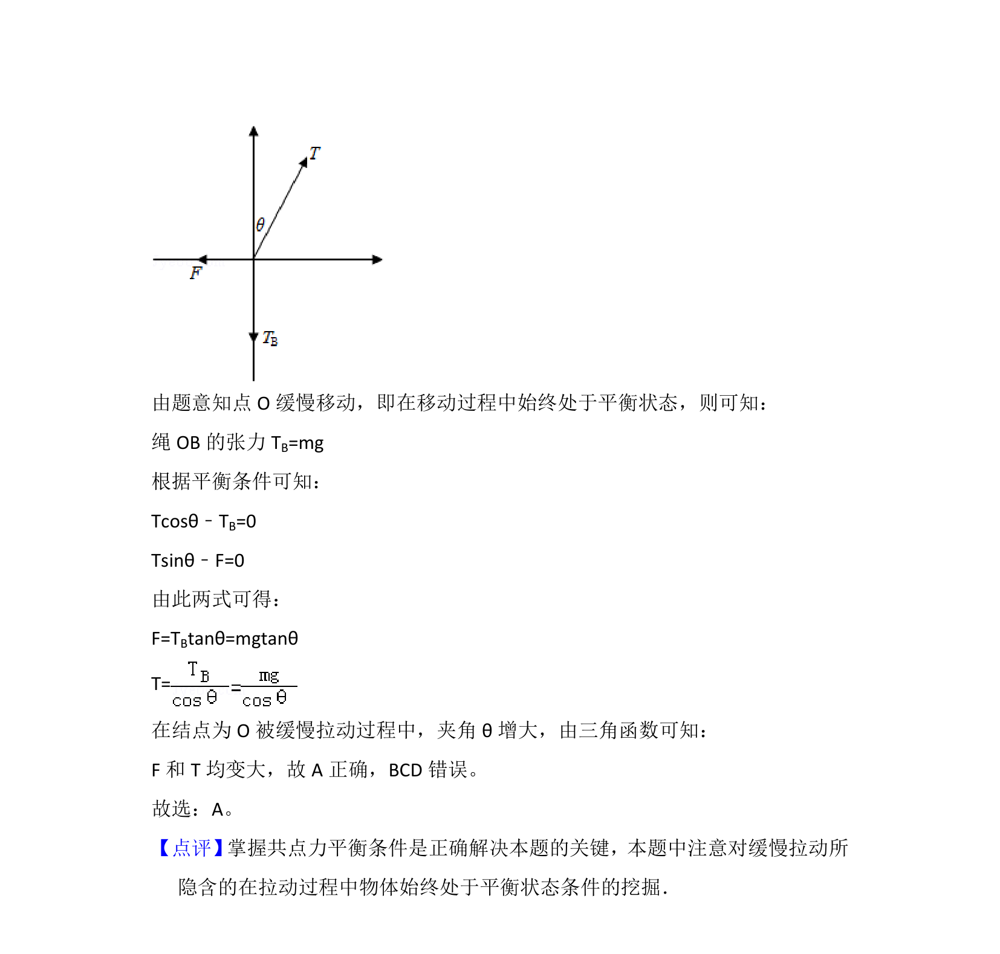

## 题面

## 摘要

本题通过共点力平衡分析绳的拉力与外力变化，考查受力分析与动态平衡。

## 关联考点

- [[532-力的合成与分解|力的合成与分解]]
- [[208-共点力平衡|共点力平衡]]
- [[536-动态平衡分析|动态平衡分析]]

## 答案与解析

> 📄 原 PDF 第 1 页：`素材/真题/吉林/2008-2024·（吉林）物理高考真题/2016年高考物理试卷（新课标Ⅱ）（解析卷）.pdf`

<!-- 题干文本-start -->
## 题干文本
1． （6分）质量为m的物体用轻绳AB悬挂于天花板上。用水平向左的力F缓慢
拉动绳的中点O，如图所示。用T表示绳OA段拉力的大小，在O点向左移动
的过程中（　　）
A．F逐渐变大，T逐渐变大B．F逐渐变大，T逐渐变小
C．F逐渐变小，T逐渐变大D．F逐渐变小，T逐渐变小
<!-- 题干文本-end -->

<!-- 解析文本-start -->
## 解析文本
【考点】2G：力的合成与分解的运用；3C：共点力的平衡．菁优网版权所有
【专题】11：计算题；12：应用题；31：定性思想；49：合成分解法；527：共
点力作用下物体平衡专题．
【分析】本题关键是抓住悬挂物B的重力不变，即OB段绳中张力恒定，O点缓
慢移动时，点O始终处于平衡状态，根据平衡条件列式求解各力变化情况．
【解答】解：以结点O为研究对象受力分析如下图所示：
<!-- 解析文本-end -->
