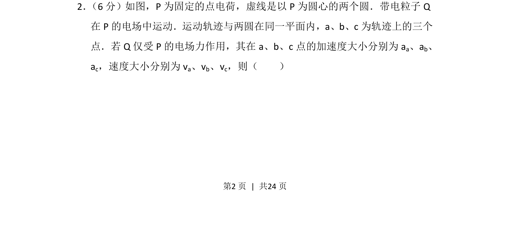
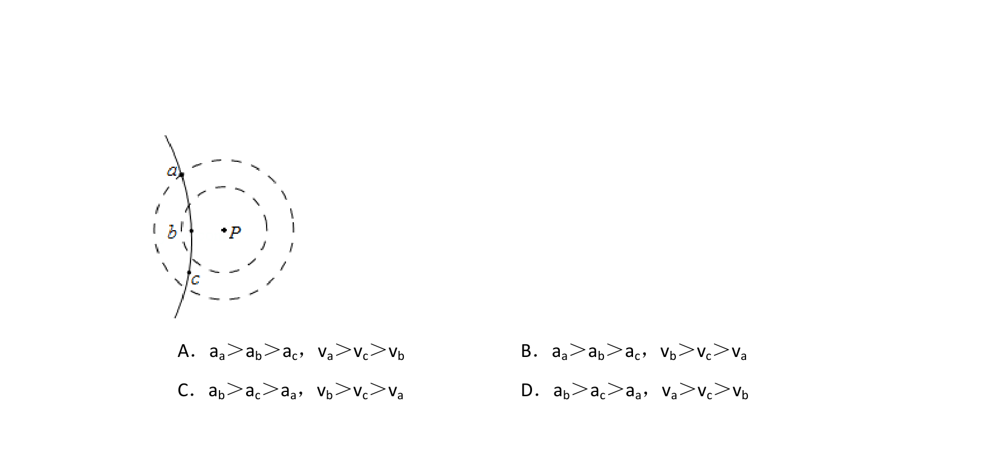
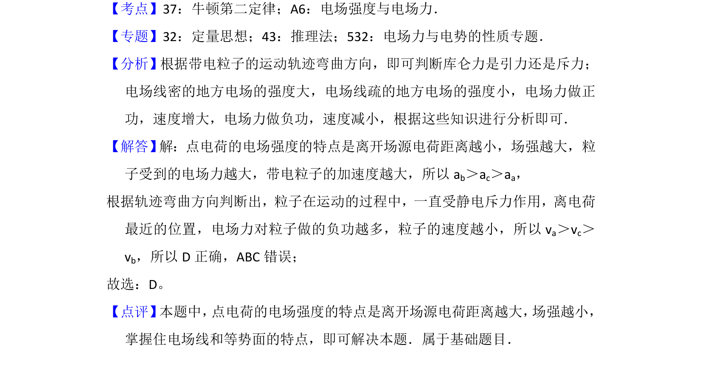

## 题面

## 摘要

本题考查带电粒子在点电荷电场中的加速度与速度变化关系。

## 关联考点

- [[263-库仑定律|库仑定律]]
- [[277-电场强度|电场强度]]
- [[229-牛顿第二定律|牛顿第二定律]]
- [[276-电势能|电势能]]

## 答案与解析

> 📄 原 PDF 第 2 页：`素材/真题/吉林/2008-2024·（吉林）物理高考真题/2016年高考物理试卷（新课标Ⅱ）（解析卷）.pdf`
