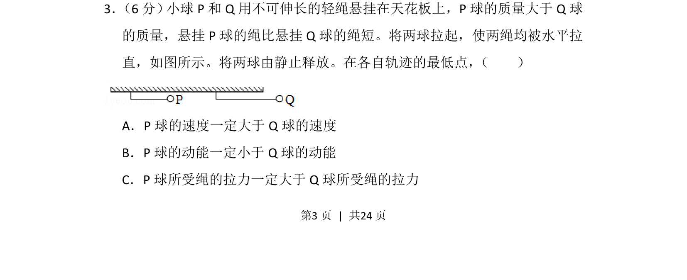

## 题面

## 摘要

两球从水平释放到最低点，比较速度、动能和拉力大小，涉及机械能守恒与圆周运动。

## 关联考点

- [[085-机械能守恒-初中|机械能守恒定律]]
- [[圆周运动向心力]]
- [[251-动能定理|动能定理]]

## 答案与解析

> 📄 原 PDF 第 3 页：`素材/真题/吉林/2008-2024·（吉林）物理高考真题/2016年高考物理试卷（新课标Ⅱ）（解析卷）.pdf`
