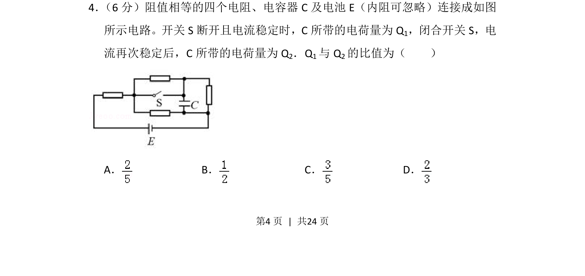
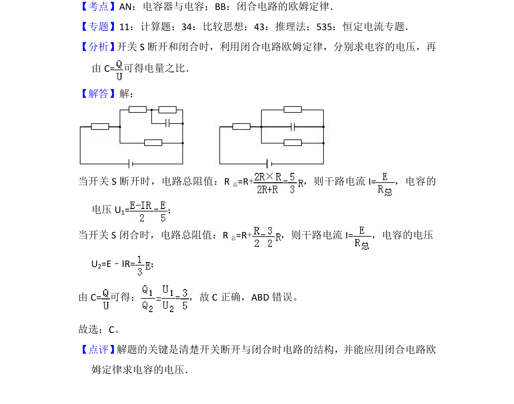

## 题面

## 摘要

四个等值电阻与电容器、电池组成的电路，通过开关通断改变电路结构，求电容器所带电荷量之比。

## 关联考点

- [[462-含容电路分析|含容电路分析]]
- [[698-电阻串并联|电阻串并联]]
- [[677-电容器电压|电容器电压]]
- [[678-电容定义式|电容定义式]]

## 答案与解析

> 📄 原 PDF 第 4 页：`素材/真题/吉林/2008-2024·（吉林）物理高考真题/2016年高考物理试卷（新课标Ⅱ）（解析卷）.pdf`
