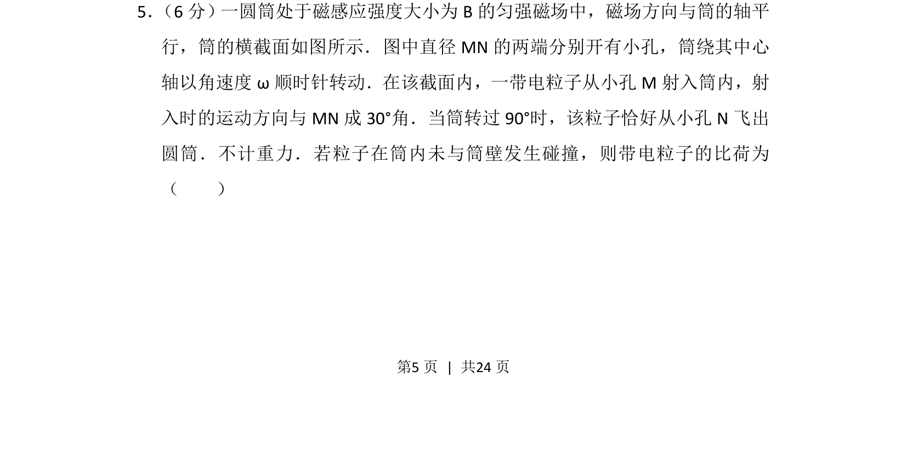
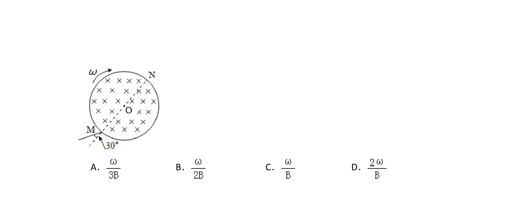
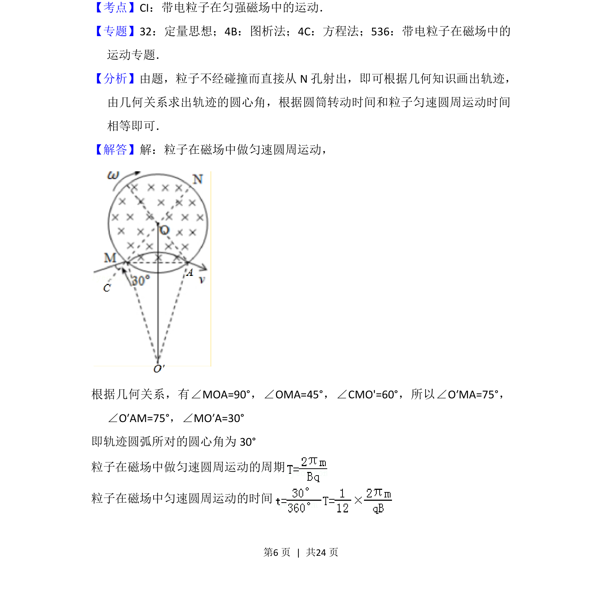
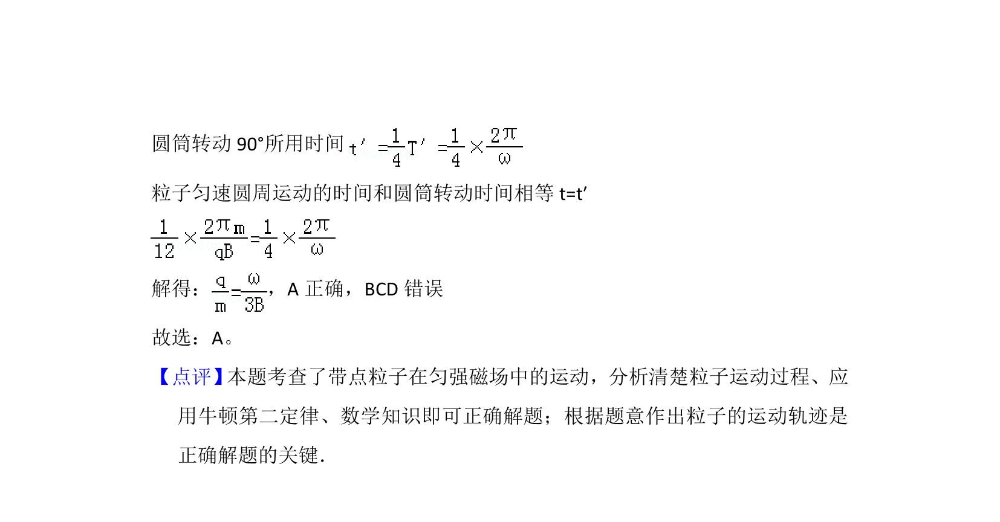

## 题面

## 摘要

带电粒子在匀强磁场与旋转圆筒中运动，通过几何关系与周期公式求比荷。

## 关联考点

- [[525-几何角度关系|几何角度关系]]
- [[573-圆周运动周期|圆周运动周期]]
- [[635-比荷计算|比荷计算]]

## 答案与解析

> 📄 原 PDF 第 5 页：`素材/真题/吉林/2008-2024·（吉林）物理高考真题/2016年高考物理试卷（新课标Ⅱ）（解析卷）.pdf`
