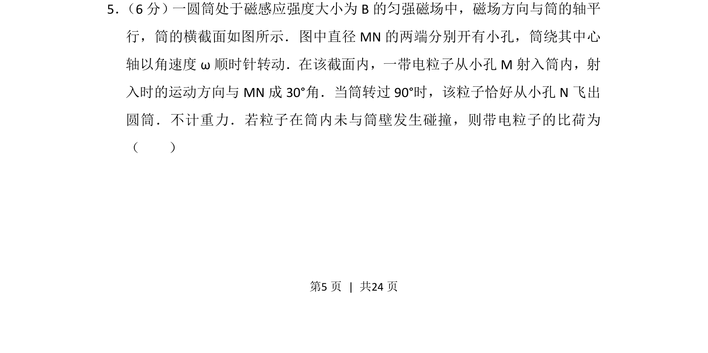
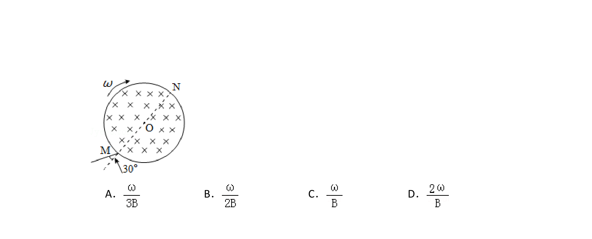
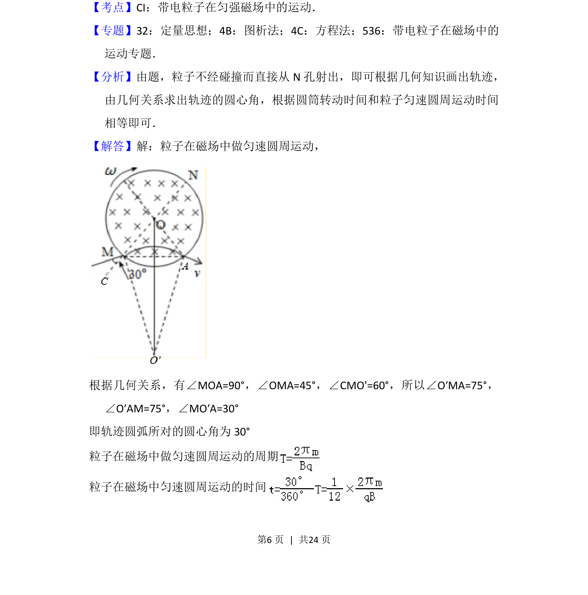
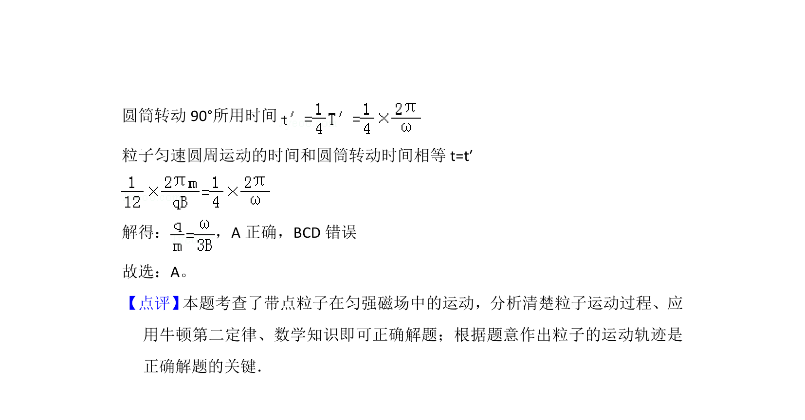

## 题面

## 摘要

带电粒子在匀强磁场与旋转圆筒中运动，通过几何关系与周期公式求比荷。

## 关联考点

- [[525-几何角度关系|几何角度关系]]
- [[573-圆周运动周期|圆周运动周期]]
- [[635-比荷计算|比荷计算]]

## 答案与解析

> 📄 原 PDF 第 5 页：`素材/真题/吉林/2008-2024·（吉林）物理高考真题/2016年高考物理试卷（新课标Ⅱ）（解析卷）.pdf`

<!-- 题干文本-start -->
## 题干文本
5． （6分）一圆筒处于磁感应强度大小为B的匀强磁场中，磁场方向与筒的轴平
行，筒的横截面如图所示．图中直径MN的两端分别开有小孔，筒绕其中心
轴以角速度ω顺时针转动．在该截面内，一带电粒子从小孔M射入筒内，射
入时的运动方向与MN成30°角．当筒转过90°时，该粒子恰好从小孔N飞出
圆筒．不计重力．若粒子在筒内未与筒壁发生碰撞，则带电粒子的比荷为
（　　）
<!-- 题干文本-end -->

<!-- 解析文本-start -->
## 解析文本

<!-- 解析文本-end -->
