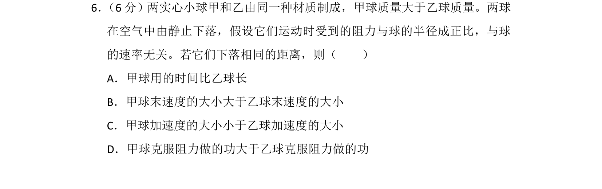
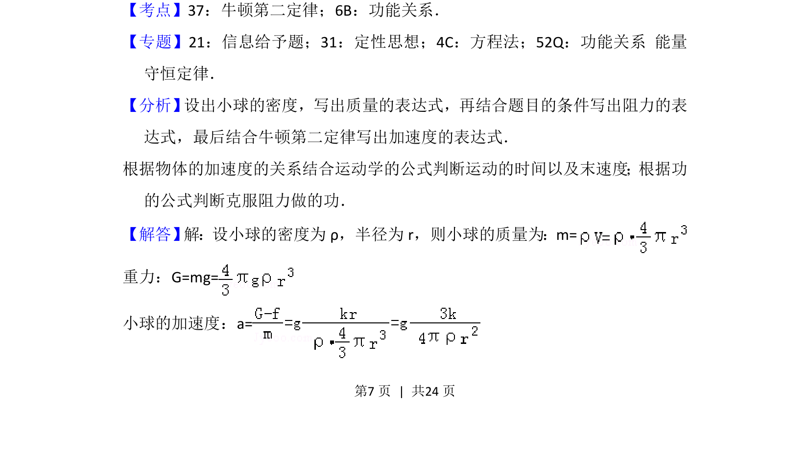

## 题面

## 摘要

两球下落受阻力与半径成正比，比较时间、末速度、加速度和做功关系

## 关联考点

- [[229-牛顿第二定律|牛顿第二定律]]
- [[249-功能关系|功能关系]]
- [[运动学公式]]

## 答案与解析

> 📄 原 PDF 第 7 页：`素材/真题/吉林/2008-2024·（吉林）物理高考真题/2016年高考物理试卷（新课标Ⅱ）（解析卷）.pdf`
