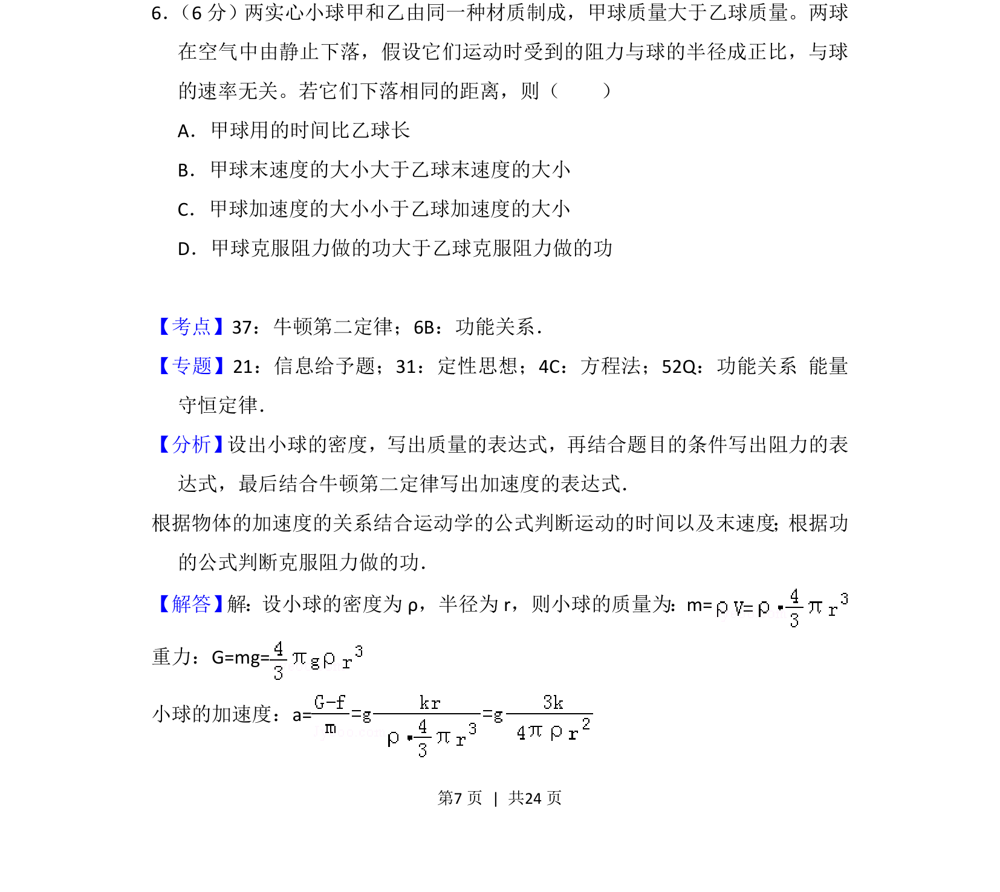
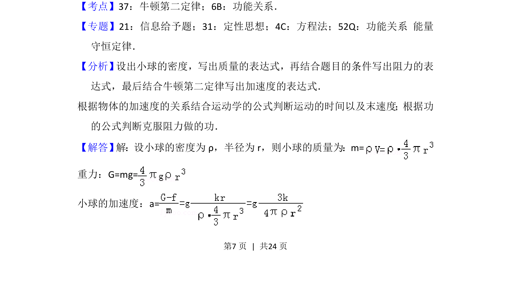
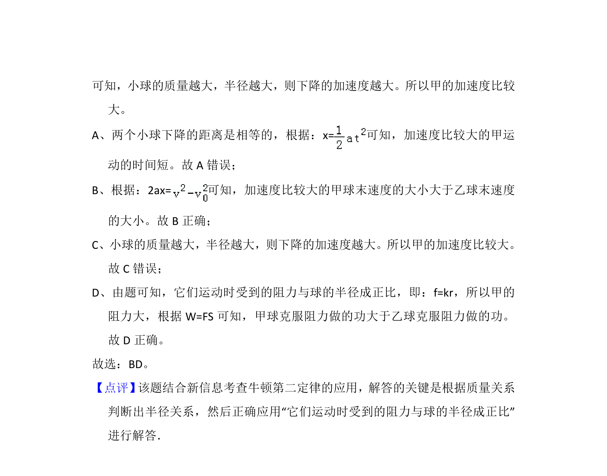

## 题面

## 摘要

两球下落受阻力与半径成正比，比较时间、末速度、加速度和做功关系

## 关联考点

- [[229-牛顿第二定律|牛顿第二定律]]
- [[249-功能关系|功能关系]]
- [[733-运动学公式|运动学公式]]

## 答案与解析

> 📄 原 PDF 第 7 页：`素材/真题/吉林/2008-2024·（吉林）物理高考真题/2016年高考物理试卷（新课标Ⅱ）（解析卷）.pdf`

<!-- 题干文本-start -->
## 题干文本
6． （6分）两实心小球甲和乙由同一种材质制成，甲球质量大于乙球质量。两球
在空气中由静止下落，假设它们运动时受到的阻力与球的半径成正比，与球
的速率无关。若它们下落相同的距离，则（　　）
A．甲球用的时间比乙球长
B．甲球末速度的大小大于乙球末速度的大小
C．甲球加速度的大小小于乙球加速度的大小
D．甲球克服阻力做的功大于乙球克服阻力做的功
<!-- 题干文本-end -->

<!-- 解析文本-start -->
## 解析文本
【考点】37：牛顿第二定律；6B：功能关系．菁优网版权所有
【专题】21：信息给予题；31：定性思想；4C：方程法；52Q：功能关系 能量
守恒定律．
【分析】 设出小球的密度，写出质量的表达式，再结合题目的条件写出阻力的表
达式，最后结合牛顿第二定律写出加速度的表达式．
根据物体的加速度的关系结合运动学的公式判断运动的时间以及末速度；根据功
的公式判断克服阻力做的功．
【解答】 解：设小球的密度为ρ，半径为r，则小球的质量为：m=
重力：G=mg=
小球的加速度：a=
<!-- 解析文本-end -->
