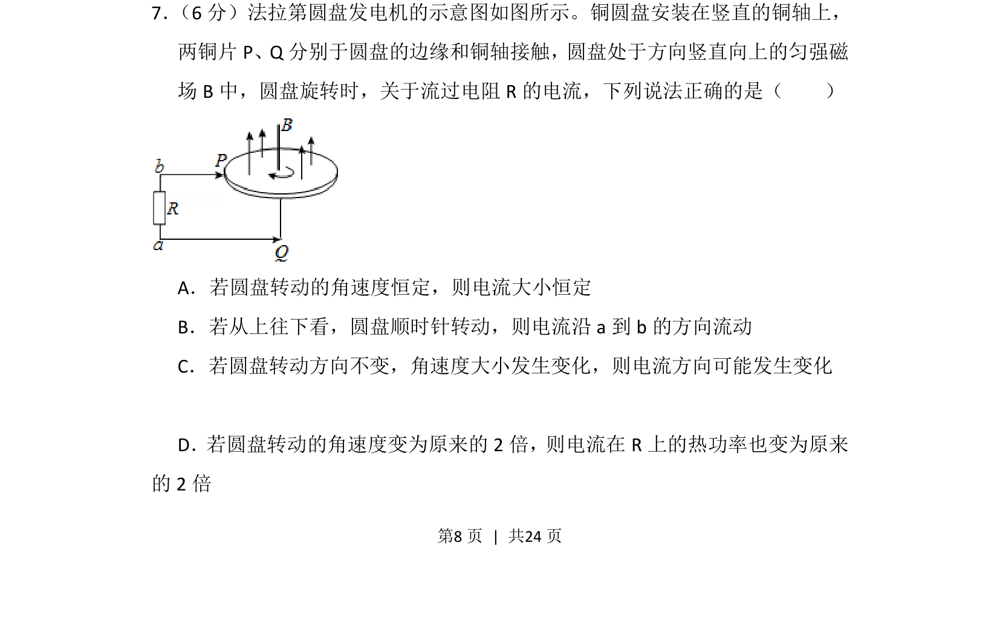
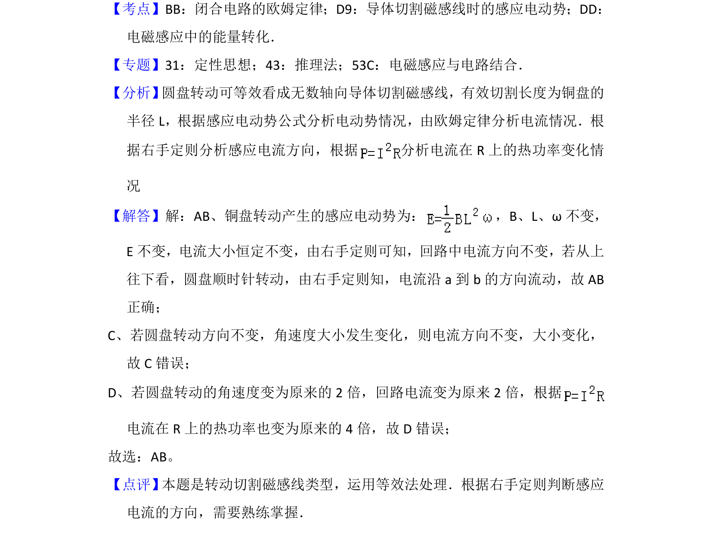

## 题面

## 摘要

考查法拉第圆盘发电机模型，分析感应电流大小、方向及热功率与角速度的关系

## 关联考点

- [[法拉第电磁感应]]
- [[135-安培定则|右手定则]]
- [[159-电功率|电功率]]

## 答案与解析

> 📄 原 PDF 第 8 页：`素材/真题/吉林/2008-2024·（吉林）物理高考真题/2016年高考物理试卷（新课标Ⅱ）（解析卷）.pdf`
