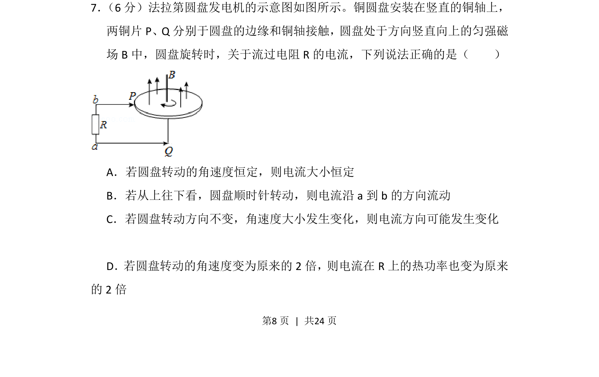
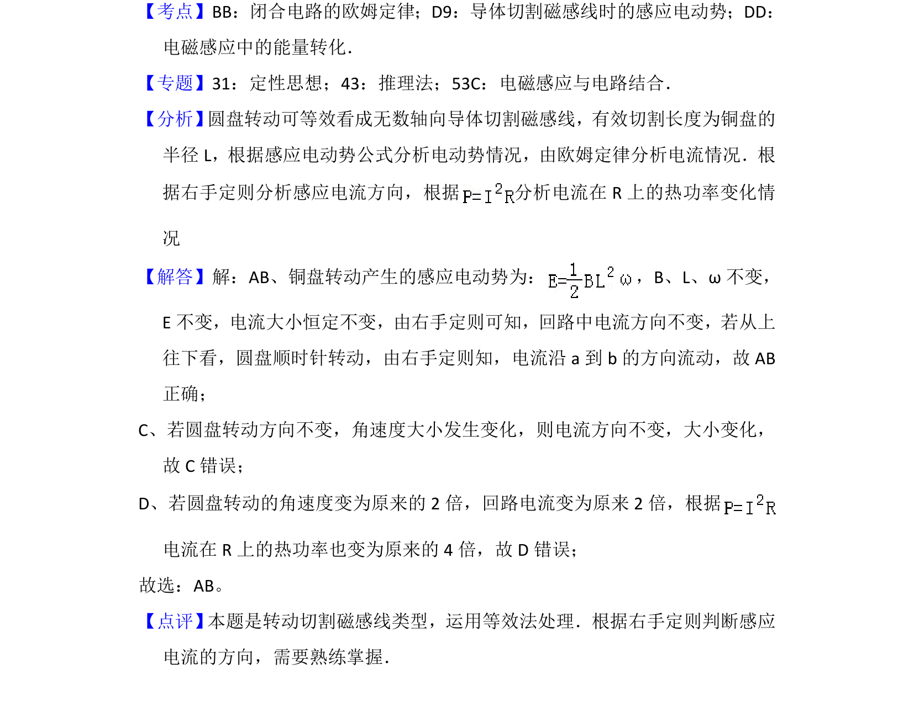

## 题面

## 摘要

考查法拉第圆盘发电机模型，分析感应电流大小、方向及热功率与角速度的关系

## 关联考点

- [[643-法拉第电磁感应|法拉第电磁感应]]
- [[135-安培定则|右手定则]]
- [[159-电功率|电功率]]

## 答案与解析

> 📄 原 PDF 第 8 页：`素材/真题/吉林/2008-2024·（吉林）物理高考真题/2016年高考物理试卷（新课标Ⅱ）（解析卷）.pdf`

<!-- 题干文本-start -->
## 题干文本
7． （6分）法拉第圆盘发电机的示意图如图所示。铜圆盘安装在竖直的铜轴上，
两铜片P、Q分别于圆盘的边缘和铜轴接触，圆盘处于方向竖直向上的匀强磁
场B中，圆盘旋转时，关于流过电阻R的电流，下列说法正确的是（　　）
A．若圆盘转动的角速度恒定，则电流大小恒定
B．若从上往下看，圆盘顺时针转动，则电流沿a到b的方向流动
C．若圆盘转动方向不变，角速度大小发生变化，则电流方向可能发生变化
D．若圆盘转动的角速度变为原来的2倍，则电流在R上的热功率也变为原来
的2倍
<!-- 题干文本-end -->

<!-- 解析文本-start -->
## 解析文本

<!-- 解析文本-end -->
