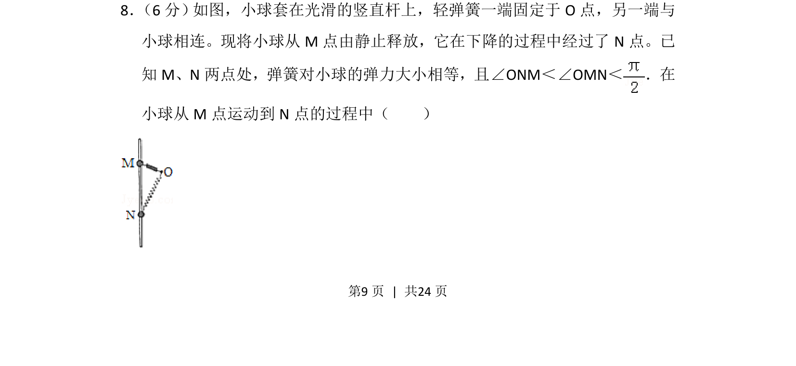
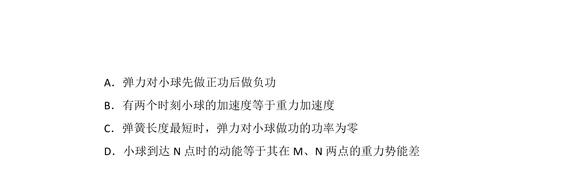
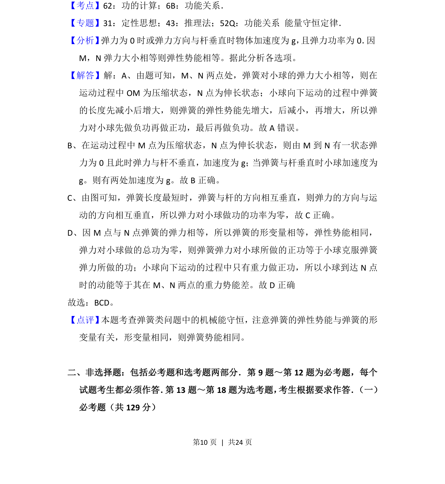

## 题面

## 摘要

小球在弹簧约束下沿竖直杆下滑，分析两点弹力相等时的加速度、速度及能量变化。

## 关联考点

- [[606-弹簧弹力|弹簧弹力]]
- [[079-弹性势能|弹性势能]]
- [[229-牛顿第二定律|牛顿第二定律]]
- [[249-功能关系|功能关系]]

## 答案与解析

> 📄 原 PDF 第 9 页：`素材/真题/吉林/2008-2024·（吉林）物理高考真题/2016年高考物理试卷（新课标Ⅱ）（解析卷）.pdf`
