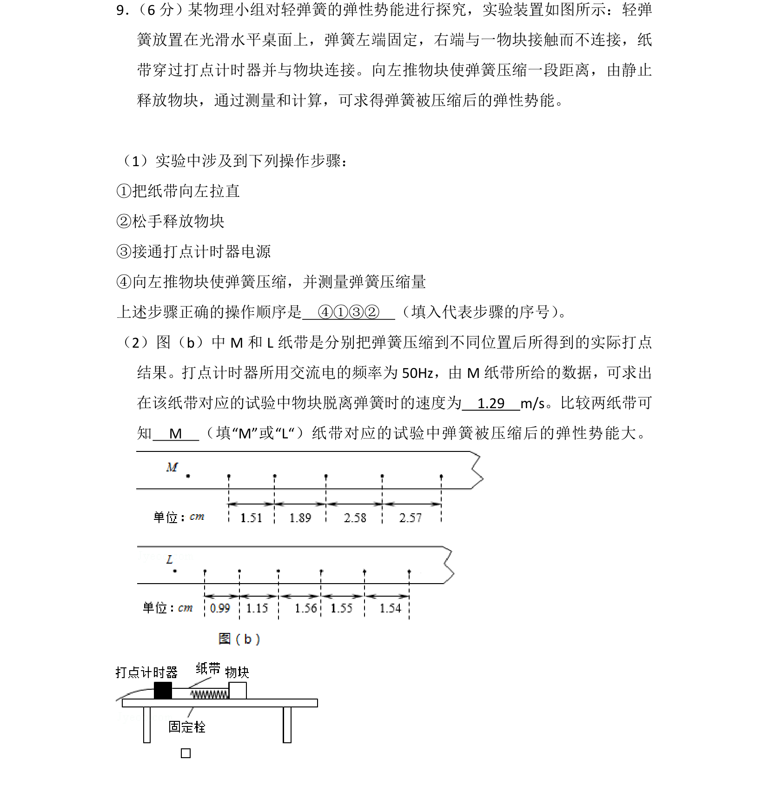
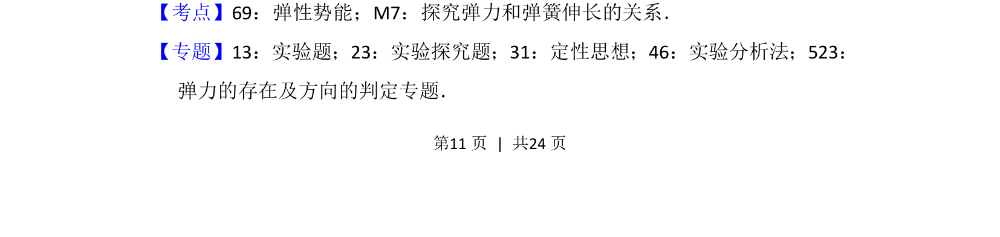
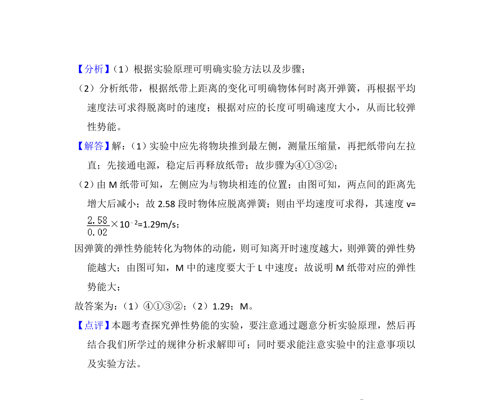

## 题面

## 摘要

利用打点计时器探究弹簧弹性势能，涉及实验步骤排序、纸带速度计算与弹性势能大小比较

## 关联考点

- [[079-弹性势能|弹性势能]]
- [[探究弹力和弹簧伸长的关系]]
- [[实验操作]]
- [[纸带数据处理]]

## 答案与解析

> 📄 原 PDF 第 11 页：`素材/真题/吉林/2008-2024·（吉林）物理高考真题/2016年高考物理试卷（新课标Ⅱ）（解析卷）.pdf`
