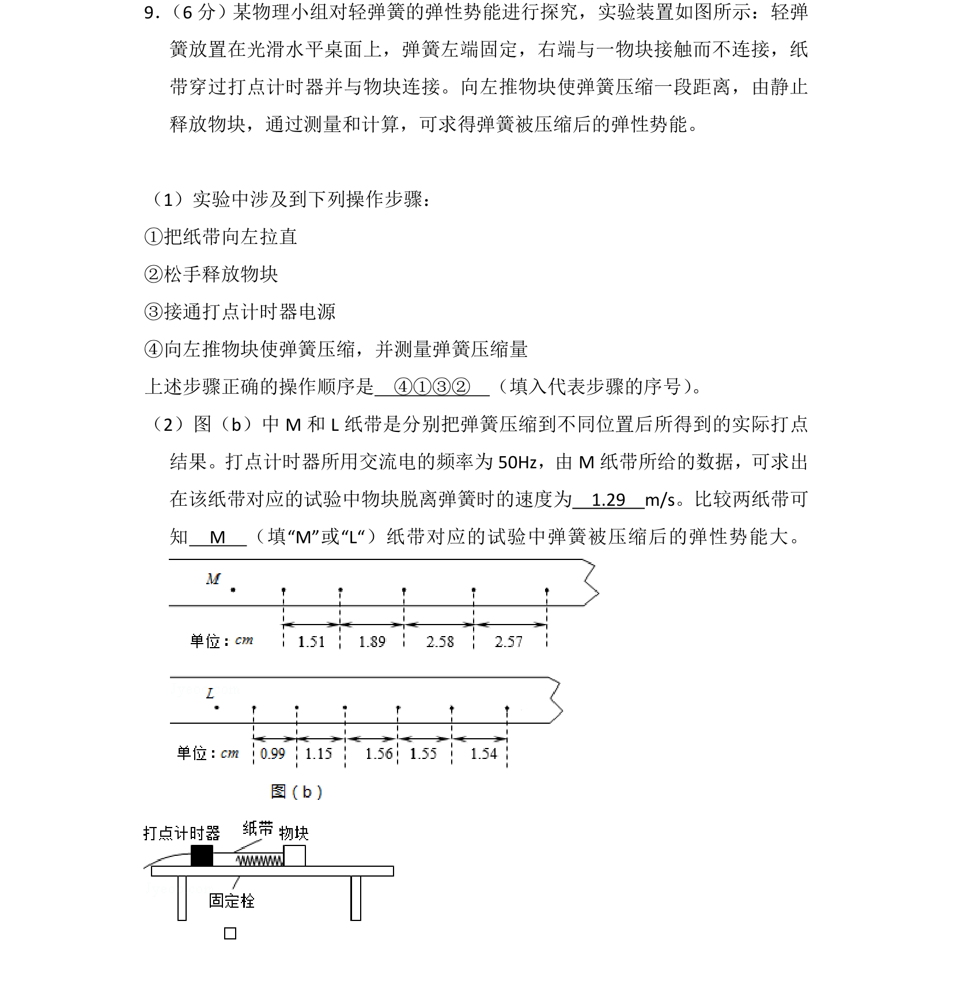
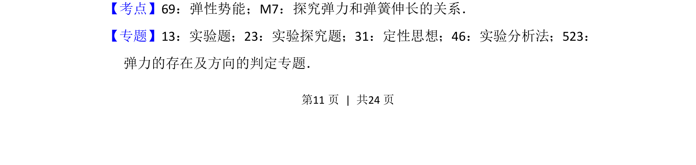
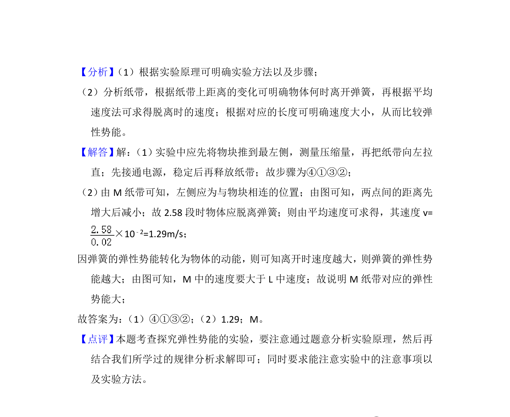

## 题面

## 摘要

利用打点计时器探究弹簧弹性势能，涉及实验步骤排序、纸带速度计算与弹性势能大小比较

## 关联考点

- [[079-弹性势能|弹性势能]]
- [[615-探究弹力和弹簧伸长的关系|探究弹力和弹簧伸长的关系]]
- [[580-实验操作|实验操作]]
- [[489-纸带数据处理|纸带数据处理]]

## 答案与解析

> 📄 原 PDF 第 11 页：`素材/真题/吉林/2008-2024·（吉林）物理高考真题/2016年高考物理试卷（新课标Ⅱ）（解析卷）.pdf`

<!-- 题干文本-start -->
## 题干文本
9． （6分）某物理小组对轻弹簧的弹性势能进行探究，实验装置如图所示：轻弹
簧放置在光滑水平桌面上，弹簧左端固定，右端与一物块接触而不连接，纸
带穿过打点计时器并与物块连接。向左推物块使弹簧压缩一段距离，由静止
释放物块，通过测量和计算，可求得弹簧被压缩后的弹性势能。
（1）实验中涉及到下列操作步骤：
①把纸带向左拉直
②松手释放物块
③接通打点计时器电源
④向左推物块使弹簧压缩，并测量弹簧压缩量
上述步骤正确的操作顺序是　④①③②　（填入代表步骤的序号） 。
（2）图（b）中M和L纸带是分别把弹簧压缩到不同位置后所得到的实际打点
结果。打点计时器所用交流电的频率为50Hz，由M纸带所给的数据，可求出
在该纸带对应的试验中物块脱离弹簧时的速度为　1.29　m/s。比较两纸带可
知　M　（填“M”或“L“）纸带对应的试验中弹簧被压缩后的弹性势能大。
<!-- 题干文本-end -->

<!-- 解析文本-start -->
## 解析文本
【考点】69：弹性势能；M7：探究弹力和弹簧伸长的关系．菁优网版权所有
【专题】13：实验题；23：实验探究题；31：定性思想；46：实验分析法；523：
弹力的存在及方向的判定专题．
<!-- 解析文本-end -->
